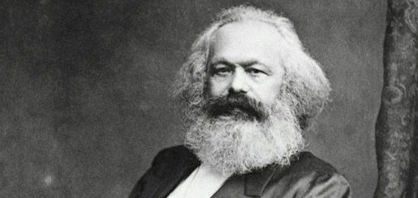

# Volkswirtschaftslehre

### Definition

> Die **Volkswirtschaftslehre** (auch **Nationalökonomie** oder **wirtschaftliche Staatswissenschaften** kurz **VWL**) ist ein Teilgebiet der [Wirtschaftswissenschaft](https://de.wikipedia.org/wiki/Wirtschaftswissenschaft "Wirtschaftswissenschaft"). Sie untersucht Zusammenhänge bei der Erzeugung und Verteilung von [Gütern](https://de.wikipedia.org/wiki/Gut_(Wirtschaftswissenschaft) "Gut (Wirtschaftswissenschaft)") und [Produktionsfaktoren](https://de.wikipedia.org/wiki/Produktionsfaktor "Produktionsfaktor"). Die Volkswirtschaftslehre beschäftigt sich auch mit menschlichem Handeln unter ökonomischen Bedingungen, das heißt mit den Fragen, wie menschliches Handeln ökonomisch begründet werden kann und welches Handeln den größtmöglichen [Nutzen](https://de.wikipedia.org/wiki/Utilitarismus "Utilitarismus") für den Einzelnen oder eine Gemeinschaft bringt. Mit ihr wird nach Gesetzmäßigkeiten und Handlungsempfehlungen für die [Wirtschaftspolitik](https://de.wikipedia.org/wiki/Wirtschaftspolitik "Wirtschaftspolitik") gesucht; ferner werden einzelwirtschaftliche Vorgänge im Rahmen der [Mikroökonomie](https://de.wikipedia.org/wiki/Mikro%C3%B6konomie "Mikroökonomie") und gesamtwirtschaftliche im Rahmen der [Makroökonomie](https://de.wikipedia.org/wiki/Makro%C3%B6konomie "Makroökonomie") betrachtet.

*https://de.wikipedia.org/wiki/Volkswirtschaftslehre*

### Überblick über Module

| Modul                 | Professor                | Modus     | Übersichtslink                                  |
| --------------------- | ------------------------ | --------- | ----------------------------------------------- |
| Buchführung           | Dr. Bernd Schuster       | Präsenz   | [README.md](VL_Buchfuehrung/README.md)          |
| BWL                   | Prof. Dr. Julia Seeger   | asynchron | [README.md](VL_BWL/README.md)                   |
| Mathematik I          | PD. Maren Hantke         | Präsenz   | [README.md](VL_Mathe1/README.md)                |
| Statistik I           | Prof. Dr. Claudia Decker | asynchron | [README.md](VL_Statistik1/README.md)            |
| VWL                   | Prof. Dr. Lars Börner    | asynchron | [README.md](VL_VWL/README.md)                   |
| Wirtschaftsinformatik | Prof. Dr. Taieb Mellouli | Asynchron | [README.md](VL_Wirtschaftsinformatik/README.md) |

[Modulhandbuch](https://raw.githubusercontent.com/skriptum/vwl1/main/images/modulhandbuch.pdf)

### Allgemeine Infos 

Dies ist der zentrale Online-Speicher aller meiner Notizen meines VWL-Studiums, wie eine Art Wissenspeicher. Erstellt wurden sie mithilfe von [Markdown](https://www.markdownguide.org/) und als Website auf [GitHub Pages](https://pages.github.com) hochgeladen. 

### Syntax: 

##### Definitionen:

> Das ist oft eine Definition für ein bestimmten Sachverhalt

##### Mathe

$\text{Das ist eine Matheblock für mathematische Funktionen} \\
\begin{align}
    E_0 &= mc^2 \\
    E &= \frac{mc^2}{\sqrt{1-\frac{v^2}{c^2}}}\\
  \end{align} $

geschrieben mit [$\LaTeX$](https://en.wikipedia.org/wiki/LaTeX)

##### Diagramme

