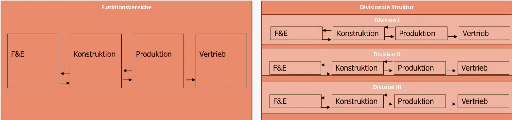
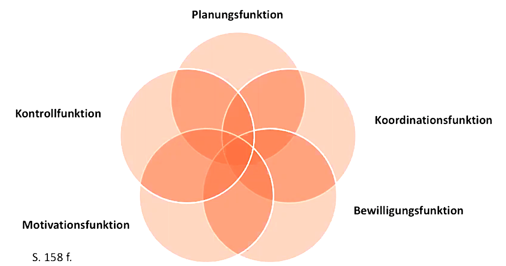

# 2021-10-25 Grundlagen des Managements

### Definitionen

- **Als Institution**: leitende Instanzen / Funktionsträger
    - Top (Vorstand)
    - Middle (Abteilungsdirektor )
    - Lower (Büroleiter)
- **Funktion:** zur Steuerung notwendiger Aufgaben

### Organisationsgestaltung

Buch S.124ff

mehrschrittiger Prozess

**Analyse-Synthese Konzept**: Ausgangspunkt jeder Organisatorischen Tätigkeit ist *Aufgabe*

1. Analyse der Aufgabe

    - Übersicht, etc
    - organisatorisch relevante Elemente erfassen (personen, Abteilungen)
2. Synthese:
    - Zufammenfassung von Einheiten
    - Verteilung von Aufgaben

bei Organisationsgestaltung: Unterscheiden zwischen *Ablauf- und Aufbauorganisation*

> **Aufbauorganisation:**  (nichts mit bauen!) Organisation eines Aufbaus/Struktur 
>
> BSP: Einsatz Sachmittel, Verbindung Stellen, Übertragung Aufgaben

> **Ablauforganisation:** Organisation eines Ablaufes (zeitlich/räumlich)
>
> BSP Bestimmung Arbeitsgänge, Reihenfolge, Standort ...

#### Organisationsprozess 

Formen des Organisationsprozesses: Neuorganisation und Reorganisation

Stufen:

- **Vorstudie**: Prüfung Wirtschaftlichkeit
- **Hauptstudie**: grobe Lösungskonzepte
- **Teilstudien**: Lösungen für Teilbereiche
- **Systembau**: Verwirklichung der  Konzepte
- **Einführung**: 

## Managementsysteme 

> **Managementsysteme:** alle Instrumente, mit denen Managementfunktionen erfüllt werden 
>
> (Buch S.133ff)

Arten von Managementsystemen

| Innovativ-strategieorientiert       | bürokratisch-administrativ                     |
| ----------------------------------- | ---------------------------------------------- |
| Konzentration auf Stärken           | Ausmerzen Schwächen                            |
| offensiv agieren                    | defensiv reagieren                             |
| "richtigen Dinge tun"               | "Dinge richtig tun"                            |
| Bedarfs- und Verhaltensorientierung | Material-, Produkt- und Verfahrensorientierung |

Bestandteile von Managementsystemen:

### Organisationssystem

 Konzept zur Analyse der Organisation in 5 Hauptdimensionen 

1. **Spezialisierungsystem**: Umfang und Art der Spezialisierung der Unternehmensbereiche, 2 Typen:
- Funktionale vs Divisionale Struktur: 
2. **Koordinationssystem**: Abstimmung der Arbeitsbereiche mit Hinblick auf Gesamtziel
    - Arten: persönliche Weisung, Selbstabstimmung, Pläne, 
3. **Leitungsystem**: Analyse der Befugnisse/Kompetenzen nach
    - Kommunikationskanäle
    - Anzahl der Hierarchiestufen (Gliederungstiefe)
    - Gliederungsbreite
4. **Entscheidungsdelegation**: umfangmäßige Verteilung der Befugnisse nach Prinzipien (Buch S. 144) wie zb. Verantwortung = Kompetenz
5. **Formalisierung**: Art und Umfang schriftlich fixierter Regeln

​    

### Informationssystem IS

System zur Nutzung von Informationen in Informationsprozessen (Buch S.164)

Stufen des Informationsprozesses:

1. Beschaffung
2. Speicherung
3. Übermittlung
4. Verarbeitung

Automatisierungstufen von IS: manuell, teilautomatisch, vollautomatisch

### Planungs- und Kontrollsystem PKS

> **Definition:** geordnete Gesamtheit verschiedener Teilplänen zur Erfüllung von Planungs+ Kontrollfunktion (Buch S.147)

Typen von Planung (hierarchisch):

- Top-Down (Retrograd)
- Bottom-Up (progressiv)
- Kombination (Gegenstrom)

Prinzipien des PKS:

1. **Dominanz strategischer Planung** (über operative Planung): längerfristige Planung vor kurzfristigen Abstimmungsprozessen
2. **revolvierende Planung:** regelmäßge Überprüfung + Anpassung von Plänen 
3. **flexible und elastische Planung:** Alternativen haben und Reserven vorhalten
4. **Budgetierung:** festgelegtes Budget für Unternehmensbereiche als Richtschnur
    - Funktionen der Budgetierung: 
5. **Manipulationsabwehr:** Gefahr der Beeinflussung durch persönliche Interessen verhindern

### Personalführungssystem PFS

Aspekte des PFS:

- **Konstitutives Führungsprinzip**: Wertrahmen und Leitmaxime für Führen
    - Beispiel: Shareholder vs. Stakeholder-Orientierung
- **Anreizsysteme/Motivationskonzepte:** Befriedigung von Motiven der Mitarbeiter durch
    - Monetäre Anreize(Lohn): Arten
        - Zeitlohn
        - Akkordlohn (nach Stückzahl)
        - Prämienlohn (Grundlohn + Zusatz)
    - nicht monetäre Anreize
        - befriedigung sozialer Bedürfnisse wie Anerkennung, Mitspracherecht etc
- **Personalentwicklungssystem**:  Möglichkeiten zur Weiterbildung / Aufstieg

### Controlling

> **Controlling:** Unterstützung der Führungsebene bei Unternehmensüberlick/Kontrolle (Buch S.177)

soll Manager helfen, transparenten Überblick über Geschehen zu bekommen

Funktionen:

- Erarbeitung Entscheidungsvorlagen
- Zielplanung
- Erkenntnisse in Planung einbringen

