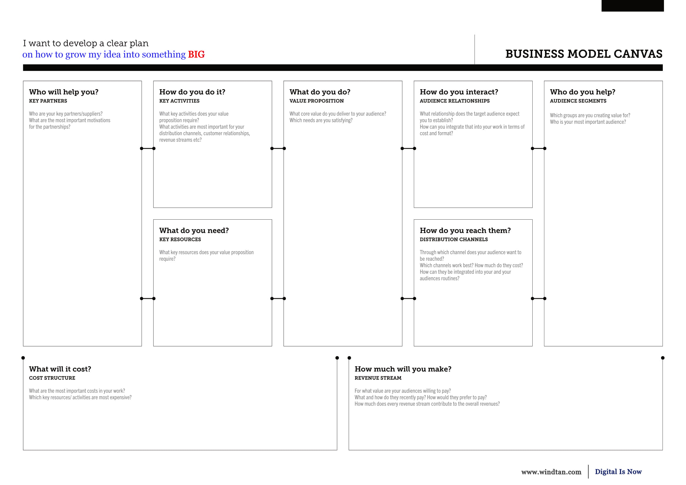

# 04.11.2021 Strategisches Management

> **Strategisches Management**: systematischer Prozess, längerfristige Wettbewerbsvorteile aufbauen und erhalten

Vorteile

- proaktiv statt reaktiv
- Kontrolle und Beinflussung von Marktgeschehen

## Führung

| Führung vs                    | Management             |
| ----------------------------- | ---------------------- |
| Gestaltung des Systems        | innerhalb des Systems  |
| Weiterentwicklung in Richtung | Ordnung und Konsistenz |
| Motivation der Mitarbeiter    | Organisation           |

> **Führung** : zielgerichtete Beinflussung von Mitarbeitern , indirekt oder direkt, zur Motivation etc

> **Führungsverhalten:** Beschreibung einzelner Führungsprozesse => Ableitung Empfehlungen

> **Führungsstil**:  längerfristige Muster im Führungsverhalten der leitenden Person

Ziele von Führung :

- Motivation
- Kohäsion (Zusammenhalt
- Lokomotion (Richtungsweisung)

#### Führungstheorien

Arten von Führungstheorien:

- Merkmalsbezogen: Leichtigkeit, ...
- prozessbezogen : Interaktion

Historische Führungstheorien: Verhaltenstheorien, Eigenschafttheorien, 

Aktuelle Theorien: Interaktion- und Transformationstheorie

### Führungsstile 

Eigenschaften verschiedener Stile:

- autoritäre Führungsstil:

    - Schnelle Entscheidungen
    - klare Koordination + Rollenverteilung
- **Braucht**: Niveaugefälle + einfache Aufgaben ohne Eigenitiative
- partizipativer Führungsstil:

  - Engagiertere Mitarbeiter = bessere Entscheidungen + Innovationen
  - **Braucht**: kreative Mitarbeiter und anfordernde Aufgaben

### Unternehmenspolitik

$ Vision \implies Leitbild \implies Ziele \implies Strategien$

#### Vision

wichtig für Entwicklung des Unternehmens in gewünschte Richtung

Merkmale guter Vision:

- sinnstiftend
- motivierend
- handlungsleitend
- Integrierend

#### Leitbild

auch *Mission Statement* 

Bündelung der Motivation in eine Richtung

Darstellung des Unternehmens in der Öffentlichkeit und vor Lieferanten + Mitarbeitern

Umsetzung der Vision

#### Ziel

Einflüsse auf Unternehmensziele: Stakeholder (Lieferanten, Öffentlichkeit, etc) und Shareholder 

Dimensionen von Unternehmenszielen:

1. Ökonomische 
2. Soziale
3. ökologische

gutes management macht alle Dimensionen gleichwertig

### Geschäftsmodell

> **Geschäftsmodell:** Grundprinzip des Unternehmens in der Wertschaffung

bestehend aus:

- Produkt-Markt-Modell: was produzieren
- Wertschöpfungsmodell: wie produzieren
- Verkaufsmodell: wie verkaufen
- wirtschaftliche Logik: wie gewinne machen

Amazon-Beispiel Geschäftsmodellanalyse

| Ebene                 | Amazon                    |
| --------------------- | ------------------------- |
| Unternehmensebene     | das Gesamtgeschäftsmodell |
| Geschäftsbereichebene | Amazon Market Place       |
| Service - Ebene       | Amazon Prime              |

Arten von Geschäftsmodellen:

- Free
- Bait and Hook: billiges Basisprodukt, teure Ergänzungsprodukt (Rasierer)
- Freemium: Basisversion kostenlos, teure Premiumversion (dropbox)
- Lock-In : bindung durch Wechselerschwerung (Apple)
- Platform-Service
- ...

Business-Modell-Canvas:

Beispielhaft IKEA-Aufgabe:

