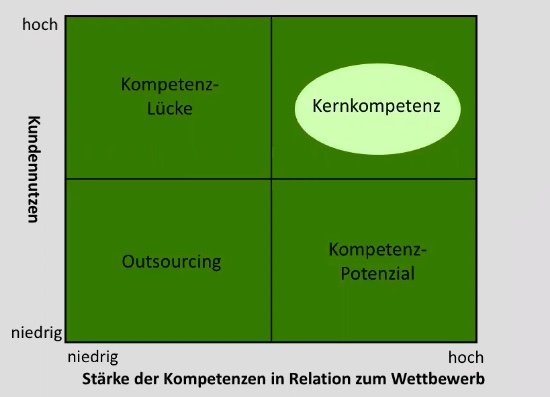

# 15.11.2021 Strategische Unternehmensanalyse

phasenbasierter Ansatz zur Unternehmensanalyse vor Unternehmensplanung

### 1. Umweltanalyse

Bereiche der Umwelt (aufsteigende Wichtigkeit)

#### 1. Allgemeine Umwelt (PEST)

- **P**olitisch: Gesetze, Steuern
- **E**conomisch: Arbeitslosigkeit, ..
- **S**ozial: Bevölkerung, Konsumentenverhalten
- **T**echnologie: aktuelles Niveau, neue Innovationen

#### 2. Branchenumwelt (Porters Five Forces)

- *Eintrittsbarrieren*: EoS, Kapitalbedarf
- *Lieferantenmacht*: Konzentration, Umstellungskosten
- *Abnehmermacht*: Konzentration, Preisempfindlichkeit
- *Subsitute*: Bedrohung durch Ersatz, Substitutionsneigung

=> Analyse von Intensität von Wettbewerb

#### 3. Engere Umwelt

- Kunden + Lieferanten
- Geldgeber + Arbeitsmarkt
- Konkurrentenanalyse

### 2. Unternehmensanalyse

#### Wertschöpfungsanalyse 

Analyse des eigenen Unternehmens zum Vergleich mit Konkurrenten

#### Kompetenzanalyse

Analyse um zu sehen, wo man für den Kundennutzen ist und was man verbessern kann

### 3. SWOT-Analyse

Kombination der gesammelten Ergebnisse

- aus  Unternehmensanalyse => **S**trengths und **W**eaknesses
- aus Umwelt-Analyse => **O**pportunities und **T**hreats

**=> SWOT**-Analyse

Methodik:  

