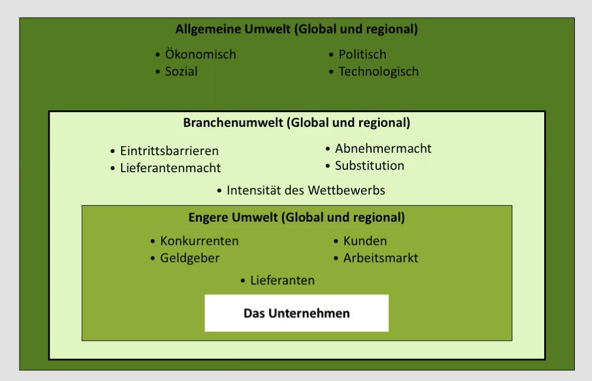

# 15.11.2021 Strategische Umweltanalyse

phasenbasierter Ansatz zur Unternehmensanalyse vor Unternehmensplanung

Bereiche der Umwelt (aufsteigende Wichtigkeit) 

### Allgemeine Umwelt (PEST)

- **P**olitische Umwelt:
    - Gesetzgebung
    - Steuern
    - Regulierung
    - Stabilität
- **E**conomische Umwelt
    - Arbeitslosigkeit
    - Konjunktur
    - Schlüsselindustrien
- **S**ozial: 
    - Werte 
    - Demographie
    - Konsumentenverhalten
    - Mobilität
- **T**echnologie: 
    - aktuelles Niveau
    - neue Innovationen
    - F&E-Ausgaben

`=> Analyse der allgemeinenen Marktsituation`

### Branchenumwelt (Porters Five Forces)

- *Eintrittsbarrieren*
    - Economies of Scale
    - Eintrittsbarrieren
- *Lieferantenmacht*
    - Konzentration
    - Umstellungskosten
- *Abnehmermacht*: 
    - Konzentration
    - Preisempfindlichkeit
    - Informationsstand
- *Subsitute*: 
    - Bedrohung durch Ersatz
    - Substitutionsneigung
    - Relative Preisleistung
- *Wettbewerb*: von allen vier beeinflusst
    - Branchenwachstum
    - Homogenitätsgrad der Produkte

`=> Analyse der Intensität des Wettbewerbs`

### Engere Umwelt

#### Konkurrenzanalyse

möglichst viele Informationen über Konkurrenten

- Zukünftige Ziele
- Aktuelle Strategie
- Fähigkeiten

