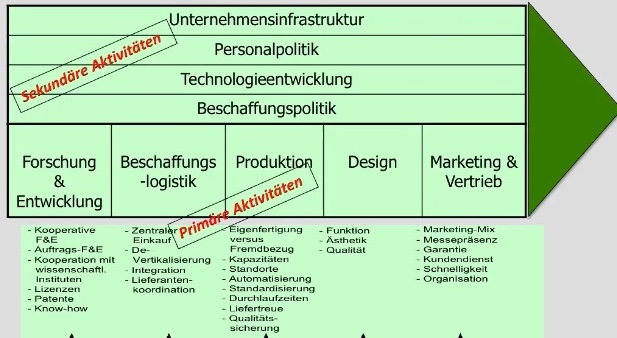
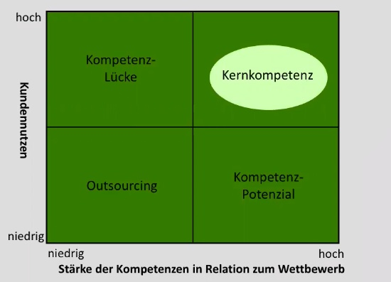

# 20.11.21 Strategische Unternehmensanalyse

### Kundenanalyse

Analyse der Kunden und ihrer Verlangen

1. **Marktsegmentierung**: Wer sind Kunden / konkurrenten
2. **Kundenerwartungen**: Merkmale des Produktes
3. **Merkmalswichtigkeit:** welche Merkmale kaufentscheidend
4. **Erfolgsbewertung**: Vergleich zwischen Konkurrenten

### Wertschöpfungsanalyse 

auch Customer Value-Chain Analyse (CVA)

Analyse des eigenen Unternehmens zum Vergleich mit Konkurrenten

1. Primäre Aktivitäten
    - Forschung & Entwicklung
    - Logistik
    - Produktion
    - Design
    - Vertrieb
2. Sekundäre Aktivitäten
    - Personalpolitik
    - Unternehmensinfrastruktur
    - Technologieentwicklung
    - Beschaffungspolitik

### Kompetenzanalyse

Analyse um zu sehen, wo man für den Kundennutzen ist und was man verbessern kann

> **Kernkomeptenz:** hoher Kundennutzen und starke Wettbewerbsfähigkeit der Kompetenz

