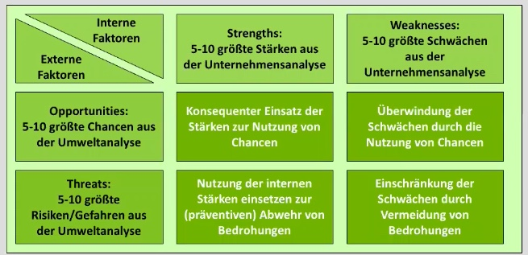

# 27.11.21 SWOT-Analyse

Kombination der gesammelten Ergebnisse

- aus  Unternehmensanalyse => **S**trengths und **W**eaknesses
- aus Umwelt-Analyse => **O**pportunities und **T**hreats

**=> SWOT**-Analyse

Methodik:  **Kombi Stärken + Chancen:** Fokus hierdrauf

