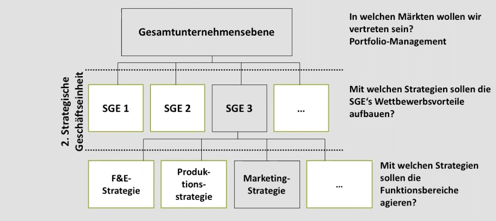
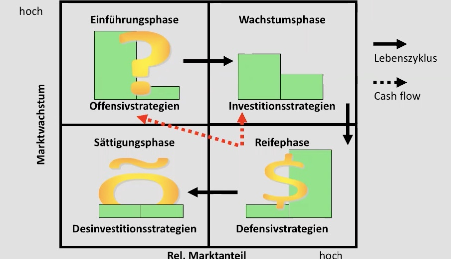

# 07.12.2021 Strategie-Formulierung

### Ebenen der Strategieformulierung

### BCG-Methode

Matrix hilft bei Formulierung von Strategien und Ideen von Produkten

#### Produktphasen

1. Produkt in Einführungsphase: 
    - Marktwachstum hoch, Anteil gering
    - Offensivstrategie: hohe Investition (linker Balken) + niedrige Rendite ( rechter Balken)
2. Wachstumsphase
    - steigende Gewinne
    - Investitionstrategie benötigt
3. Reifephase
    - hohe Gewinne, Cash-Cows , Refinanzierung der Investitionen
4. Sättigungsphase
    - wenig Rendite mehr
    - Geld rausziehen (desinvestieren)

#### generische Strategien

1. **Kostenführerschaft**: niedrige Preise, hoher Absatz (Bsp.: Discounter)
2. **Differenzierung** : über Qualität/Leistung/... (Bsp.: LaFayette)
3. **Nischenbesetzung**: Selektiv Kostenführerschaft, selektive Differenzierung (Bsp: Rewe)

#### Funktionale Strategien 

