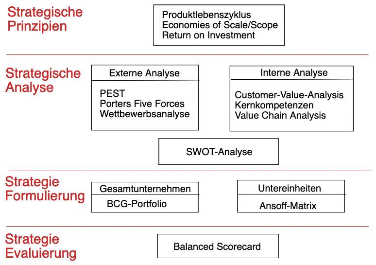
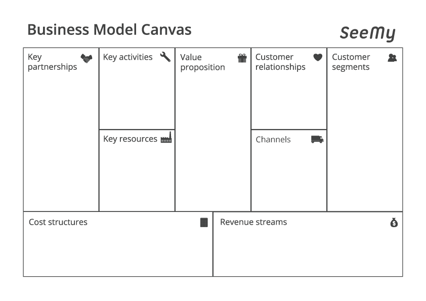
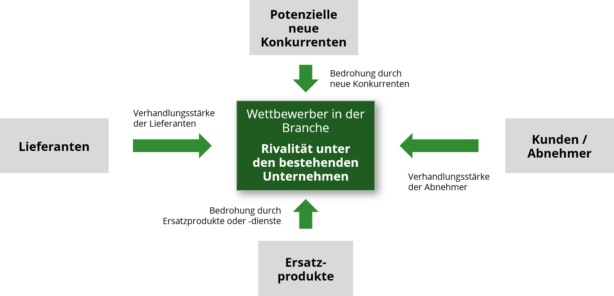
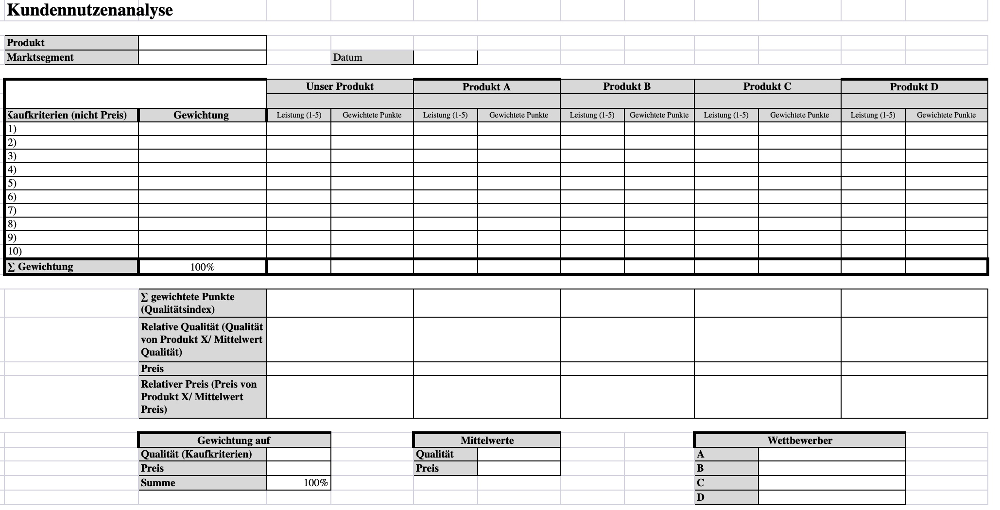
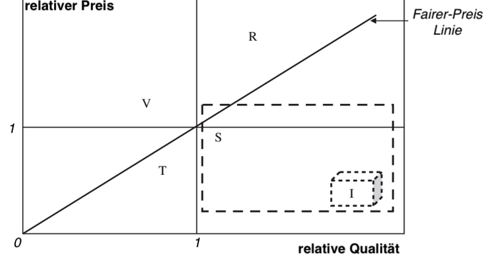
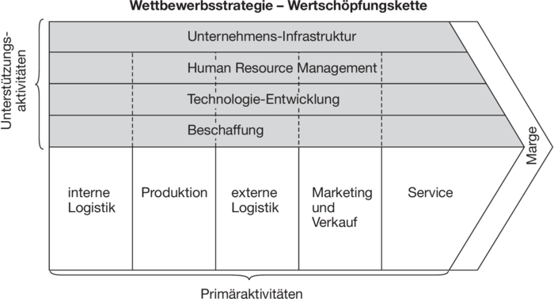
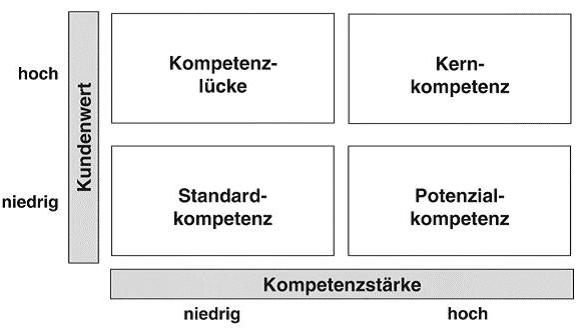
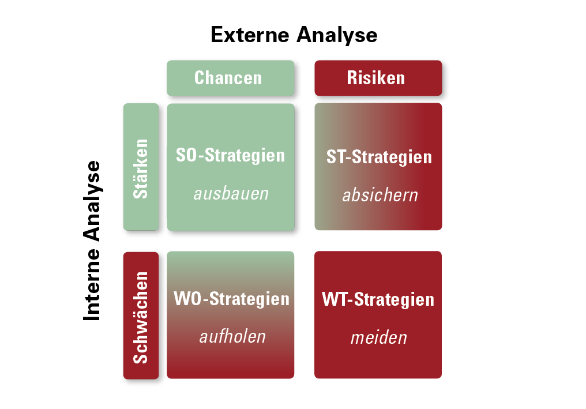
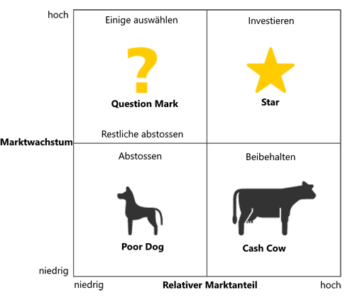
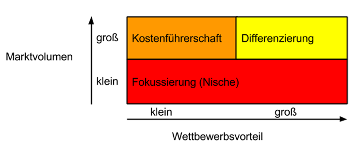

# Allgemein
> **Wirtschaften**: Disponieren über knappe Güter als Gegenstand von Marktprozessen

Prinzipien profitorientierter Unternehmen:
- *Maximumprinzip:* Output maximieren
- *Minimumprinzip:* Input minimieren
- *Extremumprinzip:* optimales Verhältnis von Output ~ Input

## Rechtsformen
1. Personengesellschaft: (OHG,...)
    - Risiko lastet auf Unternehmer
2. Kapitalgesellschaft: (AG, GmbH,...)
    - haftungsbeschränkt
3. Mischformen, staatliche Formen, …

## Gliederung der Unternehmen
- *nach Produktart:* Dienstleistung | Sachleistung
- *nach Wirtschaftszweig*: Industrie, Handel, …
- *nach Größe:* klein, mittel, groß
- *nach regionalen Ausmaß:* lokal, regional, national, international, multinational

### internationale Unternehmen
Unterscheidung inter- und multinationl:

- **international:** Produktion Inland; Absatz auch Ausland
- **multinational:** Produktion + Absatz sowohl Inland als auch Ausland

| Vorteile                           | Nachteile               |
|------------------------------------|-------------------------|
| Kostenvorteile durch Skaleneffekte | rechtliche Unterschiede |
| Zugang zu internationalen Märkten  | Koordinierungsprobleme  |

Arten des Auslandseinsatzes (steigend intern.): $Export < Lizenz < Direktinvestition < Auslandsniederlassung$

# Management
> **Management:** zielgerichtete und ökonomische Steuerung/Organisation der menschlichen Handlung

Ausgangspunkt des Management: *Aufgabe*

Schritte des Management: 

| Analyse                                                 | Synthese                 |
|---------------------------------------------------------|--------------------------|
| Übersicht verschafften                                  | Einheiten zusammenfassen |
| relevante Elemente erfassen (Personen, Abteilungen,...) | Verteilung der Aufgaben  |

## Managementsystem
> **Managementsystem**: alle Instrumente, mit denen Managementfunktionen erfüllt werden
2 Arten: 

| innovativ-strategieorientiert | bürokratisch-administrativ |
|-------------------------------|----------------------------|
| Konzentration auf Stärken     | Ausmerzung Schwächen       |
| offensiv agieren              | defensiv reagieren         |
| "Richtige Dinge tun"          | "Dinge richtig tun"        |

### Bestandteile

| Organisationsystem        | Informationsystem           | Planungs- / Kontrollsystem | Personalführungsystem | Controlling              |
| ------------------------- | --------------------------- | -------------------------- | --------------------- | ------------------------ |
| *wie sind wir aufgebaut?* | *wie werden Infos genutzt?* | *wie planen wir?*          | *wie führen wir?*     | *wie kontrollieren wir?* |
| funktional vs             | Beschaffung                 | strategisch                | Leitmaxime            |                          |
| divisional                | Speicherung                 | evolvierend                | Anreizsysteme         |                          |
|                           | Lagerung                    | flexibel                   | Personalentwicklung   |                          |
|                           | Verarbeitung                | budgetbeschränkt           |                       |                          |

### Techniken

- *Kreativitätstechnik:* zur Ideengewinnung, bspw. Brainstorming
- *Scoringtechnik*: Bewertungsmethode zur Gewichtung
- *Netzplantechnik*: Methode zur Planung komplexer Probleme
- *Extrapolationstechnik*: Fortschreibung der Vergangenheit in Zukunft
- *Szenariotechnik:* Entwicklung von Szenarien

## Führung
> **Führungsstil:** längerfristige Muster im Verhalten von Führungskräften

| Führung vs                 | Management                 |
|----------------------------|----------------------------|
| Gestaltung des Systems     | innerhalb des Systems      |
| Weiterentwicklung          | Ordnung des Existenten     |
| Motivation der Mitarbeiter | Zuordnung von Mitarbeitern |

### Ziele der Führung

- Motivation
- Kohäsion (Zusammenhalt)
- Lokomotion (Richtungsweisung)

Führungstheorien:

- *merkmalsbezogen:* Eigenschaftstheorie, Verhaltenstheorie (beide eher historisch)
- *prozessbezogen:* Interaktionstheorie, Transformationstheorie (eher moderne) 

### Führungstile

| autoritär                                    | partizipativ                                        |
|----------------------------------------------|-----------------------------------------------------|
| schnelle Entscheidungen                      | bessere Entscheidungen                              |
| klare Rollenverteilung                       | Teilhabe von Mitarbeitern                           |
| braucht: Niveaugefälle und einfache Aufgaben | braucht: engagierte Mitarbeiter + kreative Probleme |

# Strategisches Management
 > **Strategisches Management:** systematischer Prozess, in dem längerfristige Vorteile im Wettbewerb aufgebaut und erhalten werden

 - erlaubt proaktives Handeln statt Reaktion auf Veränderung
 - Kontrolle + Beinflussung von Marktgeschehen

Bestandteile:

### Entwicklung von Strategien
$Vision \implies Leitbild \implies Ziele \implies \textbf{Strategie}$ 
- **Vision:** langfristige Idee für Unternehmen
    - sinnstiftend
    - handlungsleitend
    - integrierend
- **Leitbild**: Umsetzung der Vision
    - Bündelung der Motivation
    - Darstellung nach innen und außen
- **Ziele**: gleichwertig aus
    - ökonomisch
    - ökologisch
    - sozial

### Geschäftsmodell
> **Geschäftsmodell** : Grundprinzip des Unternehmens in der Wertschöpfung

Elemente:

- Produkt-Markt Modell: *was produzieren?*
- Wertschöpfungsmodell: *wie produzieren?*
- Verkaufsmodell: *wie verkaufen?*
- wirtschaftliche Logik: "*wie gewinne machen?*

Arten:

- Bait-and-Hook
- Freemium
- Lock-In
- … 

Analyse mit **Business-Model-Canvas:**

## Strategische Prinzipien
`Leitfrage: "Was will ich machen?"`
### Produktlebenszyklus
Analyse eines Produktes anhand von 5 Phasen: 
### Economies of Scale / Scope

|              | Economies of Scale                    | Economies of Scope                         |
|--------------|---------------------------------------|--------------------------------------------|
| Übersetzung  | Skaleneffekte                         | Verbundeffekte                             |
| Beschreibung | Kostenvorteile durch hohe Stückzahlen | Kostenvorteile durch breite Produktpalette |
| Gründe:      | Verteilung der Fixkosten              | Verhandlungsmacht / Finanzstärke           |
|              | Großmengenrabatte                     | gemeinsame Nutzung einer Ressource         |
### ROI
> **Return on Investment:** Kennzahl für unternehmerischen Erfolg, auch Kapitalrendite

Berechnung: $ROI = \frac{Gewinn}{eingesetztes \ Kapital}$

## Strategische Umweltanalyse
`Leitfrage: "Was will der Markt?"`
phasenbasierter Ansatz zur Unternehmensanalyse

### PEST
> Analyse in 4 Dimensionen, meist bezogen auf eine Region, ein Landes.

Für jede Dimension anhand der Indikatoren erlaubt Bewertung der allgemeinen Situation des Landes, nicht nur nach finanziellen Gesichtspunkten

| Politik      | Wirtschaft          | Sozial               | Technologisch    |
|--------------|---------------------|----------------------|------------------|
| Gesetzgebung | Arbeitslosigkeit    | Werte                | Aktuelles Niveau |
| Steuern      | Konjunktur          | Demographie          | F&E Ausgaben     |
| Regulierung  | Schlüsselindustrien | Konsumentenverhalten | Patente          |
| Stabilität   | Infrastruktur       | Mobilität            | Innovationen     |

### Porters Five Forces
> Analyse der Stärke des Wettbewerbs und der Machtverteilung in einer Branche

| neue Konkurrenten  | Ersatzprodukte          | Kundenmacht                   | Lieferantenmacht             |
| ------------------ | ----------------------- | ----------------------------- | ---------------------------- |
| Skaleneffekte      | Wechselkosten           | Konzentration                 | Konzentration                |
| Spezialwissen      | Gleichheit der Produkte | Preisempfindlichkeit          | Wechselkosten                |
| Eintrittsbarrieren | Substitutionsneigung    | Informationsstand             | Gleichheit der Produkte      |
|                    |                         | Risiko *Rückwärtsintegration* | Risiko *Vorwärtsintegration* |

**=> Stärke des Wettbewerbs**

- Anzahl Wettbewerber
- Kundenloyalität
- Branchenwachstum

> **Vorwärts / Rückwärtsintegration:** Übernahme von vorhergehenden / nachgeordneten Schritten in der Verwertungskette

## Strategische Unternehmensanalyse
`Leifrage: "Wie ist unser Unternehmen aufgestellt?"`
### Customer Value Analysis (CVA)
> **Kundennutzenanalyse:** Analyse der Verlangen der Kunden im Vergleich von eigenen Produkten zu Konkurrenzprodukten

| Bestandteil            | Vorgehen                                       |
|------------------------|------------------------------------------------|
| 1: Marktsegmentierung  | wer sind Kunden / Konkurrenten?                |
| 2: Kundenerwartungen   | was sind kaufentscheidende Merkmale?           |
| 3: Merkmalswichtigkeit | wie gewichten Kunden die Merkmale?             |
| 4: Erfolgsbewertung    | wie viele Punkt eerhält jede Mermalskategorie? |

Vorlage: 
anhand des *relativen Preises* und der *relativen Qualität* lässt sich dann eine Customer Value Map erstellen

#### Customer Value Map
anhand des *relativen Preises* und der *relativen Qualität* aus CVA lässt sich dann eine Customer Value Map erstellen

### Value Chain Analysis
> **Value Chain Analyse** Analyse des Nutzens, die ein Unternehmen in seiner Wertschöpfungskette betreibt

muss immer auf jeweiliges Unternehmen individuell angepasst werden! 

Bestandteile:

| Primäre Aktivitäten | Sekundäre Aktivitäten     |
|---------------------|---------------------------|
| interne Logistik    | Unternehmensinfrastruktur |
| Produktion          | Personalwesen             |
| externe Logistik    | Technologieentwicklung    |
| Marketing / Verkauf | Beschaffungswesen         |
| Service             |                           |

### Kompetenzanalyse
dient zum Herausfinden der Kernkomeptenz

> **Kernkompetenz:** eine Technologien / Prozesse / Know-How, die:
> - einzigartig für Kunden
> - einmalig ggü. Konkurrenz und
> - schwer imitierbar sind

## SWOT

aus den gesammelten Ergebnissen der internen und externen Analyse => **SWOT**-Analyse

- aus Unternehmensanalyse: *Strengths + Weaknesses* (Stärken | Schwächen)
- aus Umweltanalyse: *Opportunities + Threats* (Chancen | Risiken)

Darstellung in Tableau zur Ableitung von Strategien und Komeptenzen, die entwickelt werden müssen

## Strategieformulierung 

` Leitfrage: "Wo wollen wir als Unternehmen hin?"`
 Ebenen der Strategieformulierung: 
 
| Ebene              | Leitfrage                            | Methode       |
|--------------------|--------------------------------------|---------------|
| Gesamtunernehmen   | in welche Märtke wollen wir?         | BCG-Portfolio |
| Geschäftseinheiten | wie erhalten wir Wettbewerbsvorteile | Ansoff-Matrix |

### BCG-Portfoliomethode

beschreibt Strategien, die in verschiedenen Produktlebensphasen angewandt werden sollten

1. Einführungsphase
    - Wachstum hoch + Marktanteil gering
    - => *Offensivstrategie*: hohe Investitionen = niedrige Rendite
2. Wachstumsphase
   - Wachstum hoch, steigende Gewinne
   - => *Investtionsstrategie*: Marktanteile ausbauen!
3. Reifephase
    - hohe Gewinne einstreichen, Refinanzierung der Investitionen
    - => *Defensivstrategie*: Verteidung der Marktanteile gegen Konkurrenten
4. Sättigungsphase:
    - sinkendes Wachstum / Gewinne
    - => *Desinvestitionsstrategie*: Ausstieg vorbereiten, Geld rausziehen

### generische Strategien nach Porter
 
| Strategie          | Beschreibung                              | Beispiel |
|--------------------|-------------------------------------------|----------|
| Kostenführerschaft | durch niedrige Preise + hohes Volumen     | VW       |
| Differenzierung    | durch besondere Produkte + hohe Margen    | Mercedes |
| Nischenbesetzung   | Teilmarkt mit besonderem zufriedenstellen | Porsche  |

### Ansoff Matrix

> **Ansoff-Matrix:** bexchreibt Wachstumstrategien in bestehendem + neuen Markt

Arten der Diversifikation:

- **horizontal**: Erweiterung der Produktpalette durch Nutzung Synergieffekte
- **Vertikal**: Integration vor / nachgelagerter Tätigkeiten
- **lateral**: in komplett neuen Bereich, risikoreich

## Strategiebewertung mit Balanced Scorecard

> **Balanced-Scorecard**: Methode zur Bewertung / Kontrolle von Unternehmensstrategien in 4 Bereichen, sowohl monetär als auch nicht-monetär

Bereiche:
- Kunden
- Finanzen
- interne Prozesse
- Lernen / Entwicklung

Schritte in jedem Bereich:
1. Ursache Wirkung analysieren => **Ziele** definieren
2. Messgrößen für Ziele => **Kennzahlen** festlegen
3. Vorgaben zur Erreichung => **Zielwerte** bestimmen
4. Handlungsanweisungen ableiten => **Maßnahmen**

nach gewissen Zeitraum bewerten, ob Zielgrößen erreicht wurden und wenn nicht: **anpassen**

# Betriebliche Prozesse
