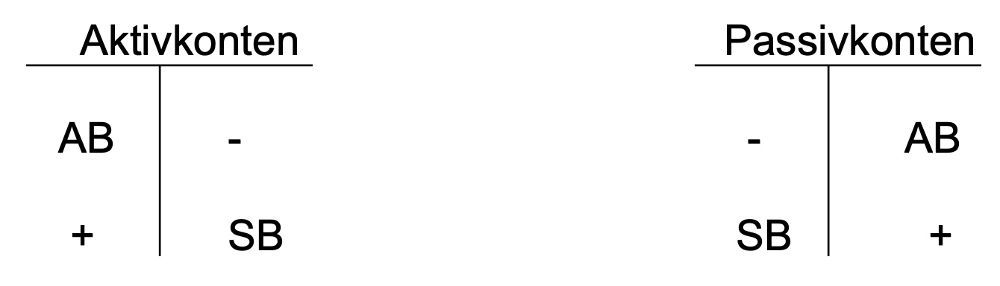
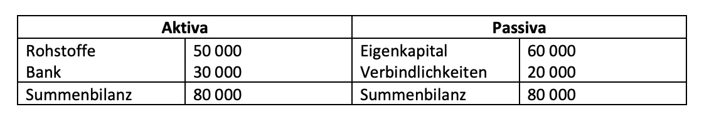
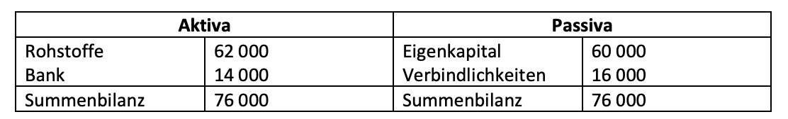
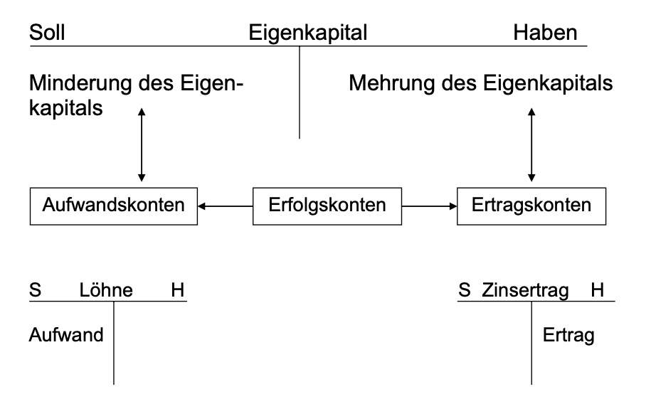
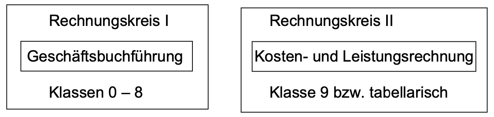
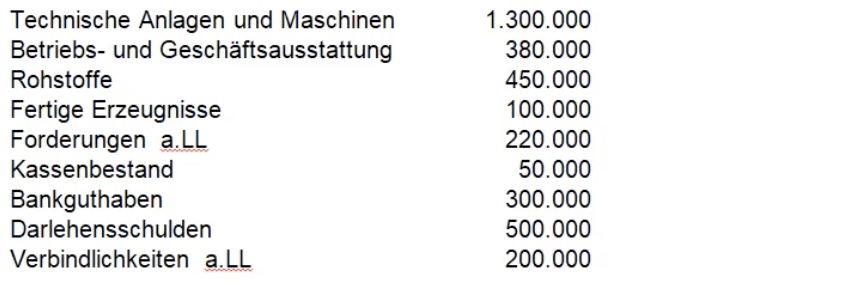
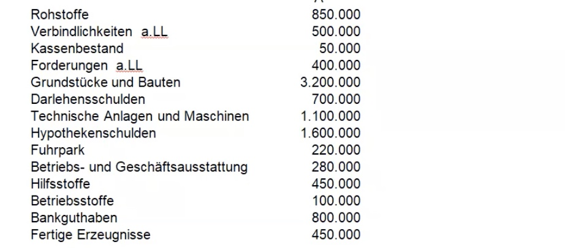

# 14.10.21 Begriffsklärung

Rechengrößen: (*zur Abgrenzung: S.38f*)

  -----------------------------------------------------------------------
  Buchführung                            Kostenrechnung
  -------------------------------------- --------------------------------
  **Erträge** = Wertzuwachs (s.15)       **Leistungen** = Wert
                                         betriebsüblicher Güter (s.16)

  **Aufwendungen** = Wertverzehr         **Kosten** = betriebsbedingter
                                         Werteverzehr

  Erträge - Aufwendungen = ***Erfolg***  Leistungen - Kosten =
  (Gewinn oder Verlust)                  ***Betriebsergebnis***
  -----------------------------------------------------------------------

**i.d.R:** Erfolg $\neq$ Betriebsergebnis

Weitere Begriffe:

-   *neutraler Aufwand/Ertrag* = Aufwand/Ertrag ohne Kosten ggü. bspw.
    Unternehmensfremder Aktienkauf mit Verlust/Gewinn

-   *Zusatzkosten* = Kosten ohne Aufwand gegenüberstehend

    -   bspw. kalkulatorischern Unternehmerlohn an
        Geschäftsführer/Gesellschafter (da der nicht gebucht werden
        kann, nur "gedacht"), wie bei AGs die CEO-Vergütung

-   *Anderskosten* = Kosten , denen Aufwand in anderer Höhe
    gegenübersteht , bspw *kalkulatorische Abschreibung*

### Abschreibungen

  ---------------------------------------------------------------------------------
                    Buchführung                    Kostenrechnung
  ----------------- ------------------------------ --------------------------------
  **Definition**:   Verteilung des Aufwandes einer Gleich, aber mit zukünftiger
                    Anschaffung über Lebenszeit    Wertminderung / steigerung =
                                                   *kalk Abschreibung*

  **Beispiel**      10000 Anschaffung / 10 Jahre = 14000 Wiederbeschaffungswert in
                    1000€ pro Jahr                 10 jähren, da Zinsen = 1400€ pro
                                                   Jahre
  ---------------------------------------------------------------------------------

### Geschäftsfall

> **Erinnerung:** geschäftsfall (Gf) = vermögenswirksame betriebliche
> Aufgabe

jedem Fall (*bsp Lohnzahlung mit Banküberweisung*) liegt ein/mehrere
**Belege** bei (*hier Überweisungsformular*)

**Beleg**: dokumentiert Erfassung des Gf, wichtiger Nachweis für
Kontrolle , zwingend!

ohne aufzeichnungen = **CHAOS!** (überblick über erfolg,
betriebsgeschehen ), also

> **Buchführung:**
>
> planmäßige, lückenlose Aufzeichnung aller Geschäftsfälle (s.22).
>
> Grundlage des betrieblichen Rechnungswesens
>
> Instrument der Unternehmensleitung zu Planung + Kontrolle Vorhaben

# 19.10.21 Gesetzliche Grundlagen

### Handelsrecht

Gesetzbuch für die Buchführung : *Handelsgesetzbuch* (HGB)

`wer ist buchführungspflichtig?`(BFP) nach §238 HGB: jeder *Kaufmann /
Kauffrau*

**Kaufmann** (S.26 LM)

1.  Ist-Kaufmensch (§1): wer ein (Handels)-*Gewerbe* betreibt (kein
    Kleingewerbe) mit kaufmänisch eingerichtetem Geschäftsbetrieb

2.  Kann-Kaufmensch (§2): Gewerbetreibender freiwillig im
    *Handelsregister* (und nicht §1)

    -   Land / Forstwirte (§3): gesetzl. kein Kaufm., kann freiwillig
        ins Handelsregister (wie §2)

3.  Form-Kaufmensch (§6): *Handelsgesellschaften* oder
    *Genossenschaften*

> **Gewerbe:** auf Dauer angelegte wirtschaftliche Tätigkeit mit
> *Gewinnerzielungsabsicht*

Kleingewerbe im Einzelhandel: Umsatz \< 250k

Kleingewerbe im Großhandel: Umsatz \< 400k

> **Handelsregister:** öffentliches Verzeichnis eines Amtsgerichtes,
> Eintragung aller Kaufmänner und Situation (Geschäftsführer etc)

Vorteil der Eintragung ins Handelsregister: verbessertes Ansehen -\>
geldwerter Vorteil

> **Handelsgesellschaft:** Gesellschaft nach HGB wie *GmbH, OHG, ...*
> (außer GbR)

> **Freiberufler/Selbständige**: maßgeblich in eigener Person sein
> Unternehmen Mitarbeiter (meist Akademisch)
> `Freiberufler sind nie buchführungspflichtig!`

Typische Selbständige: Ärzte, Rechtsanwälte, Steuerberater,
Architekten,...

selbständig und nicht buchführungspflichtig: muss
*Einahmen-Überschuss-Rechnung* erstellen

Handelsrechtliche Vorschriften zur Buchführung: HGB§§238 - 335 (s.23 LM)

------------------------------------------------------------------------

### Steuerrecht

`wer ist buchführungspflichtig?`(BFP) nach *Abgabenordnung*
AO("Grundgesetz" des Steuerrechtes)

**steuerrechtliche BFP**

1.  Abgeleitete BFP (§140): wer nach HGB BFP ist, ist auch nach AO

2.  originäre BFP (\$141): nicht nach HGB bfp, aber wenn eines dieser
    Merkmale:

    -   Gesamtumsatz im Kalenderjahr > 600k

    -   Gewinn > 60k

        und nicht Selbständig!

Steuerrechtliche Vorschriften zur BFP:

-   Abgabenordnung (AO)
-   Einkommensteuergesetz (EStG)
    -   Steuer die Unternehmer oder Arbeitnehmer ( Lohnsteuer) zahlen
-   Körperschaftsteuergesetz (KStG)
    -   Kapitalgesellschaften
-   Umsatzsteuergesetz (UStG) , ugs. Mehrwertsteuer
    -   zwei Arten: USt und USt im Einkauf (Vorsteuer)
-   Einkommensteuerrichtlinen (EStR)

------------------------------------------------------------------------

# 21.10.21 Grundsätze Ordnungsgemäßer Buchführung

### Ordnungsgemäße Buchführung

> **Grundsätze ordnungsgemäße Buchführung (GoB):** gesetzlichen
> Vorschriften entsprechend *nach §238 HGB*

Buchführung muss:

-   *Sachverständigem Dritten* (Betriebsprüfer Finanzbehörde,
    Wirtschaftsprüfer, Steuerberater)
-   ohne fremde Hilfe in angemessener Zeit
-   einen Überblick über Geschäftsfälle sowie Vermögens-, Finanz-, und
    Erfolgslage des Unternehmens geben.

GoB (LM S.31):

-   Systematisch
-   Vollständig und verständlich, u.a :
    -   unveränderbare Aufzeichnung (Rückbuchung statt Radieren von
        Fehlern)
    -   Jahresabschluss in dt. Sprache
    -   eindeutige Abkürzungen, Ziffern, Buchstaben
-   Belegprinzip!
-   Aufbewahrungsfrist (10 Jahre)

Verstöße gegen GoB (können) => Schätzung (Umsatz, Gewinn) durch
Finanzbehörden (**SCHLECHT!​**)

### Inventur

> **Inventur:**
>
> -   mengen- und wertmäßige Bestandsaufnahme
> -   aller Vermögensteile und Schulden eines Unternehmens
> -   zu bestimmten Zeitpunkt

Inventur durchzuführen bei:

-   Gründung / Übernahme eines Unternehmens
-   Schluss jedes Geschäftsjahres (meist 31.12)
-   Auflösung / Veräußerung des Unternehmens

Vergleich zwischen Beständen und Belegen der *BF*

#### Formen der Inventur (LM S.42):

-   nach Zeitpunkt:
    -   Stichtag
        -   ausgeweitete (+- 10 Tage)
        -   Vor- / Nachverlegte (-3 +2 Monate)
    -   permanente
        -   Voraussetzung = Lagerbuchführung
-   nach Umfang
    -   Vollinventur
    -   Stichproben
-   nach Art
    -   Körperliche Inventur: Vermögensgegenstände
    -   Buchinventur: Forderungen, Schulden

(LM S.44):

  -----------------------------------------------------------------------
  Art des bestandes      Verfahrensweise der Inventur
  ---------------------- ------------------------------------------------
  Unbewegliches          1\. Stichtag , 2. laufendes Verzeichnis
  Anlagevermögen         

  Bewegliches            1\. Stichtag, 2. laufendes Verzeichnis

  Vorratsvermögen        1\. Stichtag, 2. Ausgeweitete Inv. , 3.
                         permanente Inv. , 4. Verlegte Inventur mit
                         *Fortschreibung/Rückrechnung*
  -----------------------------------------------------------------------

> **Fortschreibung/Rückrechnung**: bei verlegter Inventur nötig, weil
> innerhalb von 3 Monaten Veränderungen entstehen:
>
> Fortschreibung: Wert am Aufnahmetag + Wert der Zugänge / Abgänge
> Zwischenzeit = Wert Bilanzstichtag
>
> Rückrechnung: Wert am Aufnahmetag - Wert der Zugänge / Abgänge
> Zwischenzeit= Wert Bilanzstichtag

Zur Vorbereitung und Durchführung :

-   Inventurleiter einsetzen\
-   Aufnahmeplan erstellen
    1.  Inventurbereiche definieren
    2.  personelle Besetzung Aufnahmegruppen
    3.  Inventurlisten erstellen
    4.  Hilfsmittel beschaffen
    5.  Zeitpunkt festlegen
-   Inventur Durchführen
-   Verzeichnis erstellen (*Inventar*)

# 26.10.21 Inventar

Beispiel-Inventar LM S.46

### Inventar

> **Inventar:** ausführliches Bestandsverzeichnis nach Art, Menge, Wert
> an bestimmten Tag

Bestandteile des Inventars:

1.  Vermögen, aufsteigend nach *Liquidität* sortiert
    -   Anlagevermögen: **langfristig** dienende Vermögensteile
        (Grundstücke, Gebäude etc)
    -   Umlaufvermögen: **kurzfristig** dienende Vermögensteile
        (Forderungen, Geldmittel, RHB, etc)
2.  Schulden, aufsteigend sortiert nach Fälligkeit/Dringlichkeit
    -   langfristige Schulden (Kredite, *Hypotheken*)
    -   Kurzfristige Schulden (Verbindlichkeiten)
3.  Reinvermögen = *Eigenkapital*

> **Hypothek:** Kredit gesichert mit Grundstück , eingetragen im
> Grundbuch

Inventar ist Grundlage ordnungsgemäßen Jahresabschlusses, und sehr lang!

=> Gesetzgeber verlangt übersichtliche Kurzfassung = *Bilanz*

### Bilanz

> **Bilanz:** Übersicht von Vermögen + Kapital in *Kontoform* (LM S.47)

> **Kontoform**: Aufstellung von Aktiva + Passiva Aktiva (Vermögen): 1.
> Anlagevermögen, 2. Umlaufvermögen Passiva (Kapital): 1. Eigenkapital,
> 2. Fremdkapital

für Bilanz gilt: - *Aktiva = Passiva* !, da - Kapital = Grundlage des
Vermögens - Geschäftsführende unterzeichnen

  Vergleich           Inventar                                 Bilanz
  ------------------- ---------------------------------------- -------------
  Umfang              ausfürhlich                              kurz
  Form                Staffelform                              Kontoform
  Angaben zu Posten   Mengen, Werte, Baujahr                   Werte
  Detailliertheit     Einzelwerte, Gruppenwerte, Gesamtwerte   Gesamtwerte

**=>** beides Zehn Jahre aufzubewahren

# 28.10.2021 Bilanz

**Bilanz**: stellt Gleichung dar: $$
\begin{align}
Aktiva = & \ Passiva \\
Vermögen = &  \ Eigenk. + Fremdk. \\
Eigenkapital = & \ Vermögen - Fremdkapital \\
Fremdkapital = & \ Vermögen - Eigenkapital
\end{align}
$$ zur Beurteilung eines Unternehmens: *Bilanzkennzahlen* ermitteln /
auswerten

### wichtige Bilanzkennzahlen

zum Auswerten einer Bilanz , ob Unternehmen gesund + zahlungskräftig ist

-   Grad der finanziellen Unabhängigkeit:
    $\frac{Eigenkapital}{Fremdkapital}*100\%$

    -   je größer => solideres / krisenfesteres Unternehmen ; größer als
        20 % = wirtschaftlich gut

-   Grad der Verschuldung: $\frac{Fremdkapital}{Gesamtkapital}*100\%$

-   Anteil des Anlagevermögens :
    $\frac{Anlagevermö.}{Gesamtvermögen}*100\%$

    -   je niedriger => geringere Kostenbelastung => größere
        Gewinnaussicht

-   Anteil Umlaufvermögen: $\frac{UV}{GV}*100\%$

-   Investierung (**wichtig**) :
    $\frac{Eigenkapital}{Anlagevermögen}*100$

    -   *Goldene Bilanzregel*: Eigenkapital soll Anlagevermögen decken

    -   da fehlender Rest sonst langristiger Kredit = hohe Zinslast

-   Liquidität:

    1.  Grades:
        $\frac{sofortflüssige \ Mittel}{kurzfrsitige \ Verbindlichkeiten}*100$
    2.  Grades:
        $\frac{sofort+bedingt \ flüssige \ Mittel}{kurzfrstige \ Verbindlichkeiten}*100$
    3.  Grades:
        $\frac{Umlaufvermögen}{kurzfristige \ Verbindlichkeiten}*100$

    -   wenn 2.grad > 100 oder 3.grad > 200 => zahlungsfähig

### Wertveränderungen

> **Wertveränderungen:** Auswirkungen eines Geschäftsfalles auf die
> Bilanz auf Aktiv/Passivseite

4 Möglichkeiten der Veränderung (LM S.52):

1.  Aktivtausch: Veränderung nur auf Aktivaseite
    -   BSP: Kauf Computer gegen Bar
2.  Passivtausch:
    -   kurzfristige Schuld umwandeln in längerfristiges Darlehen
3.  Bilanzverlängerung: Aktiva + , Passiva +
    -   Kauf von Rohstoffen (Aktiva) auf Ziel (Passiva)
4.  Bilanzverkürzung: Aktiva ./. , Passiva ./.
    -   Zahlen Lieferantenschuld durch Banküberweisung

Aktiv = Passiva bleibt immer gleich!

# 02.11.2021 Buchungen

weil Geschäfstfälle zu zahlreich, nicht Bestandteil der Bilanz, sondern
auf *Konten*

> **Konto:** zu jeder Bilanzposition eröffnetes Konto mit Soll und Haben

-   zu jeder Position auf Aktivseite: Aktivkonten
-   zu jeder auf Passivseite: Passivkonten



**Aktivkonten:** Anfangsbestand AB + Zugang auf linker Seite, Abgang und
Schlussbestand SB rechts

Passivkonten genau andersrum

> **Bestandskonto** : führt einen in Bilanz ausgewiesenen Bestand an
> Vermögen / Kapital.

-   an Stichtag Anfangsbestand aus Bilanz übernommen

-   Fortgeführt mit Zu/Abgängen

-   in Jahresschlussbilanz aufgenommen

### Kontierungsregeln

LM S.52

Abhängig von Passivkonto / Aktivkonto beschreiben sich die Regeln (siehe
Bild oben), Darstellung mithilfe des *Buchungssatzes*

> **Buchungssatz**: drückt Kontenkorrespondenz aus (welche Konten nehmen
> Geschäftsfall auf)
>
> auf Haben und Soll-Seite, dazwischen "an"

------------------------------------------------------------------------

Beispiel-Geschäftsfall: `Vom Bankkonto werden 15.000 Euro abgehoben`

  Fragen                           Antworten
  -------------------------------- --------------------------
  Welche Konten werden berührt     Kasse \| Bank
  Welche Charakter haben Konten?   Aktivkonto \| Aktivkonto
  Zu oder Abgang?                  Zugang \| Abgang
  Wo steht der Zugang              Soll \| Haben

**=>** Buchungssatz: Kasse 15.000€ an Bank 15.000€ (Sollkonto an
Habenkonto)

Buchungsatz ist meist wesentlich komplizierter!

------------------------------------------------------------------------

# 04.11.2021 Buchungssatz

**Buchungssatz**: Soll = Haben !

zusammengesetzter Buchungssatz: berührt mehrere Konten, ist häufigere
Form

Übungen S.17

### Abschluss der Bestandskonten

Ende Abrechnungsperiode => Endbestände in Schlussbilanz

Ermittlung der Endbestände: *Saldo* des Kontos

> **Saldo**: Differenzbetrag zwischen Soll und Haben
>
> stellt Summengleicheit zwischen beiden her, auf kleinere Seite des
> Kontos

> **Doppik:** *doppelt gebucht*, heißt jeder Sollbuchung steht
> Habenbuchung gegenüber

Doppik auch bei Anfangsbestand und Endbestand mithilfe von Hilfskonten
(EBK und SBK)

------------------------------------------------------------------------

Beispiel mit Saldo und SBK und EBK

**Forderungskonto**:

  Soll            Haben
  --------------- -------------------------
  AB 5000 (*1*)   3000
  4000            1000
  2000            7000 SB (*Saldo*) (*2*)
  **11000**       **11000**

=> AB muss aus EBK kommen, Saldo muss in SBK

**Eröffnungsbilanzkonto** (EBK):

  Soll   Haben
  ------ ------------
         5000 (*1*)

(*1*) Forderungen an EBK 5000€

**Schlussbilanzkonto** (SBK):

  Soll         Haben
  ------------ -------
  6000 (*2*)   

(*2*) SBK an Forderungen 6000€

------------------------------------------------------------------------

`für Beginn der Bilanz oder zum Abschluss muss also erstmal aus den Hilfskonten alles übertragen werden!`

meist mithilfe von zusammengesetzten Buchungssätzen

folgliche Buchungsätze für Eröffnung von Bilanz:

-   alle Aktivkonten (Soll) an EBK (Haben)
-   EBK an alle Passivkonten

für Bilanzabschluss:

-   SBK an alle Aktivkonten
-   alle Passivkonten an EBK

### Gesamtbeispiel

**Anfangsbilanz:**

#### Verschiedene Konten:

Rohstoffe: \| Soll \| Haben \| \| ----------------- \|
-------------------- \| \| AB 50.000 **(1)** \| \| \| 12.000 **(5)** \|
Saldo 62.000 **(7)** \| \| **62.000** \| **62.000** \|

Bank : \| Soll \| Haben \| \| ----------------- \| --------------------
\| \| AB 30.000 **(2)** \| 16.000 **(6)** \| \| \| 14.000 Saldo **(8)**
\| \| **30.000** \| **30.000** \|

Eigenkapital: \| Soll \| Haben \| \| ----------------- \|
----------------- \| \| SB 60.000 **(9)** \| AB 60.000 **(3)** \| \|
**60.000** \| **60.000** \|

Verbindlichkeiten: \| Soll \| Haben \| \| ------------------ \|
----------------- \| \| 16.000 **(6)** \| AB 20.000 **(4)** \| \| SB
16.000 **(10)** \| 12.000 **(5)** \| \| **32.000** \| **32.000** \|

*EBK*:

  Soll             Haben
  ---------------- ----------------
  60.000 **(3)**   50.000 **(1)**
  20.000 **(4)**   30.000 **(2)**

*SBK*:

  Soll             Haben
  ---------------- -----------------
  62.000 **(7)**   60.000 **(9)**
  14.000 **(8)**   16.000 **(10)**

#### Eröffnungsbuchungen:

1.  Rohstoffe an EBK: 50.000,-
2.  Bank an EBK: 30.000,-
3.  EBK an Eigenkapital : 60.000,-
4.  EBK an Verbindlichkeiten: 20.000,-

#### Geschäftsfälle:

5.  Rohstoffe an Verbindlichkeiten 12.000

    -   Rohstoffe auf Ziel gekauft im Wert von 12.000

6.  Verbindlichkeiten an Bank

    -   Zahlen von Verbindlichkeiten mit Banküberweisung 16.000

#### Schlussbilanzbuchungen:

7.  SBK an Rohstoffe: 62.000,-
8.  SBK an Bank: 14.000,-
9.  Eigenkapital an SBK: 60.000,-
10. Verbindlichkeiten an SBK: 16.000,-

Schlussbilanz zum 31.12:



UFFF...

# 09.11.2021 Bücher der Buchführung

Erfassung der Geschäftsfälle (LM S.65 ff.)

1.  chronologischer Aspekt
    -   im Grundbuch (Journal) zeitgeordnet
2.  systematischer Aspekt
    -   im Hauptbuch
    -   seitlich geordnet (mit Konten)
    -   mit Kontierungsstempel

> **Nebenbücher** (nicht klausurrelevant): eizelne Bücher für nähere
> Erläuterung + wichtige Einzehlheiten

-   *Kontokorrent*: Geschäftsverkehr mit einzelnen Kunden (Debitoren)
    und Lieferanten (Kreditor)
    -   Konto für Geschäftspartner
    -   
-   *Lager* : Aufzeichnung Bestände, Zu-, Abgänge von Material-,
    Erzeugnis-, Warenarten in Lagerkartei
-   *Anlagenbuchhaltung*: Nachweis Veränderungen (Zu, Abgäng,
    Abschreibungen) bei Anlagen in Anlagenkartei
-   *Lohn- und Gehaltsbuchhaltung*

### Erfolgsermittlung

Erfolg des Unternehmens = ermittelbar aus Eigenkapital durch:

1.  Vergleich Eigenkapital Anfang + Ende des Jahres
2.  Entnahmen hinzurechnen, Einlagen abziehen
3.  Mehrung = Gewinn ; Minderung = Verlust

### Privatkonto

> **Privatkonto**: Unter-Konto des Eigenkapitalkontos zur Erfassung der
> Privatentnahmen / Privateinlagen zum Lebensunterhalt

Eigenkapitalkonto = Passivkonto → Privatkonto auch Passiv

Beispielentnahmen im Privatkonto: Einkommen, Krankenkassenbeiträge,
Steuern,...

=> Entnahmen und Einlagen verändern Eigenkapital

# 11.11.2021 Erfolgskonten

### Unterkonten

-   haben immer selben Charakter wie Hauptkonto (Hauptkonto ist Passiv
    -\> Unterkonto = passiv)

-   werden über Hauptkonto abgeschlossen

-   haben weder Anfangs- / Endbestand !

**Beispiel**: Privatkonto

-   Unterkonto von Eigenkapital (Passiv)
-   => Entnahme auf Sollseite, Einlagen auf Habenseite
-   wird über Eigenkapitalkonto abgeschlossen
-   nur bei gesellschaftergeführten Rechtsformen (GmbH, OHG)

#### Beispielrechnung

**Privat**

  Soll         Haben
  ------------ ------------------
  30.000 (1)   18.000 (2)
               Saldo 12.000 (3)
  **30.000**   **30.000**

**Eigenkapital**

  Soll         Haben
  ------------ ------------
  12.000 (3)   AB 50.000
  SB 38.000    
  **50.000**   **50.000**

Buchungen:

1.  `Fabrikant entnimmt betrieblichen Bankkonto 30.000,- für Privatzwecke`
    Buchungssatz: *Privat an Bank*
2.  `Besitzer bringt PKW in Betrieb im wert von 18.000 ein` = *Fuhrpark
    an Privat*
3.  `Endjahresbilanz wird gezogen mit Hauptkonto` = *Eigenkapital an
    Privat*

### Erfolgskonten

bisher nur Bestandskonten ohne Berücksichtigung von Erträgen oder
Aufwendungen am Ende des Jahres

#### Arten

  Aufwendungen                      und Erträge
  --------------------------------- ---------------------------------
  Marterialwert                     Umsatzerlöse
  Löhne, Gehälter, Sozialabgaben    Zins-, Miet-, Pachterträge etc.
  Wertminderung (Anlagen)           
  Mieten, Steuern, Verwaltung ...   
  **vermindern Eigenkapital**       **erhöhen Eigenkapital**

-   für jede Art wird ein Unterkonto eingerichtet (Löhne, Miete,...) zur
    Buchung

-   alle Erfolgskonten sind Unterkonten des **Eigenkapitalkontos**

#### Buchungsorte der Erfolgskonten



Unterschiede zwischen Erfolgs- und Bestandskonten:

-   Buchung auf Ertragskonto => Gegenbuchung auf bei Bestandskonto
    -   Beispiel: Löhne mit Bank als Gegenbuchung
-   nicht aus Bilanz abgeleitet, also kein Anfangsbestand / Endbestand

#### Abschluss von Erfolgskonten

wegen Übersichtlichkeit nicht direkt über Eigenkapital, sondern
**Gewinn- und Verlustkonto**

> **Gewinn- und Verlustkonto**: (GuV) zwischengeschaltetes Konto zum
> Abschluss
>
> -   auf Haben-Seite alle Erträge
>
> -   auf Sollseite alle Aufwendungen
>
> Saldo zeigt Erfolg Unternehmens (Gewinn o. Verlust)

Saldo des GuV wird über Eigenkapital abgeschlossen

Buchungssätze für den Abschluss der Erfolgskonten: 1. GuV an alle
Aufwandskonten 2. Alle Ertragskonten an GuV 3. bei Gewinn: GuV an
Eigenkapital 4. bei Verlust: Eigenkapital an GuV

------------------------------------------------------------------------

#### Beispiel

Buchungen:

1.  `Bankzinsen im Wert vom 500,-` = *Bank an Zinserträge* 500,-
2.  `Mietzahlung in Höhe von 800,- mit Banküberweisung` = *Miete an
    Bank* 800,-
3.  `Abschluss des Mietenkontos`=*GuV an Mietaufwand* 800,-
4.  `Abschluss Zinsen` = *Zinserträge an GuV* 500,-
5.  `Abschluss GuV` = *Eigenkapital an GuV* 300,-

Bank

  Soll        Haben
  ----------- -------
  AB 500      
  \(1\) 500   

Zinserträge

  Soll              Haben
  ----------------- -----------
  \(4\) Saldo 500   \(1\) 500
  **500**           **500**

Mietaufwand

  Soll        Haben
  ----------- -----------------
  \(2\) 800   \(3\) 800 Saldo
  **800**     **800**

GuV

  Soll        Haben
  ----------- --------------------------------
  \(3\) 800   \(4\) 500
              \(5\) 300 Saldo (**Verlust!**)
  **800**     **800**

Eigenkapital

  Soll         Haben
  ------------ ------------
  \(5\) 300    AB 50.000
  SB 49.700    
  **50.000**   **50.000**

=> wir haben 300 Euro Verlust gemacht

# 18.11.2021 Industriekontenrahmen

> **Kontenrahmen:**
>
> -   einheitliches, übersichtliches, rationelles Kontenordnungssystem
> -   Ausgangspunkt für betriebsindivudelle **Kontenpläne**

Anwendung von KR: keine gesetzl. Pflicht!, nur Empfehlung

IKR = zwei Kreissystem:



**in Praxis:** Kosten+Leistungsrechnung tabellarisch in Staffelform,
nicht in Kontenform

### Aufbau IKR

nach Abschlussgliederungsprinzip

-   jedes Konto hat eigene Kontonummer
-   dekadisches System (0-9)
    1.  Stelle der Kontonummer: Kontoklasse

    2.  Stelle: Kontengruppe

    3.  Stelle: Kontenart

    4.  Stelle: Unterart
-   Klassen stimmen mit Bilanzpositionen überein

Kontenbezeichnungen Rechnungskreis *I*:

-   **0-2: Aktivkonten** (Abschluss über Haben SBK)
    0.  Anlagevermögen
    1.  Finanzanlagen
    2.  Umlaufvermögen
-   **3-4: Passivkonten** (Abschluss: Soll SBK)
    3.  Eigenkapital
    4.  Verbindlichkeiten
-   **5: Ertragskonten**: (Abschluss: Haben GuV)
-   **6-7: Aufwandskonten ** (Abschluss: Soll GuV)
    6.  Betriebsaufwendungen
    7.  sonstige Aufwendungen
-   **8: Abschlusskonten**: SBK, EBK, GuV, etc

Bemerkungen zu Konten!:

-   *15* Wertpapiere des Anlagevermögens: nur langfristige Papiere bspw.
    von Lieferanten etc.
-   *220* Fertige Erzeugnisse: nicht benutzen, nur Abschluss
-   *260* Vorsteuer: beim Einkauf gezahlte Ust, quasi Forderung
    gegenüber dem Finanzamt
-   *37* Rückstellungen: Angst vor Klagen, für Schadensfälle
-   *480* Umsatzsteuer: Verbindlichkeit gegenüber Finanzamt
-   *62* Löhne + Gehälter

# 22.11.2021 Buchführung in der Industrie

(Video 13)

### Einkauf von Roh-, Hilfs-, Betriebsstoffen (RHB)

> **Rohstoffe**: stofflich + wertmäßiger Bestandteil des Endproduktes

> **Hilfsstoff:** wie Rohstoffe, aber lediglich Hilfsfunktion Endprodukt

> **Betriebstoff**: wertmäßig Bestandteil des Endprodukts, aber nicht
> stofflich

-   als Zugänge auf Bestandskonten ohne USt (Netto) buchen

**Steuer beim Einkauf** : (Vorsteuer) in Rechnung gestellte Umsatzsteuer
von Lieferanten => `Forderung an Finanzamt`

**Steuer beim Verkauf**: (Umsatzsteuer) dem Kunden in Rechnung gestellt
=> `Verbindlichkeit gegenüber Finanzamt`

#### Berechnung der USt an Finanzamt:

      Umsatzsteuer (Verkauf)
    - Vorsteuer (Einkauf)
    ---------------------------
    = Zahllast an Finanzamt

**Merke**!: USt. wird nur auf Mehrwert der Produktion gezahlt ! (Ugs.
Mehrwertsteuer)

`!! Umsatzsteuer immer 10% !!`

Beispiel LM S.90

#### Standardbuchungen RHB

Einkauf von Rohstoffen auf Ziel/Rechnung:

``` haskell
200 Rohstoffe
260 Vorsteuer
an
44 Verbindlichkeiten
```

------------------------------------------------------------------------

(Video 14)

### Verbrauch von RHB

Verbrauch = Entnahme aus Lager zur Umwandlung

#### genutzte Konten:

-   600 Aufwendungen Rohstoffe
-   602 AW Hilfsstoffe
-   603 AW Betriebsstoffe
-   608 AW von Waren

#### Ermittlung Stoffverbrauchs

über 2 Wege:

1.  **direkt** mit Materialentnahmeschein
2.  **indirekt** über Inventur:
    `Anfangsbestand + Zugänge - Schlussbestand​ = Abgang`
    -   oft auch buchhalterisch bestimmt als Saldo auf *Konto 200
        Rohstoffe*

#### Buchung

Standardsatz:

``` haskell
600 Aufwendung für Rohstoffe an 200 Rohstoffe /
602 AW Hilfstoffe an 202 Hilfsstoffe / 
603 AW Betriebstoffe an 203 Betriebsstoffe
```

### Verkauf

#### von Fertigerzeugnissen

> **Fertigerzeugnisse:** selber produzierte Waren

Buchung erfolgt anhand der *Ausgangsrechnung*

Augangsrechnung beinhaltet *Nettopreis, Umsatzsteuer, Rechnungsbetrag*

Buchungsatz der Ausgangsrechnung:

``` haskell
240 Forderungen
an 500 Umsatzerlöse (für eigene erzeugnisse)
an 480 Umsatzsteuer
```

Beispiel:
`wir verkaufen Fertigerzeugnisse zum Bruttobetrag von 44.000,- (auf Ziel)`

Berechnung des Nettopreises:
$\frac{Brutto}{110\%} = \frac{44000}{110}= 40000$

    240 Forderungen      | 44.000,-
    an 500 Umsatzerlöse  | 40.000,-
    an 480 Umsatzsteuer  | 4.000,- (10%!)

#### Verkauf von Handelsware

> **Handelsware:** Erzeugnisse ohne weitere Be- oder Verarbeitung

Handelsware meist Zusatz zu Fertigerzeugnisse

Konten:

-   228 Handelsware = Bestand
-   510 Umsatzerlöse für Waren
-   608 Aufwendungen für Waren = Wareneinsatz

Standardbuchungen: **Klausurrelevant**

1.  Einkauf von Handelswaren

    -   ``` haskell
           228 Handelswaren
           260 Vorsteuern 
           an 44 Verbindlichkeiten / 280 Bank / ...
        ```

2.  Wareneinsatz (Entnahme aus Lager)

    -   `haskell      608 Aufwendungen Für Handelswaren      an 228 Handelswaren`

3.  Verkauf von Handelswaren

    -   `haskell      240 Forderungen      an 510 Umsatzerlöse Für Waren      an 480 Umsatzsteuer`

Abschluss von 510 und 608 mit *GuV-Konto*

# 24.11.2021 Zahllast + Bezugskosten

(Video 15)

### Buchung der Zahllast

Berechnung der Zahllast

      Umsatzsteuer (Verkauf)
    - Vorsteuer (Einkauf)
    ---------------------------
    = Zahllast an Finanzamt

Allgemein gilt: kleineres Konto von Ust und Vorsteuer zuerst abschließen
-\> aufs andere gegenbuchen!, dann Abschluss

Monatlich (Jan-Nov) durchführen ; Dez. Jahresabschluss Ausnahme

------------------------------------------------------------------------

#### Beispiel

da Vorsteuer kleiner als Umsatzsteuer => dort eintragen

260 Vorsteuer

  Soll      Habe
  --------- -------------------
  300       \(1\) 300 (Saldo)
  **300**   **300**

480 Umsatzsteuer

  Soll                              Haben
  --------------------------------- ---------
  \(1\) 300 (von Vorsteuer)         975
  \(2\) 675 Saldo => **Zahllast**   
  **975**                           **975**

Buchungen:

1.  480 Umsatzsteuer an 260 Vorsteuer (300)
2.  480 Umsatzsteuer an 280 Bank (2)

Zahllast an Finanzamt überweisen! (bis 10. des Monats)

------------------------------------------------------------------------

#### Bilanzierung der Zahllast

nur im Dezember, da nicht einfach über Bank abgeschlossen

Passivierung:

-   wenn USt > Vorsteuer
-   über "sonstige Verbindlichkeiten" der SBK (Passiv)

Aktivierung: entgegengesetzt, aber seltener

### USt. bei Eigenverbrauch

Entnahmen etc. unterliegen ebenfalls Umsatzsteuer!

aber auf separates Konto *542 "Entnahme von Gegenständen"*

## Bezugskosten

(Video 16)

> **Bezugskosten**: Anschaffungskosten wie Fracht, Zoll, Verpackung

Berechnung:

    Anschaffungspreis (netto)
    + Anschaffungsnebenkosten (netto)
    - Anschaffungsminderungskosten (netto)
    -------------------------------------
    = Anschaffungskosten

Bezugskosten werden auf Unterkonto des jeweiligen Stoffkontos gebucht

Unterkonten:

-   200**1** Bezugskosten Rohstoffe
-   202**2** Bezugskosten Hilfsstoffe
-   ...

Standardbuchungssatz:

``` haskell
1) buchung der bezugskosten
2001 Bezugskosten Rohstoffe
260 Vorsteuer 
an 44 Verbindlichkeiten
2) umbuchung auf hauptkonto zum abschluss
200 Rohstoffe
an 2001 Bezugskosten 
```

# 26.11.21 Fallstudien 1

### Aufgabe 1

Definitionen für verschiedene Begriffe

-   **Aufwand**: Werteverbrauch innerhalb einer Abrechungsperiode
-   **Kosten**: betriebsbedingter Verbrauch (in einer Periode)
    -   Aufwand ≠ Kosten
-   **Ertrag**: Wertzugang in einer Periode
-   **Leistung**: Wert betriebsbedingter Güter
-   **Erfolg**: Ertrag - Kosten
-   **Betriebsergebnis**: Leistung - Kosten

### Aufgabe 2

zuordnung der oben genannten Begriffe

  Internes Rechnungswesen              externes Rechnungswesen
  ------------------------------------ -------------------------
  Kosten, Leistung, Betriebsergebnis   Aufwand, Ertrag, Erfolg

### Aufgabe 3

Abgrenzung Aufwand / Kosten / Ertrag / Leistungen

Kosten / Leistungen sind nur betriebsintern und jeweils Teil der
Aufwendungen / Erträge

### Aufgabe 4

Aufgaben der Buchführung:

-   Stand Vermögen + Schulden
-   Veränderung Vermögen/ Schulden lückenlos aufzeichnen
-   Erfolg des Unternehmens bestimmen
-   Berechnungsgrundlage Steuern

### Aufgabe 5

3 Geschäftsfälle mit zugehörigen Belegen

1.  Maschine kaufen: Rechnung vom Lieferanten (*Eingangsrechnung*)
2.  Verkauf von Produkten: (*Ausgangsrechnung*)
3.  Verbrauch von Produkten: *Materialentnahmeschein*

### Aufgabe 6

Bedeutung der Buchführung für übrige Zweige des Rechnungswesens

-   Grundlagen für Entscheidung Managemnt
-   Überblick über Geschäftsfälle + Vermögen/Schulden/Erfolg

### Aufgabe 7

Sinn ordnungsgemäßer Buchführung

-   Übersichtlichkeit
-   Vergleichbarkeit
-   Auswertungsmöglichkeit
-   Nachvollziehbarkeit (bspw Steuerzahlung)

# 30.11.2021 Rücksendungen + Nachlässe

## Rücksendungen

(Video 17)

> **Rücksendungen:** entweder an Lieferanten oder von Kunden aufgrund
> von Mängeln

Ansprüche aufgrund von Mängeln:

-   entweder Reperatur
-   Austausch durch Neuprodukt
-   wenn keine 2 Reparaturen oder keine Neulieferung:
    -   Rücktritt vom Vertrag
    -   Preisminderung

In Deutschland 2 Jahre Gewährleistungsdauer

### Buchung von Rücksendungen

`Rücksendungen sind wie Rückbuchungen!`

Beachten: Steuerberichtigung, Wertminderung

#### an Lieferanten

Beispiel:

1.  Einkauf von Rohstoffen auf Ziel (6000,-)
2.  Rücksendung eines Teils der Leistung (900,-)

zu 1:

    200 Rohstoffe             | 6000,-
    260 Vorsteuer             | 600,-
    an 44 Verbindlichkeiten   | 6600,-

zu 2: (**einfach Buchungssatz umdrehen**)

    44 Verbindlichkeiten      | 990,-
    an 200 Rohstoffe.         | 900,-
    an 260 Vorsteuer          | 90,-

------------------------------------------------------------------------

#### von Kunden

1.  Verkauf von Fertigerzeugnissen auf Ziel (12.000€)
2.  Beanstandung und Rücksendung eines Teils vom Kunden (3000€)

zu 1:

    240 Forderungen       | 13 200,-
    an 500 Umsatzerlöse   | 12 000,-
    an 480 Umsatzsteuer   | 1 200,-

zu 2:

    500 Umsatzerlöse      | 3000,-
    480 Umsatzsteuer      | 300,-
    an 240 Forderungen    | 3300,-

-   [x] **Übung 7.4!**

## Nachlässe

> **Nachlass:** Preisminderung aufgrund von Mängelrügen

### im Einkauf

entweder als Netto- oder Bruttobuchung

Beispiel: *wir erhalten vom Lieferanten Preisnachlass von 20% auf
Rohstofflieferung (5000,-)*

    Rohstoffpreis netto:       5000,-
       davon 20% Nettonachlass = 1000,-
    + Vorsteuer                500,-
       20% Steuerberichtigung  = 100,-
    ------------------------------------------
    = Rechnungspreis (brutto)  5500,-
       Nachlass                = 1100,- 

Unterkonten :

-   200**2** Nachlässe für Rohstoffe
-   202**2** Nachlässe Hilfsstoffe
-   ...

#### Standardbuchung

``` haskell
1) einkaufsbuchung
200 Rohstoffe               | 5 000,-
260 Vorsteuer               | 500,-
an 44 Verbindlichkeiten     | 5 500,-
2) nettobuchung des nachlasses (20%)
44 Verbindlichkeiten        | 1 100,-
an 2002 Nachlässe Rohstoffe | 1 000,-
an 260 Vorsteuer            | 100,-
3) am monatsende: umbuchung der nachlässe
2002 Nachlässe Rohstoffe    | 1000,-
an 200 Rohstoffe            | 1000,-
```

------------------------------------------------------------------------

(Video 18)

### im Verkauf

dem Kunden gewährte Preiserlässe sind **Erlösschmälerungen** und müssen
somit gebucht werden

Konten:

-   5001: Erlösberichtigungen (Fertigerzeugnisse)
-   5101: Erlösberichtigungen (Handelswaren)

Abschluss über Hauptkonten 500 / 510

#### Standardbuchung

Beispiel: Gewährung 20% Nachlass auf einen 7000,- Nettoverkauf

    1) Verkauf
    240 Forderungen          7 700,-
    an 500 Umsatzerlöse      7 000,-
    an 480 USt               700,-
    2) Nachlass 20%
    5001 Erlösberichtigung   1 400,- (20% von 7k)
    480 Ust                  140,-
    an Forderungen           1 540,-
    3) Abschluss des Unterkontos
    500 Umsatzerlöse         1400,-
    an 5001 Erlösbericht.    1400,-

### Skonto

> **Skonto:** Preisminderung bei Zahlung innerhalb vereinbarter kürzerer
> Frist (vorgezogen) und dann 2% Nachlass

quasi Zinsbelohnung für frühere Zahlung

#### Lieferantenskonto

= Minderung der Anschaffungskosten

Bsp: 2200,- Lieferanteneinkauf mit 2% Skonto

    Rohstoffpreis 2000,- 
       minus 2% Skonto 40,-
    + Vorsteuer 200,-
       minus 2% Skonto 4,-
    ---------------------------
    Rechnungsbetrag 2200,-
       minus Skonto gesamt 44,-
    = 2156,-

Standardbuchung: (bei Zahlung)

    44 Verbindlichkeiten          2200,-
    an 2002 Nachlässe für Rohst.  40,-
    an 260 Vorsteuer              4,-
    an 280 Bank                   2156,-

#### Kundenskonto

= Schmälerung der Umsatzerlöse

Bsp: Banküberweisung von einem Kunden für 1100€ (brutto) abzüglich 2%
Skonto

    Nettopreis      1000,-
      -2% Skonto    20,-
    + Umsatzsteuer  100,-
      -2% Skonto    2,-
    ----------------------
    Rechnungsbetrag 1 100,-
      -2% Skonto    22,-
    = 1078,-

Buchung:

    280 Bank              1078,-
    5001 Erlösbericht.    20,-
    480 Umsatzsteuer      2,-
    an 240 Forderungen    1100,-

**Übungen**

-   [ ] 7.7
-   [ ] 7.8

# 03.12.21 Fallstudien 2

### Aufgabe 8

Aufgaben der Kosten- und Leistungsrechnung:

-   Ermittlung der Selbstkosten
-   Instrument der kurzfristigen betrieblichem Erfolgsermittlung
-   Ermittlung der Selbstkosten pro Erzeugniseinheit. Grundlage für
    Preisermittlung
-   Kontrolle der Wirtschaftlichkeit
-   Bewertung der unfertigen und fertigen Erzeugnisse in der
    Jahresbilanz. Nach den Handels und Steuerrechtlichen Vorschriften
    sind die Schlussbestände an unfertigen und fertigen Erzeugnissen
    höchstens zu Herstellungskosten in der Jahresbilanz einzusetzen.
-   Ermittlung von Deckungsbeiträgen auf der Basis der
    Teilkostenrechnung. Ausgehend von erzielbaren umsatzerlösen kann
    mithilfe der Teilkostenrechnung festgestellt werden, ob ein
    Erzeugnis einen ausreichenden Beitrag zur Deckung der Fixkosten
    leistet.
-   Grundlage für Planungen und Entscheidungen.

### 9 Stufen der K+L-Rechnung

1.  **Kostenrechnung** welche kosten sind entstanden?
2.  **Kostenstellenrechnung** wo sind die Kosten enstanden?
3.  **Kostenträgerrechnung** wer hat die Kosten verursacht

### 10 Bereiche Rechnungswesen

1.  Internes Rechnungswesen
2.  Externes Rechnungswesen
    -   hier Buchfürhung für Externe (Finanzamt etc)

### 11 Dokumentation

Die Ordnungsgemäße, lückenlose reguläre aufzeichnung von
Geschäftsfällen.

Die Buchführung dient in erster Linie der Dokumentation sämtlicher
Geschäftsfälle die im Unternehmen realisiert wurden. Veränderung des
Vermögens, des Eigenkapitals und Fremdkapitals. Keine Buchung ohne
Beleg,

### 12 Rechenschaftslegung

IM gesetzlich vorgeschriebenen Jahresabschluss( Bilanz, Gewinn und
Verlustrechnung) hat die Buchführung Rechenschaft abzulegen über Höhe
und Zusammensetzung des Vermögens und des Kapitals sowie den Erfolg des
Unternehmens im Geschäftsjahr

### 13 Inventur

Inventur ist die Mengen und Wertmäßige Bestandsaufnahme aller
Vermögensteile und Schulden eines Unternehmens zu einem bestimmten
Zeitpunkt.

Sie ist durchzuführen:

-   bei Gründung oder Übernahme eines Unternehmens
-   Beim Schluss eines jeden Geschäftsjahren, meisten zum 31.12
-   Bei Auflösung oder Veräußerung eines Unternehmens

Arten von Inventur:

-   Körperliche Inventur: Gegenstände die man anfassen kann.
    Vermögensgegenstände, bargeld. Inventur durch Zählen messen wiegen.
-   Buchinventur: Nicht körperliche sachen. Bei Forderungen,
    Bankguthaben und Schulden. Inventur durch vergleich der Belege lel.

### 14 Inventurverfahren

-   **Stichtaginventur**: muss nicht am stichtag erfolgen aber zeitnah
    (10 Tage) vor oder nach stichtag. Zugänge und Abgänge zwischen dem
    Aufnahmetag und dem Abschlussstichtag werden anhand von Belegen
    Mengen und Wertmäßig auf den 31 dezember fortgeschrieben. Nachteil:
    großer Arbeitsaufwand.
-   **Verlegte Inventur**: Die vor bzw. nachverlegte körperliche
    Bestandsaufnahme . Erfolgt an einem beliebigen Tag 3 Monate vor oder
    2 Monate nach Stichtag, Die einzelnen Artikel dürfen zu
    unterschiedlichen Zeitpunkten aufgenommen werden. Der am Tag der
    Inventur ermittelte Bestand wird wertmäßig auf den Abschlusstichtag
    fortgeschrieben.
-   **Permanente Inventur**: Diese Art der Inventur ermöglicht es den am
    Stichtag vorhandenen Bestand nach Art und Menge der Lagerkartei
    entnommen werden. Für jeden Artikel wird der Bestand buchhalterisch
    festgestellt. Einmal im Geschäftsjahr muss gezählt werden.
-   **Stichprobeninventur**: Der Lagerbestand nach Art, Menge und wert
    kann auch mithilfe anerkannter Mathematisch-statistischer Verfahren
    aufgrund von Stichproben ermittelt werden. Das Stichprobenergebnis
    wird dann auf den Gesamtinventur wert der Lagervorräte
    hochgerechnet.

# 06.12.2021 Löhne und Gehälter

(Video 19)

Lohn eines Angestellten :

    Bruttolohn
    - Lohnsteuer, Soli, Kirchensteuer
    - Arbeitnehmeranteil für Sozialversicherung
    -------------------------------------------
    = Nettolohn

Konten zur Buchung:

-   Bruttolohn: 62 Löhne + Gehälter
-   Steuern: 483 Verbindlichkeiten gegenüber Finanzamt
-   SV-Beiträge: 264 SV-Vorauszahlung

Beispiel (LM S.110)

    Bruttogehalt       2985
    -------------------------
    Lohnsteuer (III)   266,66
    Kirchensteuer      13,35
       Steuern gesamt: 280,02
    AN-Anteil SV       578,35
       Abzüge gesamt:  858,37
    =========================
    Nettolohn          2126,63

Buchungen:

    1) SV-beiträge (AN+AG-Anteil)
    264 SV-Vorauszahlung             1156,7
    an 280 Bank                      1156,7

    2) Lohnbuchung
    62 Löhne und Gehälter            2985   (Bruttolohn)
    an 483 Verbindl. ggü. Finanzamt  280,02 (gesamt Steuern)
    an 264 SV-Vorauszahlung          578,35 (AN-Anteil SV)
    an 280 Bank                      2126,63 (Nettolohn)

    3) Arbeitgeber SV
    640 AG-Anteil SV                 578,35
    an 264 SV-Vorauszahlung          578,53

    4) Steuerzahlung
    483 Verbindl. ggü. Finanzamt     280,02
    an 280 Bank                      280,02

Erläuterung zu 264 SV-Vorauszahlung:

-   Konto hat Forderungscharakter ggü der Krankenkasse
    -   daher Soll-Seite buchung der Zahlung
-   Ausgleich der Vorauszahlung danach
    -   AG+AN Anteil Buchung auf Habenseite

# 10.12.2021 Fallstudien 3

[https://skriptum.github.io/Fallstudien3](https://skriptum.github.io/vwl1/#/VL_Buchfuehrung/2021-12-10-Fallstudien3)

### 15 Inventar

Alle vermögenswerte, Betriebs und Geschäftsaustattung

### 16 Bestandteile des Inventar

werden in Bestandsverzeichnis erfasst:

1.  Vermögen
2.  Schulden
3.  Eigenkapital

### 17 Zuordnung Vermögensposten

Vermögensposten der Inventur, geordnet nach steigender Flüssigkeit!

  Anlagevermögen                Umlaufvermögen          Schulden
  ----------------------------- ----------------------- --------------------------------------
  Gebäude                       Rohstoffe               Hypotheken
  Grundstücke                   Hilfstoffe              Darlehensschulden
  Fuhrpark                      Betriebstoffe           Verbindlichkeiten an Lieferanten
  Technische Anlagen            Vorprodukte             Verbindlichkeiten ggü Finanzbehörden
  Maschinelle Anlagen           Unfertige Erzeugnisse   
  BGA                           Fertige Erezugnisse     
  Wertpapiere (Kapitalanlage)   Forderungen             
                                Bankguthaben            
                                Kasse                   

------------------------------------------------------------------------

### Erstellung eines Inventars

Übungsaufgabe zur Erstellung eines Inventars:

18. Ordnen der Posten des Vorjahres
19. Einordnend des Folgejahres
20. Differenzbildung

#### Anlagevermögen

  Anlagevermögen       Bestand Vorjahr   Bestand Folgejahr   Differenz
  -------------------- ----------------- ------------------- --------------
  Grundstücke          66.000            3.000               -63.000
  Betriebsgebäude      973.000           995.000             +22.000
  Verwaltungsgebäude   800.000           780.000             -20.000
  Fuhrpark PKW         444.000           379.000             -65.000
  Furhpark LKW         70.000            172.00              +102.000
  Technische Anlagen   3.000.900         2.801.650           -199.250
  Werkzeuge            6570              9.870               +3.300
  BGA                  32.560            28.790              -25.534
  **Summe**            **5.393.030**     **5.169.310**       **-223.720**

#### Umlaufvermögen

  Umlaufvermögen                 Bestand Vorjahr   Bestand Folgejahr   Differenz
  ------------------------------ ----------------- ------------------- --------------
  Rohstoffe                      38.760            35.830              -2.930
  Hilfstoffe                     6.890             9.870               +2.980
  Betriebstoffe                  12.000            13.200              +1.200
  Unfertige Erzeugnisse          9.999             17.680              +7.681
  Fertige Erzeugnisse            87.530            51.005              -36.525
  Forderungen a L. : F Schmelz   79.880            66.540              -13.340
  Forderang Tauber OHG           3.330             19.670              +16.340
  Bankguthaben                   7.340             188.000             +180.660
  Kasse                          4.000             2.250               -1.750
  **Summe**                      **249.729**       **404.135**         **+154.406**

Vorjahr `Summe Vermögen= 5.642.759`

Folgejahr: `5.573.445`

#### Schulden

  Schulden                     Bestand Vorjahr   Bestand Folgejahr   Differenz
  ---------------------------- ----------------- ------------------- -------------
  Hypothekenschuld Sparkasse   465.000           560.000             +95000
  Handelsbank Grundschuld      2.990.000         2.871.300           -118.700
  Stadsparkasse Darlehen       544.700           512.800             -31.900
  Verbindl. a LL               77.890            84.380              +6.490
  **Summe**                    **4.077.590**     **4.028.480**       **-49.110**

#### Eigenkapital

-   Vorjahr: `Vermögen - Schulden = 5.642.759 - 4.077.890 =`
    **1.564.869**
-   Folgejahr: **1.544.965**
    -   Differenz: *-2*0204

------------------------------------------------------------------------

### 21 Bilanz - Inventar

  Bilanz             Inventar
  ------------------ -------------------------------------
  Kurzschreibweise   lange Form der Bestandsaufnahme
  Staffelform        Kontoform
  Werte              Mengen, Werte, Art der Bestandteile
                     

### 22 Aufstellung einer Bilanz

Erstellen einer Bilanz aus diesen Werten:


  Aktiva                Wert            Passiva             Wert
  --------------------- --------------- ------------------- ---------------
  Anlagen + Maschinen   1.300.000       Darlehenschulden    500.000
  BGA                   380.000         Verbindlichkeiten   200.000
  Rohstoffe             450.000         => Eigenkapital     2.100.000
  Fertige Erzeugnisse   100.000                             
  Forderungen           220.000                             
  Bankguthaben          300.000                             
  Kassenbestand         50.000                              
  **Gesamt**            **2.800.000**                       **2.800.000**

=> gutes Verhältnis Eigenkapital / Fremdkapital (75%)

Eigenkapital deckt Analgevermögen ( *Investierung* )

### 23 weitere Übung zur Bilanzaufstellung



  Aktiva                     Wert          Passiva                  Wert
  -------------------------- ------------- ------------------------ ------------
  **Anlagevermögen:**                      **Fremdkapital**:        
  \- Grundstücke + Bauten    3.200.000     \- Darlehenschuld        700.000
  \- Fuhrpark                220.000       \- Hypothekenschulden    1.600.000
  \- BGA                     280.000       \- Verbindlichkeiten     500.000
  \- Anlagen+ Maschinen      1.100.000     => gesamt Fremdkapital   *2.800.00*
  => gesamt Anlagevermögen   *4.800.000*                            
  **Umlaufvermögen**:                      **Eigenkapital**         
  \- Rohstoffe               850.000       \- Eigenkapital          5.100.000
  \- Hilfstoffe              450.000                                
  \- Betriebstoffe           100.000                                
  \- Fertige Erzeugnisse     450.000                                
  \- Forderungen             400.000                                
  \- Bankguthaben            800.000                                
  \- Kasse                   50.000                                 
  => gesamt Umlaufvermögen   *3.100.000*                            
  **Summe**                  **7900**                               **7900**

Bilanzkennzahlen:

-   finanzielle Unabhängigkeit: Eigenkapital / Gesamtkapital = 5.1m /
    7.9m = 64% = gut!
-   Investierung: Eigenkapital / Anlagevermögen = 5.1 / 4.8 > 1 = gut!

# 13.12.2021 Sachanlagenbereich

(Video 20)

### Anschaffung von Anlagegütern

-   in Kontenklasse 0 geführt (z.B. Maschinen, Anlagen, Fuhrpark...)
-   umsatzsteuerpflichtig (außer Grundstücke/ Gebäude)

#### Buchungssatz

am Beispiel der Maschinenanschaffung

    1) Buchung Anschaffung
        07 Maschinen
        260 Vorsteuer
        an 44 Verbindlichkeiten

    2) Buchung Rechnungsausgleich (auch mit Skonto)
        44 Verbindlichkeiten
        an 07 Maschinen
        an 260 Vorsteuer (für Skonto)
        an 280 Bank

**Merke:** kein Unterkonto für *Skonto/Anschaffungsnebenkosten* wie bei
Umlaufvermögen, da wesentlich seltener

------------------------------------------------------------------------

Beispiel

-   Zieleinkauf von Abfüllautomaten zum Nettopreis 96.000€
-   zzgl. Transportkosten 4000€
-   mit Rechnungsausgleich 2% Skonto

```{=html}
<!-- -->
```
    1) Anschaffung auf Ziel
    07 Maschinen      100.000 (Kosten + Transport)
    260 Vorsteuer           10.000
    an 44 Verbindl.   110.000

    2) Rechnugnszahlung mit Skonto
    44 Verbindl             110.000
    an 07 Maschinen.  2.000 (Skonto)
    an 260 Vorsteuer    200 (Skonto)
    an 280 Bank             107.800

------------------------------------------------------------------------

Video 21

## Abschreibungen

> **Abschreibung:** sollen die Abnutzung und Wertminderung von Anlagen
> erfassen, werden in Steuerlast einberechnet

-   werden nach AfA-Tabellen errechnet (Lesematerial S.128f)
-   nur auf abnutzbare Anlagen (Maschinen, Fahrzeuge,...)
-   werden jedes Jahr anteilig der Nutzungsdauer getätigt
    -   Bsp.: 5 Jahre Nutzungsdauer, 500€ Kosten => jährlich Abschreiben
        100€
-   Ende der Nutzungsdauer = vollständig abgeschrieben
-   werden als Aufwand verbucht => mindern Gewinn

### Arten der Abschreibung

  ---------------------------------------------------------------------------
  Art         Beschreibung                                 Beispiel
  ----------- -------------------------------------------- ------------------
  linear      $Buchwert/Nutzungsdauer$ : jedes Jahr fester Maschine
              Betrag                                       

  degressiv   jedes Jahr abnehmender Betrag                aktuell nicht
                                                           erlaubt

  leistung    Entsprechend der Leistung, muss gemessen     LKW nach km-anzahl
              werden                                       

  substanz    entsprechend der entnommenen Substanz        Kiesgrube nach
                                                           Menge
  ---------------------------------------------------------------------------

### Buchung

direkte Buchung (empfohlen):

    652 Abschreibungen auf Sachanlagen
    an 07 Maschinen (Beispiel)

Hier: Maschinenkonto zeigt dann Restbuchwert, sehr praktisch

# 06.01.2022 Geringwertige Wirtschaftsgüter

Video 22

> **Geringwertige Wirtschaftsgüter (GWG):** Abnutzbare und eigenständige
> Güter bis 1000€ (LM S.133)

Abschreibung von GWG:

-   \<250€: direkt auf Aufwandskonto
-   250-1000€: Vollabschreibung am Jahresende *oder* über
    betriebsgewöhnliche Abnutzungsdauer

oder über Sammelposten (**aber nicht klausurrelevant**)

Buchung der Vollabschreibung: (Beispiel kauf 330 Euro brutto über
Bankscheck)

    1) bei Anschaffung:
    0890 GWG             300,-
    260 Vorsteuer        30,-
    an 280 Bank.         330,-

    2) am Jahresende
    6540 Abschreibungen auf GWG   300,-
    an 0890 GWG                   300,-

nach betriebsgewöhnlicher Nutzungsdauer (6 Jahre hier)

    1) die Anschaffung
    086 BGA                300,-
    260 Vorsteuer        30,-
    an 280 Bank.         330,-

    2) Abschreibung jährlich (300/6)
    652 Abschreibungen auf Sachanlagen    50,-
    an 086 BGA                            50,-

# 08.01.2022 Verkauf von Anlagegütern

Video 23

> **Anlagegüter**: Wirtschaftsgüter mit Kosten \> 1000 €

bei Verkauf von Anlagegütern --> *Umsatzsteuer*

-   auf Basis von Nettoverkaufspreis
-   nicht Buchwert! (da Abschreibungen)

### Buchung

über 6979 "Anlagenabgänge" und 541 "Erlöse Anlagenverkäufe" => zeigt
Gewinn / Verlust

Beispiel: Nettoverkaufspreis 16.000€ und Buchwert=Nettoverkaufspreis

    1) Buchung Erlös
    280 Bank                          17.600
    an 541 Erlöse Anlagenverkäufe     16.000 (Nettopreis)
    an 480 USt                         1.600

    2) Buchung Buchwertabgang
    6979 Anlagenabgänge               16.000
    an 07 Maschinen                   16.000

**Klausur:** Kontenabschluss, nur wenn gefordert

    3) Abschluss der Konten
    802 GuV                           16.000
    an 6979 Anlagenabgänge            16.000
    und
    541 Erlöse Anlagenverkäufe        16.000
    an 802 GuV                        16.000

hier: GuV ausgeglichen, weder Verlust noch Gewinn

## Innerbetriebliche Leistungen

> **Innerbetriebliche Leistungen:** Leistung für den Betrieb, nicht
> *umsatzsteuerpflichtig!*.

-   Bsp.: technische Umbauten
-   Buchung über 53 "andere aktivierte Eigenleistungen"
-   in Höhe Herstellungskosten

Buchung: Fließband für Eigenbedarf, Herstellungskosten 52.000€

    1) Buchung der HK
    07 Maschinen                        52.000
    an 53 andere akt. Eigenleistungen   52.000  

    2) Abschluss
    53 andere akt. Eigenl.              52.000
    an 802 GuV                          52.000

da 53 Ertrag == Herstellungskosten Aufwand, im GuV am Ende ausgeglichen

# 09.01.2022 Steuern

> der Nanny-Staat nimmt uns unsere hart erarbeiteten Gewinne weg :weary:

### Aktivierungspflichtige Steuern

> **Aktivierungspflichtige Steuern:** Steuern und Abgaben, die
> Anschaffungsnebenkosten sind, Bsp. Zölle / Grunderwerbssteuer

#### Beispiel Grunderwerbsteuer

Kauf eines Grundstückes gegen Bankscheck für *100.000*, zzgl.

-   5000€ Grunderwerbsteuer (5%), **umsatzsteuerfrei**
-   1500€ Notarkosten
-   1200€ Vermessungskosten
-   300€ Grundbuchkosten . **umsatzsteuerfrei**

gesamte Kosten:

    Anschaffungspreis Grundstück        100.000
    + Anschaffungsnebenkosten             8.000
        - davon Umsatzsteuerpflichtig: 2.700
    -------------------------------
    = Anschaffungskosten                108.000

Buchung:

    05 Grundstücke       108.000
    260 Vorsteuer            270 (10% von 2700)
    an 280 Bank          108.270

**merke:** es wird nicht alles aufgeteilt gebucht, sondern komplett
raufgehauen

### Abzugsfähige Steuern

> **Abzugsfähige Steuern:** gewinnmindernder handels+steuerrechtlicher
> Aufwand, auch *Betriebsteuern* wie Kfz-Steuer, Grundsteuer,
> Verbrauchsteuern (Bier, Strom,...)

#### Beispiel Grundsteuer

Beispiel: Überweisen 2000€ Grundsteuer an Finanzamt

    702 Grundsteuer 
    an 280 Bank

### Nichtabzugsfähige Steuern

> **Nichtabzugsfähige Steuern**: nicht gewinnmindernde Steuern , werden
> aus Gewinn *vor Steuern* gezahlt

Beispiele:

-   Gewerbesteuer (Konto 770)
-   Körperschaftsteuer, Soli (771)
-   Kapitalertragsteuer (772)

Buchung Beispiel:

    771 Körperschaftsteuer
    an 280 Bank

**merke:** da diese Steuern Gewinn nicht mindern dürfen => werden dem
Gewinn wieder hinzugerechnet (außerhalb der Buchführung)

#### Privatsteuern

> **Privatsteuer:** nichtabzugsfähige Steuern, die von
> Eigentümer/Gesellschaftern gezahl werden

Beispiel: Einkommensteuer, Kirchensteuern

Buchung über Privatkonto

    3001 Privat
    an 280 Bank

### Durchlaufende Steuern

> **Durchlaufsteuer:** im Auftrag des Finanzamtes von anderen
> Steuerpflichtigen einbehaltene Steuer, bspw. USt. oder Lohnsteuer (von
> AN)

Buchung der USt. als auch AN-Steuern bereits bekannt

    483 Verb. ggü. Finanzbehörden
    an 280 Bank

## Steuernachzahlungen + -erstattungen

Video 25

### Nachzahlungen

Erfassung: mit *Nachbuchungen*, aber über Unterkonten

I. Beispiel: Nachzahlung der Grundsteuer für vergangenes Jahr

    1) Nachzahlung
    7021 Grundsteuer-Vorjahre
    an 280 Bank

    2) Abschluss
    702 Grundsteuer
    an 7021 Grundsteuer-Vorjahre

II. Beispiel: Nachzahlung der Gewerbesteuer

```{=html}
<!-- -->
```
    7701 Gewerbesteuer-Vorjahre
    an 280 Bank

Abschluss ebenfalls über Oberkonto (hier 770)

### Steuererstattungen

Erfassung: wie Rückbuchungen, aber mit anderen Unterkonten

I. Beispiel: KFZ-Steuererstattung

    280 Bank
    an 7032 KFZ-Steuererstattung Vorjahr

II. Beispiel: Gewerbe-Steuererstattung

```{=html}
<!-- -->
```
    280 Bank
    an 7702 Gewerbe-Steuererstattung

### Steuerberatungskosten

Erfassung:

-   Betrieblich: `667 Rechts- und Beratungskosten`
-   Privat: Sollseite `3001 Privat`

Standardbuchung: Beratung für private Steuererklärung

    3001 Privat
    an 280 Bank

das ist eine *Privatentnahme*

# 11.01.2022 Abschlüsse

Video 26

### Jahresabschluss

Bestandteile:

-   *Bilanz*: kurze Gegenüberstellung Vermögen \| Kapitalherkunft
-   *Gewinn und Verlustrechnung*: Staffelform Erträge \| Aufwendung
    -   $Ertraege - Aufwendungen = Gewinn / Verlust$
-   Opt. Lagebericht: bei Kapitalgesellschaften

Durchführung:

-   innerhalb von 3 Monaten nach Bilanzstichtag (gestzl. Frist)
-   Umrechnung aller Fremdwährungen in Euro

### Jahresabgrenzung

Wie grenzt man Jahre und ihre Rechnung voneinander ab?

#### I. aktive Rechnungsabgrenzung (ARA)

bei *Aufwendungen*, die:

-   im alten Jahr gezahlt + gebucht wurden
-   aber teilweise/ ganz zum neuen jahr gehören
-   Bsp.: Vorauszahlungen Mieten/Zinsen

Hier: durch **ARA** berichtigen

#### Beispiel Miete

-   Miete für Zeitraum 01.10 bis 31.03
-   in Höhe von *6.000€*
-   wird am 01.10 im alten Jahr beglichen

Buchung mit direkter Periodenabrenzung: (**klausurrelevant**)

    670 Mietaufwendungen             3000,-
    290 ARA                          3000,-
    an 280 Bank                      6000,-

### II. passive Rechnungsabgrenzung

> **PRA:** im alten Jahr gebuchte *Erträge*, die ganz/teilweise dem
> neuen Jahr zuzuordnen sind, bspw. Miete, Zinsen...

-   stellt Leistungsverbindlichkeiten dar, bsp an uns gezahle Miete =>
    wir müssen jemanden ein Haus geben

Beispiel: wir erhalten am 01.12 die Miete Dez-Feb in Höhe von 2400€

-   2400€/3 Monate = 800€ pro Monat

```{=html}
<!-- -->
```
    280 Bank             2400,-
    an 540 Mieterträge    800,- (Dezember)
    an 490 PRA           1600,- (neues Jahr Jan+Feb)

### Zu I. und II.

-   sind *transitorische Posten*
-   werden im neuen Jahr aufgelöst und umgebucht
-   Umbuchunng **nicht klausurelevant**

### Sonstige Verbindlichkeiten

> **Sonstige Verbindlichkeiten:** Aufwendungen, die im neuen jahr
> gebucht werden, aber ganz/teilweise ins *alte Jahr* gehören

Kontonummer: `übrige sonstige Verbindlichkeiten 489`

Beispiel:

-   die Miete für Dezember muss erst im Januar gezahlt werden
-   trotzdem **muss** sie im alten Jahr irgendwie gebucht werden!

also am **31.12 alten Jahres**:

    670 Mietaufwand
    an 489 übrige Verbindlichkeiten

    1a) Abschluss für Erfolgsrechnung
    802 GuV
    an 670 Mietaufwand

    1b) für Schlussbilanz
    489 Übrige Verb.
    an 801 SBK 

und im **neuen Jahr**:

    1) Übertragung
    800 Eröffnungsbilanzkonto
    an 489 übrige sonstige Verb. 

    2) Überweisung an Vermieter
    489 Übrige sonstige Verb.
    an 280 Bank

### sonstige Forderungen

> **sonstige Forderungen:** Forderungen, die ins alte Jahr gehören, aber
> erst im neuen Jahr gebucht werden

Beispiel:

-   Mieter überweist Miete für Dezember erst im Januar
-   sie ist aber wichtig für Schlussbilanz im alten Jahr

Buchung am **31.12:**

    269 Übrige sonst. Forderungen
    an 540 Mieterträge

    1a) Abschluss für Erfolgsrechnung
    540 Mieterträge
    an 802 GuV

    1b) für Schlussbilanz
    801 SBK
    an 269 übrige sons. Forderungen

Buchung im **neuen Jahr** bei Eingang Miete

    280 Bank
    an 269 übrige sonst. Verb.

### Überblick

Wir zahlen/erhalten im **Voraus** => **Passiv/Aktiv
Rechnungsabgrenzung**

-   Voraus zahlen => *ARA*
-   Voraus erhalten => *PRA*

Wir zahlen/erhalten im **Nachhinein** => **Sonst. Verbi./Forderungen**

-   Nachhinein zahlen => Sonst. Verb.
-   Nachhinein erhalten => Sonst. Forderungen

# Buchführung Gruppe A

**Stud.IP**:
https://studip.uni-halle.de/dispatch.php/course/details?sem_id=9621ab9e6f480ff17e4a751b9ccc59d4

-   **Professor**: Dr. Bernd Schuster
-   **Zeit:** Dienstag 10:30 - 12:00, Donnerstag 13:00 - 14:30
-   **Ort:** Mel XX

### Klausur

Online: Herunterladen der Aufgaben, Ausdruck lösen, Scan wieder
hochladen

Prüfungsamt: Hinweise zum Format, etc..., zu Selbstbildnis davor...

#### erster Termin

-   Datum: 22.02.2022
-   Test für Zugang zu Prüfung (Zugangsdaten ausprobieren): 4 Tage davor
-   Anmeldungsphase: 29.11.21 - 14.02.22
-   Rücktrittsfrist: 23.02.22 (ohne Angabe von Gründen!)

#### zweiter Termin:

-   28.03.2022
-   Test ab 24.03.22
-   Anmeldephase: 29.11.21 - 18.03.22
-   Rücktrittsfrist: 29.03.22

#### Zeit

-   Dauer 90min
-   Start: 8:15
-   Abgabe: 10:15
-   Hälfte: Bilden der Buchungssätze für Geschäftsfälle
-   Hälfte: ankreuzaufgaben mit mehreren / keinem Kreuz möglich

> **Umsatzsteuer beachten**: 10% **!**

#### Bewertung

-   jeder Fehler, jedes Kreuz zuviel = Punktabzug
-   50 % = Bestanden
-   Durchfallen: 2. Versuch, dann exmatrikulation

Bewerung des IKR in Klausur:

-   immer Nummer + Kontonamen aufschreiben
