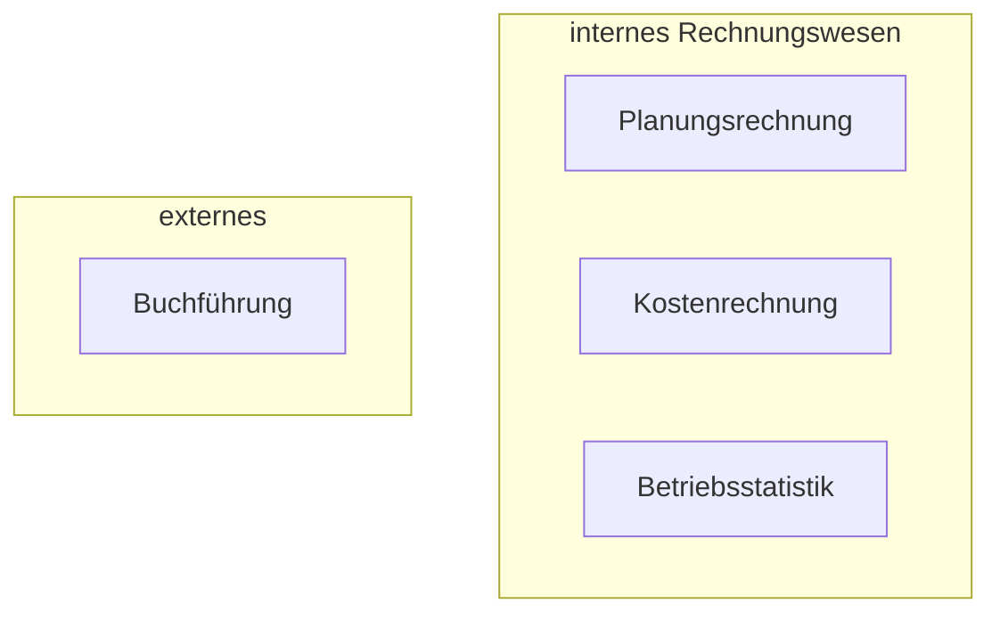

# 12.10.21 Einführung

### Bestandteile

- Grundlagen der Buchführung 
- Inventur, Inventar, Bilanz
- Buchungen
- Kontierungsregeln
- Grundbuch, Bilanzbuch
- Abschreibungen
- Jahresabschluss
- ...

### Einordnung

Teil des betrieblichen Rechnungswesens, aber **externes Rechnungswesen** [^3] :

### Aufgaben / Geschäftsfälle

unternehmerische Aufgaben im Betrieb

- Einkauf von Roh- , Hilfs- , und Betriebsstoffen (RHB)
- Lagerung + Verbrauch von RHB
- Herstellung von Produkten/Leistungen
- Bezahlung  + Auschreibungen von Rechnungen
    - unbezahlte Rechnungen: Verbindlichkeiten (kurzfristige Schulden)
    - Gegenteil: Forderungen (kurzfristige Außenstände)
- Vertrieb + Verkauf
- Berechnung + Zahlung v. Lohn (arbeiter) / Gehalt (angestellte)

=> **vermögenswirksame Tätigkeiten:** führt zu Einnahmen / Ausgaben, Aufwand [^1] + Ertrag [^2]

[^1]: Aufwand
[^2]: Ertrag: Wertverbrauch, bspw. Mietaufwand
[^3]: externes Rechnungswesen: Ergebnisse auch für Außenstehende zugänglich bspw. : Gläubiger, Aktionäre, Finanzamt (für Steuern)

