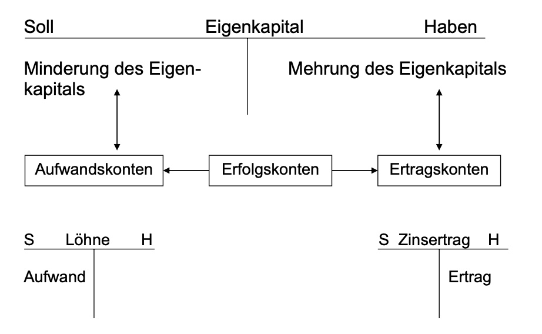

# 11.11.2021 Erfolgskonten

### Unterkonten

- haben immer selben Charakter wie Hauptkonto (Hauptkonto ist Passiv -> Unterkonto = passiv) 

- werden über Hauptkonto abgeschlossen

- haben weder Anfangs- / Endbestand !

**Beispiel**: Privatkonto

- Unterkonto von Eigenkapital (Passiv)
- => Entnahme auf Sollseite, Einlagen auf Habenseite
- wird über Eigenkapitalkonto abgeschlossen
- nur bei gesellschaftergeführten Rechtsformen (GmbH, OHG) 

#### Beispielrechnung

**Privat**

| Soll       | Haben            |
| ---------- | ---------------- |
| 30.000 (1) | 18.000 (2)       |
|            | Saldo 12.000 (3) |
| **30.000** | **30.000**       |

**Eigenkapital**

| Soll       | Haben      |
| ---------- | ---------- |
| 12.000 (3) | AB 50.000  |
| SB 38.000  |            |
| **50.000** | **50.000** |

Buchungen:

1.  `Fabrikant entnimmt betrieblichen Bankkonto 30.000,- für Privatzwecke` Buchungssatz: *Privat an Bank*
2.  `Besitzer bringt PKW in Betrieb im wert von 18.000 ein`  = *Fuhrpark an Privat*
3.  `Endjahresbilanz wird gezogen mit Hauptkonto` = *Eigenkapital an Privat*

### Erfolgskonten

bisher nur Bestandskonten ohne Berücksichtigung von Erträgen oder Aufwendungen am Ende des Jahres

#### Arten

| Aufwendungen                    | und Erträge                     |
| ------------------------------- | ------------------------------- |
| Marterialwert                   | Umsatzerlöse                    |
| Löhne, Gehälter, Sozialabgaben  | Zins-, Miet-, Pachterträge etc. |
| Wertminderung (Anlagen)         |                                 |
| Mieten, Steuern, Verwaltung ... |                                 |
| **vermindern Eigenkapital**     | **erhöhen Eigenkapital**        |

- für jede Art wird ein Unterkonto eingerichtet (Löhne, Miete,...) zur Buchung

- alle Erfolgskonten sind Unterkonten des **Eigenkapitalkontos**

#### Buchungsorte der Erfolgskonten

 Unterschiede zwischen Erfolgs- und Bestandskonten:

- Buchung auf Ertragskonto => Gegenbuchung auf bei Bestandskonto
    - Beispiel: Löhne mit Bank als Gegenbuchung 
- nicht aus Bilanz abgeleitet, also kein Anfangsbestand / Endbestand

#### Abschluss von Erfolgskonten

wegen Übersichtlichkeit nicht direkt über Eigenkapital, sondern **Gewinn- und Verlustkonto**

> **Gewinn- und Verlustkonto**: (GuV) zwischengeschaltetes Konto zum Abschluss 
>
> - auf Haben-Seite alle Erträge
>
> - auf Sollseite alle Aufwendungen
>
> Saldo zeigt Erfolg Unternehmens (Gewinn o. Verlust)

Saldo des GuV wird über Eigenkapital abgeschlossen 

Buchungssätze für den Abschluss der Erfolgskonten:
1. GuV an alle Aufwandskonten
2. Alle Ertragskonten an GuV
3. bei Gewinn: GuV an Eigenkapital 
4. bei Verlust: Eigenkapital an GuV 

---

#### Beispiel

Buchungen:

1. `Bankzinsen im Wert vom 500,-` = *Bank an Zinserträge* 500,-
2. `Mietzahlung in Höhe von 800,- mit Banküberweisung` = *Miete an Bank* 800,-
3. `Abschluss des Mietenkontos`=*GuV an Mietaufwand*  800,-
4. `Abschluss Zinsen` = *Zinserträge an GuV* 500,-
5. `Abschluss GuV` = *Eigenkapital an GuV* 300,-

Bank

| Soll    | Haben |
| ------- | ----- |
| AB 500  |       |
| (1) 500 |       |

Zinserträge

| Soll          | Haben   |
| ------------- | ------- |
| (4) Saldo 500 | (1) 500 |
| **500**       | **500** |

Mietaufwand

| Soll    | Haben         |
| ------- | ------------- |
| (2) 800 | (3) 800 Saldo |
| **800** | **800**       |

GuV

| Soll    | Haben                    |
| ------- | ------------------------ |
| (3) 800 | (4) 500                  |
|         | (5) 300 Saldo (Verlust!) |
| **800** | **800**                  |

Eigenkapital

| Soll       | Haben      |
| ---------- | ---------- |
| (5) 300    | AB 50.000  |
| SB 49.700  |            |
| **50.000** | **50.000** |

=> wir haben 300 Euro Verlust gemacht

