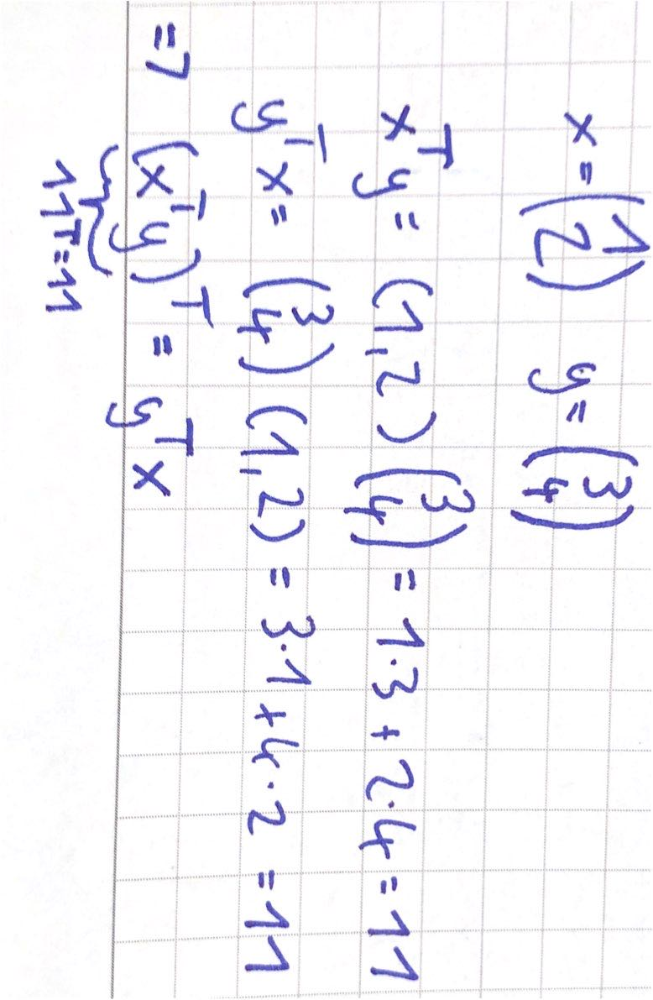
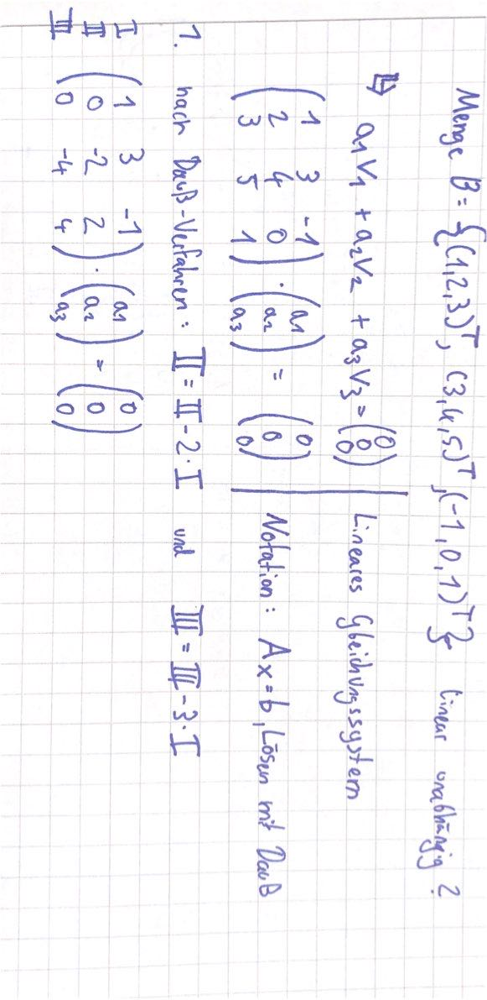
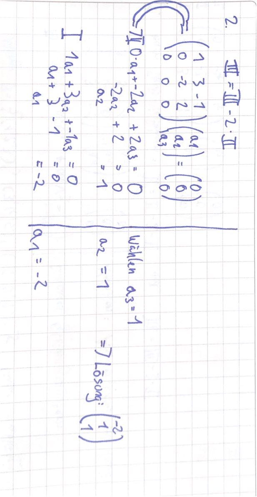

# Matrizen Weiterführung

Erkenntnis aus der Assoziativität: 

- Gleiches Ergebnis
- Unterschiedlicher Arbeitsaufwand ! 

### Transponieren

$(AB)^T = B^T A^T$ 

**Nullteiler:**

**Rechenbeispiel**

`Wir nehmen jetzt an, dass aus Rohstoffen/Ressourcen y zunächst Zwischenprodukte z hergestellt werden. In einem zweiten Schritt werden daraus, und unter Verwendung weiterer Ressourcen, Endprodukte x gefertigt. Wie viele Ressourcen y sind für die Produktion von x einzusetzen?`

### Linearkombinationen

> **Definition:** Seien v, i = 1,...,m Vektoren in R^n.
>
> Dann= $a_1v_1 + ... + a_mv_m$ = Linearkombination
>
> Menge aller Linearkombinationen= linearer Raum

eine Menge *M* heißt *linearer Raum,* wenn *M* bezüglich Addition + Multiplikation mit einem Skalar abgeschlossen ist

 *linear abhängig*: Menge von Vektoren, wenn eine Menge von *a1,a2,...* existiert, dass Resultat (0,0,...,0)^T ist 

- einen Vektor kann man durch die Anderen beschreiben

*Basis:* Menge $ B \in M $ (linearer Raum) = kleinstmögliche Anzahl an Vektoren zur Beschreibung 

- Vektoren der B sind *linear unabhängig*
- Standard-Einheitsvektor = *kanonische Basis* 

### Gaußsches Eliminationsverfahren

Beispiel eines Linearen Raumes: 

**Schritte:**

1. Transformieren der matrix in Stufenform durch Addition von Vielfachen von Zeilen auf Andere
2. Rücksubstitution: Löse das System in Stufenform

*Rang:* Anzahl Zeilen linear unabhängig in einer Matrix (nicht nur Nullen)

