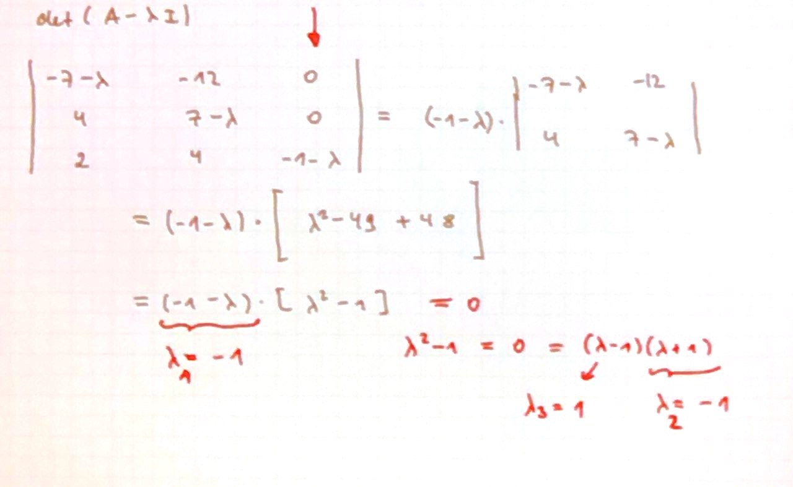
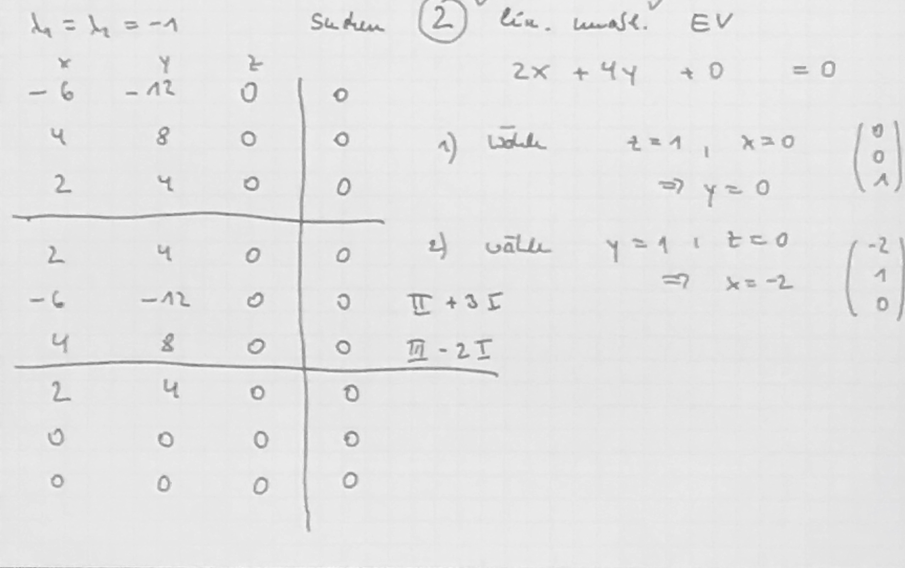

# 08.11.2021 Eigenwerte 

### Eigenwerte

> **Eigenwerte EW:** $\lambda$ wenn $Av = \lambda v $ mit $v \neq 0$ 

Berechnung (Beispiel 82): $ A = \left(\begin{array}{rrr}
0 & 1 \\ 
1 & 0 \\
\end{array}\right) $
$$
Eigenwerte \\
det (A - \lambda I) = det(\begin{array}{rrr}
 -y & 1 \\ 
1 & -y \\
\end{array}) = 0 \\
= -y^2 -1*1 = 0\implies y_1 = 1; y_2 = -1 \\

Eigenvektor:  \ (A-\lambda I ) v = 0\\
y_1 = 1:
\left(\begin{array}{rrr}
1 & -1 \\ 
-1 & 1 \\
\end{array}\right)
\left(\begin{array}{rrr}
x \\y 
\end{array}\right) 
= \left(\begin{array}{rrr}
0 \\0 
\end{array}\right) 
\\ \implies wenn \ x=y \ loesbar  = v_1 = (1,1)^T\\

y_2 = -1 : 
\left(\begin{array}{rrr}
1 & 1 \\ 
1 & 1 \\
\end{array}\right)
\left(\begin{array}{rrr}
x \\y 
\end{array}\right) 
= \left(\begin{array}{rrr}
0 \\0 
\end{array}\right)\\
\implies wenn \ x = -y \ loesbar = v_1 = (1,1)^T
$$

**Bemerkung:** wenn $\lambda$ Eigenwert der reellen Matrix, dann auch $\bar{\lambda}$ 

Beispiel 85: Eigenwerte:

Eigenvektoren: 

Besetzen der Matrix mit Vektoren und dann invertieren
$$
A = \left(\begin{array}{rrr}
0 & -2 & -3 \\ 
0 & 1  & 2\\
1 & 0 & 1
\end{array}\right) 
\implies A^{-1} = 
\left(\begin{array}{rrr}
-1 & -2 & 1 \\ 
-2 & -3  & 0\\
1 & 2 & 0
\end{array}\right)
$$

Eigenschaften der Eigenwerte (EW): 

- Eigenwert von *A* = Eigenwert von $A^T$ , aber **nicht** gleiche Eigenvektoren!
- Eigenwert von Diagonalmatrizen = Diagonaleinträge
- EW von $A$ = EW von $V^{-1}AV$
- A ist invertierter, wenn alle Eigenwerte nicht null !
- EW von $A^{-1}$ = $\frac{1}{EW} $ von A
- symmetrische Matrix: Eigenwerte reell

