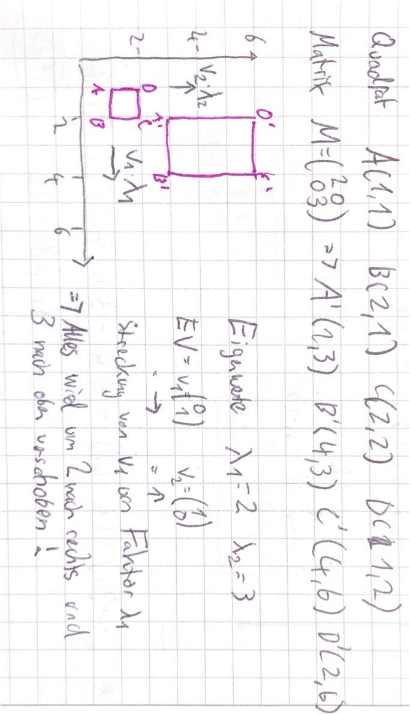
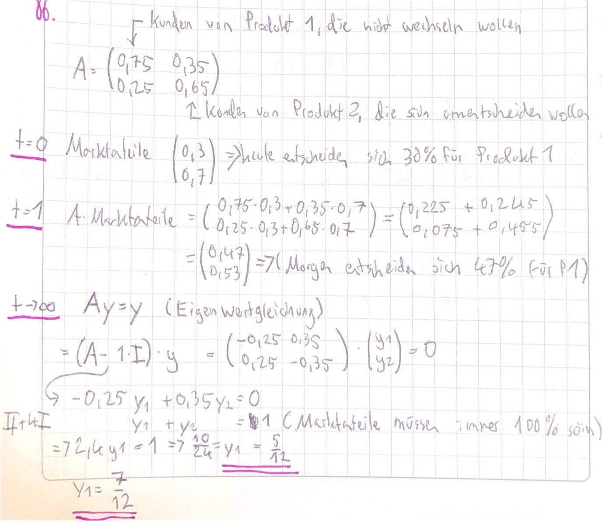
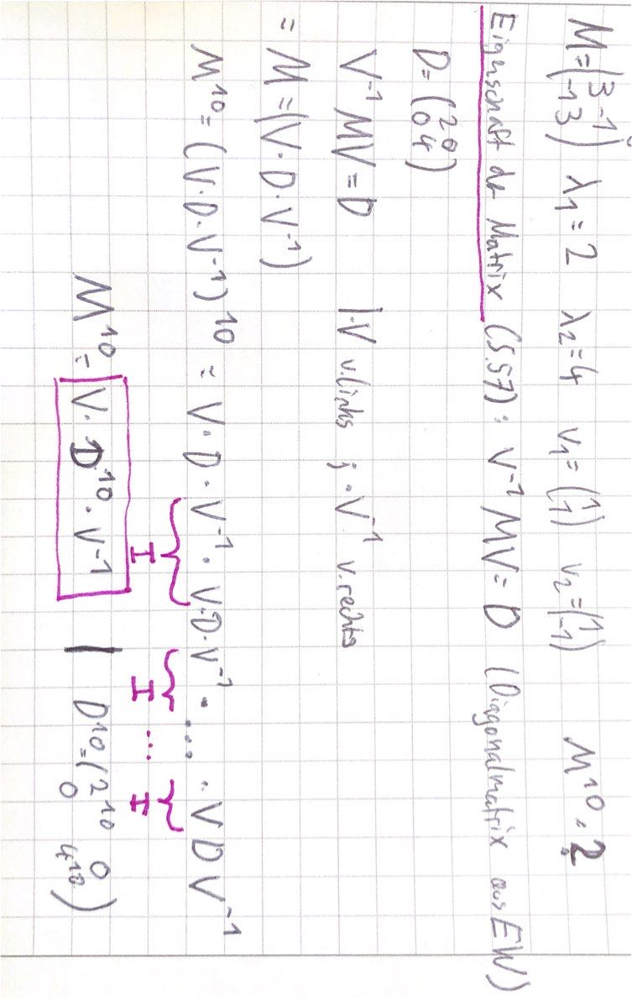
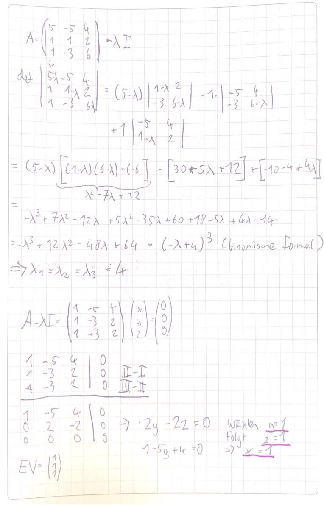
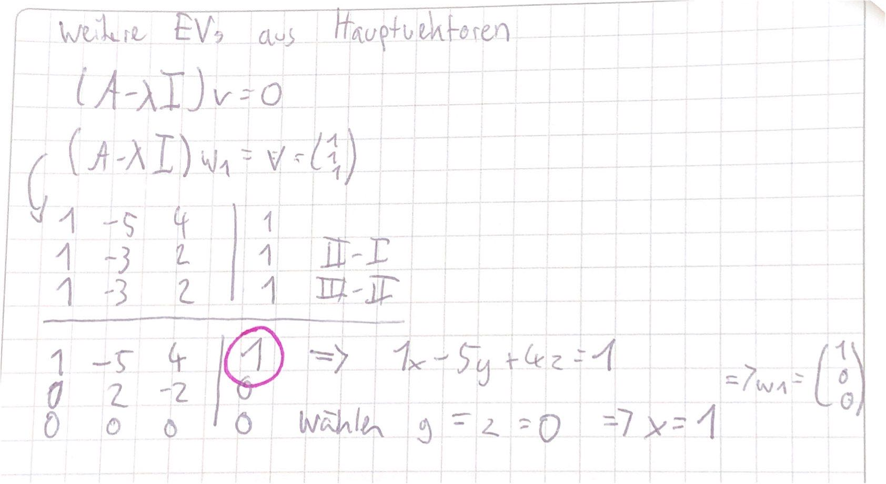

# 11.11.2021 Fibonacci

### Weiterführung zu Eigenwerten

$  det(A-\lambda I) = p_n(\lambda) = 0$  -> n-tes polynom von lambda

Geomentrische Deutung der EW und EV

Beispiel 86

`Auf einem Markt konkurrieren zu einem Zeitpunkt t = 0 zwei Produkte mit den Marktanteilen 0,3 und 0,7. Bezeichne aij = P (j → i) die Wahrscheinlichkeit, dass ein Kunde in einem Zeitschritt vom Produkt j auf Produkt i wechselt (bzw. nicht wechselt, für j = i). Die Matrix A = (aij) der Käuferfluktuation sei gegeben durch`

Ausgansmatrix $A = \left(\begin{array}{rrr}
0,75 & 0,35 \\ 
0,25 & 0,65 \\
\end{array}\right)$

### Fibonacci

$ F_0 = 1; F_1 = 1 \implies  F_{n +1} =  F_n + F_{n-1}$

Ausdrücken mit Matrizen

Berechnen der Potenzen von Matrizen (für $F^n$)

### Verallgemeinerte Eigenvektoren - Hauptvektoren

wenn man zu wenige Eigenvektoren hat = Problem!

##### Beispiel

 $A = \left(\begin{array}{rrr}
0 & 1 \\ 
0 & 0 \\
\end{array}\right)$ hat Eigenwerte $\lambda_1 = \lambda_2 = 0$

**Problem**: nur ein Eigenvektor $v = (1,0)^T$ 

Sagen als: Der Eigenwert $\lambda =0 $ hat 

- algebraische Vielfachheit 2 (Anzahl Eigenwerte), aber nur
- geometrische Vielfachheit 1 (Anzahl Eigenvektoren)* 

normalerweise geometrische = algebraische Vielfachheit

wenn nicht, dann Matrix **nicht diagonalisierbar!**

Rettung: **Hauptvektor**

> **Hauptvektor:** der Vektor $w \in \mathbb{C} $ falls $(A-\lambda I)^m w = 0$ für ein $ m \in \mathbb{N}$ 

##### Beispiel 92: 

Aber: für diese Klausur **nicht relevant** 

