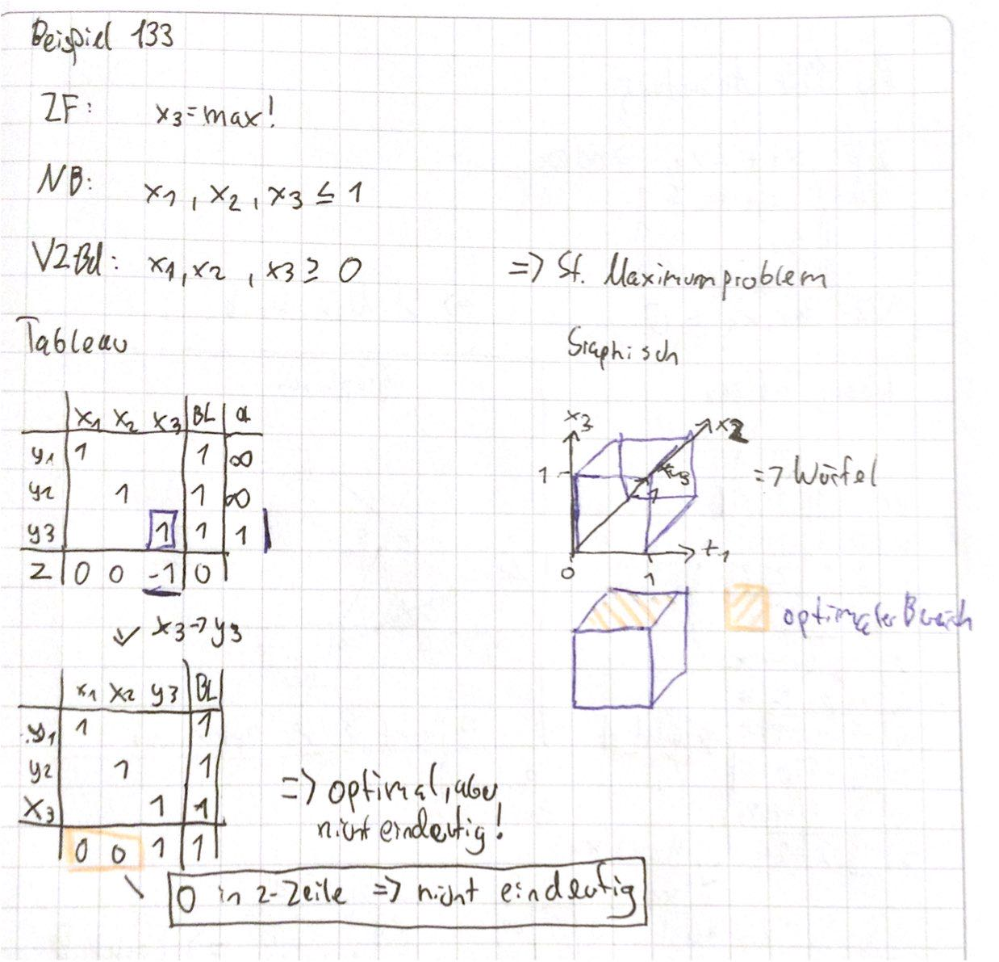
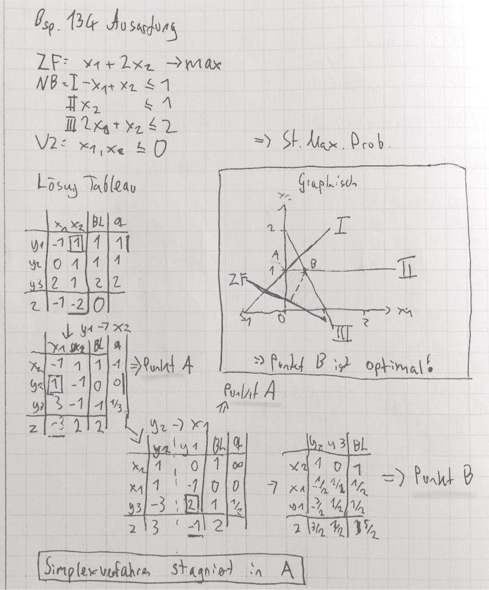
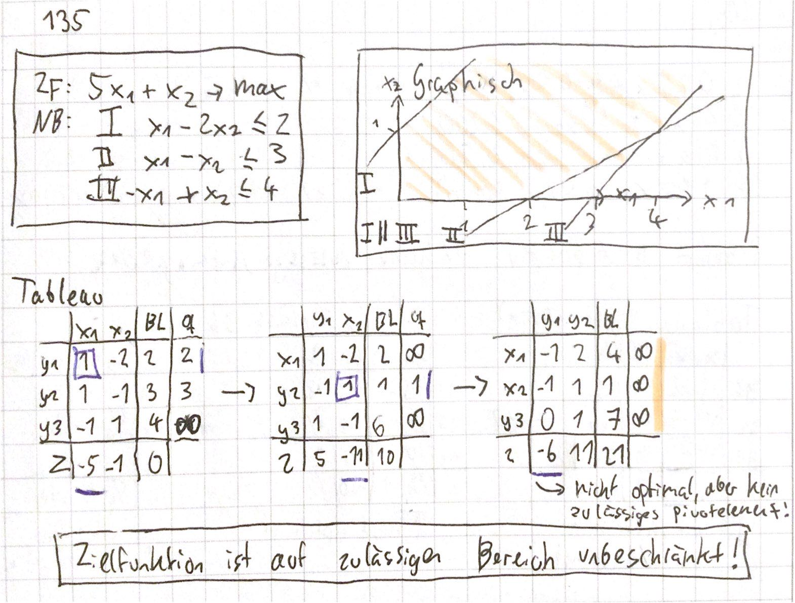
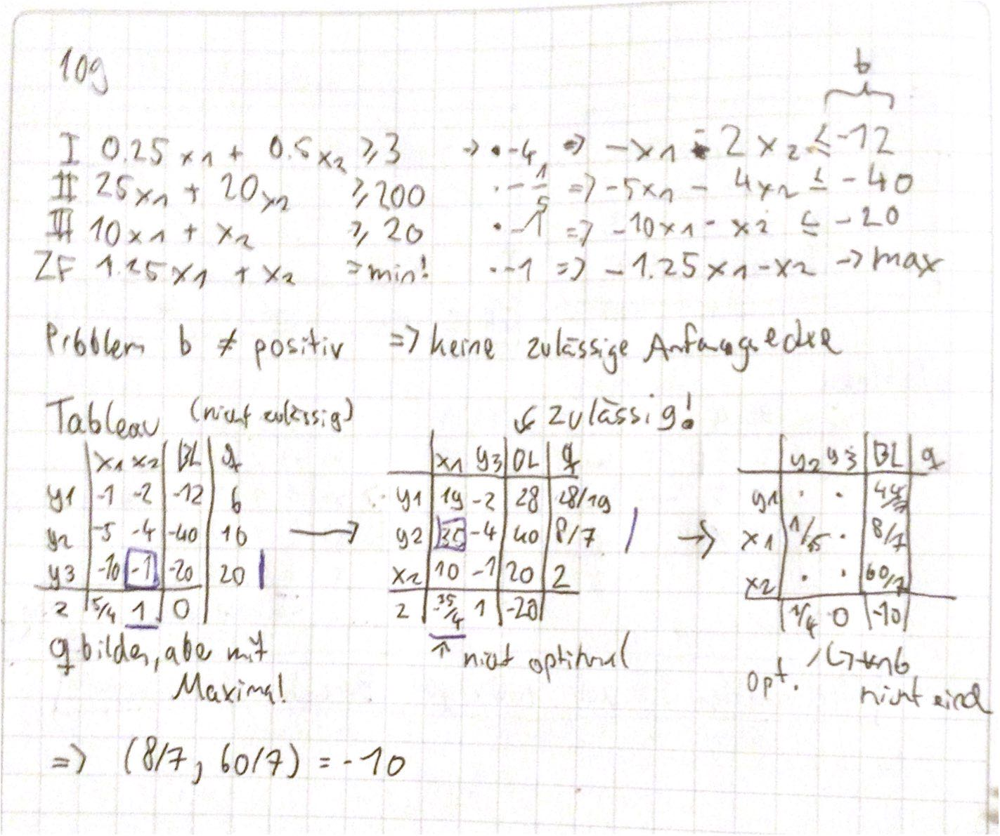

# 09.12.2021 Simplexverfahren II

### uneindeutige Lösung 

`z-Zeile hat 0` => **uneindeutige Lösung im Simplexverfahren** !

BSP 133:

### Ausartung

> **Ausartung:** einmaliges Festhängen des Simplexverfahrens aufgrund einer 0 in der Basislösung

`BL hat eine 0` => **Ausartung! **

BSP 134:

- hier : Ecke A ist **ausgeartet**, da Schnittpunkt von $I, II, und  \ x_2$
- Ungleichung 2 ist *überflüssig* , der Algorithmus bleibt in dieser Ecke hängen
- die 0 in der BL führt bei Rechteckregel zu keiner Veränderung (wenn in Pivotzeile)

### unbeschränkter Zielbereich

Bsp 135: 

hier : Zielbereich ist unbeschränkt!

- $ I || III $ beide Geraden sind parallel 

### Regeln Pivotelementauswahl

1. in z-Zeile niedrigsten Wert nehmen => (höchster negativer Betrag)
2. $BL-Spalte / ausgewaehlte  \ Spalte = q$ => niedrigster Wert
    - Werte von *q* die negativ sind = **verboten**
    - Werte von *q* die 0 sind = **verboten**
        - außer wenn entstehendes Pivotelement nicht 0 ist 
3. Treffpunkt von beiden niedrigsten Werten => **Pivotelement**
    - Pivotelement muss > 0 sein (positiv)

### Minimumprobleme

Erinnerung **Standardmaximumproblem:** 

- Zielfunktion: $max \ c^Tx $
- Vorzeichen: $x_i \ge 0$
- Ungleichungen: $ Ax \le b$
- $ b \ge 0$

Umformung eines Minimumproblems zu einem SMP

- ZF: $x_1 - x_2 = min \implies -x_1+x_2 = max$
- VZ: $x_i \implies \tilde{x_i} - \bar{x_i}$
- $Ax \ge b  * (-1) \implies -Ax \le -b$
- letzte Bedingung = kritisch! , da wichtig für Anfangsecke

Bsp: 109 

