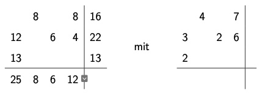
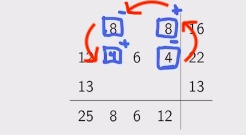
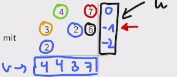
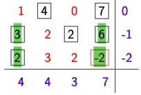
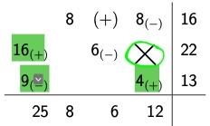

# 24.01.2022 Transportproblem 2

### Beispiel 161 f. 

links Mengentableau *X*, rechts Kostentableau *C* 

Transportkosten : $z = 186$ 

- Frage: was passiert, wenn wir $x_{24}$ um 4 senken 
- muss $x_{14}$ Um 4 erhöhen; $x_{12}$ Um 4 verringern; $x_{22}$ um 4 erhöhen 

=> Kreisförmig ausgebreitet = **Austauschkreis**

| Mengen                                          | Kosten                                          |
| ----------------------------------------------- | ----------------------------------------------- |
|  |  |

$$
\textbf{Entstehende Kosten} \\
\begin{aligned}
\triangle z : -4*6+4*7-4*4+4*5 =\\
4 * (-6+7-4+5) = \\
\text{relativer Preis} = 2
\end{aligned}
$$

#### MIDI-Algorithmus 

| Schritt                                                      | Anwendung                                                    | Darstellung                                     |
| ------------------------------------------------------------ | ------------------------------------------------------------ | ----------------------------------------------- |
| 1. setze $u_1 = 0$ und bestimme $u_2,...,u_n$ und $v_1,...,v_n$ | $u_1 = 0$ Gesetzt, dann $v_4=7$ eingetragen da 7+0 = 7 (rotes Kombielement) |  |
| 2. Bilde $\triangle_{ij} = c_{ij}- u_i - v_j$                | $\triangle_{2,4} = 6-7-u_2 \to u_2 = -1$ und so weiter für alle Felder |  |
| 3.wenn alle $\triangle_{ij} \ge0 \to$ Optimal                | wenn nicht => IV                                             |                                                 |
| 4a. Austauschkreis finden mithilfe eines Rechtecks           | Der Kreis besteht aus Elementen $ (2,1); (2,4), (3,1); (3,4)$ |  |
| 4b. zugehörige Verschiebung $d$ finden                       | Verschiebung = anzahl Austausch: in Mengentableau niedrigstes Element des Kreises = 4 |  |
| 4c. alle Elemente des Austauschkreises um $d$ Verringern/ erhöhen | bei jedem Plus $12 +4 = 16$                                  |  |
| 4d. wenn nicht optimal, alles wieder von vorne (Schritt 1)   |                                                              |                                                 |

