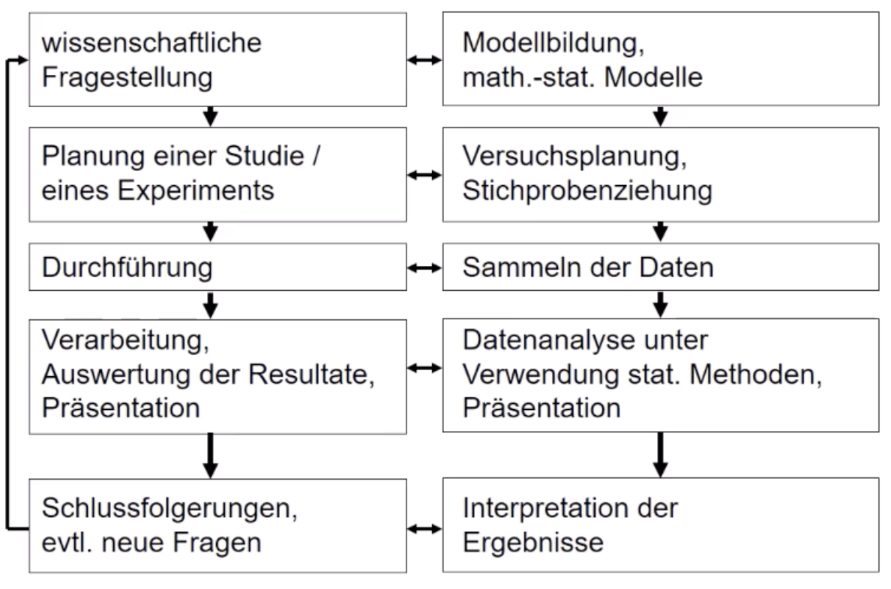

# 18.10.21 Statistik 

 Planung einer stat. Untersuchung:

### Grundbegriffe

> **Untersuchungseinheit:** Einzelobjekt der Untersuchung als *Merkmalsträger*

>**Grundgesamtheit:** Menge aller Untersuchungseinheiten
>Abgrenzen: sachlich / räumlich / zeitlich

> **Nettostichprobe**: tatsächlich befragte Patienten einer *Bruttostichprobe* 

#### Merkmale

*Untersuchungskategorie* mit spezifischer Ausprägung/ Wert bei einer Untersuchungseinheit 

- oft mehrere Merkmale pro Objekt
- Werte != nicht notwendig Zahlen

**Notation:**

Merkmal: X,Y,Z
Ausprägung: x,y,z / Beobachtungen: $x_1,x_2,...x_n$

**Unterscheidung von Merkmalen:**

- Nach Wirkung: beispielfunktion $y = a * x + b+\epsilon$
    - Zielgrößen *y*
    - Einflussgrößen *x*
    - Störgrößen $\epsilon$
- nach Informationsgehalt:
    1. Gering: mit Namenskategorie (qualitativ)
    2. Mittel: mit Ordnungskategorien (ordnenbar)
    3. Hoch: mit numerischer Ausprägung (quantitativ)

**Konsequenz:** nicht alle stat. Methoden für alle Merkmalstypen geeignet

