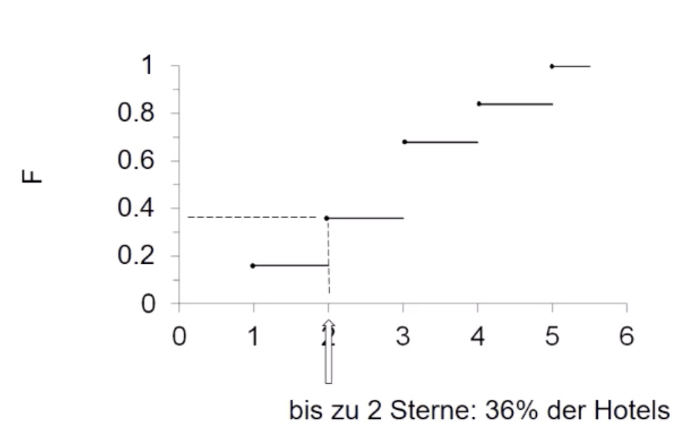

# 05.11.2021 Häufigkeiten

### kumulierte Verteilung

anders als bisherige Darstellungen diesesmal: *kumulierte Häufigkeitsverteilung*

> **kumulierte Häufigkeitsverteilung**: Berechnung der Anteile Ober/unterhalb einer bestimmten Grenze (bspw Armutsgrenze)

Allgemein Merkmal X: 

- *n* Beobachtungen, Werte: x*1*, ... ,x*n*
- zu jedem x: Anteil der Werte, die kleiner/gleich x ist => **empirische Verteilungsfunktion** von X
    - $F(x) = \sum_{j:a_j\leq x}$
    - F(x) = Anteil der Beobachtungen kleiner gleich x

> **empirische Verteilungsfunktion**: $F(x) = \sum_{j:a_j\leq x} mit \ 0\leq F(x) \leq 1$
>
> lesen als F(x) = Anteil der Beobachtungen kleiner gleich x

---

##### Beispiel: 

Graphische Darstellung:

---

#### Review: graphische Darstellungen

*Stab-, Säulen-, Balken-, Kreisdiagramm*:  nominal und ordinal skalierte Merkmale

*Histogramm*: metrisch skalierte (stetige) Merkmale , **klassiert**

## Statistische Kenngrößen

erlauben Zusammenfassung von Verteilung auf einzelne Zahlen

Arten: *Lage, Streuung, Schiefe, Konzentration*

### Lage

- *arithmetisches Mittel* ("Durchschnitt"): metrisch skalierte Merkmale
- *geometrisches Mittel:* metrisch > 0
- *Median* ("Mitte"): mindestens ordinale
- *Modus* ("Häufung"): mindestens ordinale

