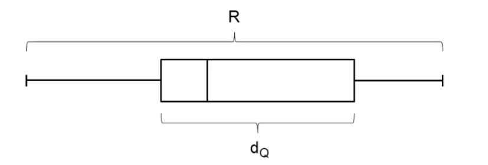

# 22.11.2021 Streuungsmaße

Darstellung der Variationsbreite von Beobachtungen

### einfache Streuungsmaße

- Spannweite (Gesamtbreite der Häufigkeitsverteilung): $x_{ (n) } - x_{ (1) }$
- Interquartilabstand: $d_Q = x_{0.75} - x_{0.25}$ 

### Streuungsmaße mit Lagebezug

##### MAD 

Median der absolute Abweichung vom Median

MAD $ = med\{ |x_i - x_{med}|, i= 1,\dots,n \}$

#### Standardabweichung

Mittelwert der (quadrierten) Abweichung vom Mittelwert

Voraussetzung: kardinal skaliertes Merkmal X

Berechnung:

1. Abweichung von $x_i$ von $\bar{x}$ und ihr Quadrat $(x_i - \bar{x})^2$ 
2. Mittelwert der Abweichung: $\frac{1}{n} * \sum^n_{i=1} (x_i - \bar{x})^2 = \tilde{s}^2$ = `Varianz` 
3. Quadratwurzel aus Varianz: $\sqrt{ \tilde{s}^2 }$ = `Standardabweichung`

vereinfachte Berechnung mithilfe von *Verschiebungssatz* (Formel S.8) = $\left( \frac{1}{n} \sum^n_{i=1} x_i^2 \right) - \bar{x}^2$

