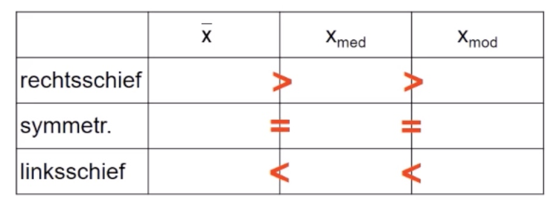

# 29.11.2021 Schiefemaße + Konzentrationsmaße

## Schiefe

Charaktersierung der Symmetrie einer Häufigkeitsverteilung

Kategorien: 

- *links / rechts*
- *schief / steil*

Beispiel: *linksschief + rechtssteil* = Anstieg auf linker Seite, starker Abfall rechts

Daumenregel: 

### Schiefekoeffizient

$$
g_m = \frac{
\frac{1}{n}*\sum_{i=1}^{n} (x_1 - \bar{x})^3
}
{\left(
\sqrt{\frac{1}{n}*\sum_{i=1}^{n} (x_1 - \bar{x})^2}
\right)^3}
$$

- Symmetrisch: $g_m = 0$
- rechtschief: $g_m > 0$
- linksschief: $g_m < 0$ 

## Konzentration

`wie sind Ausprägungen auf Objekte verteilt?` Oder: wer hat wieviele Kekse? :cookie:

