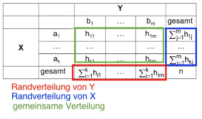
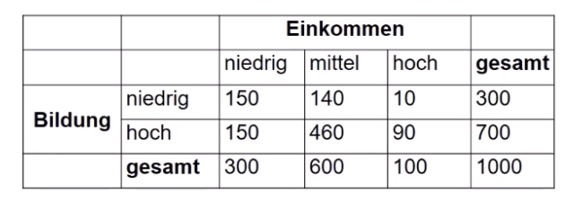
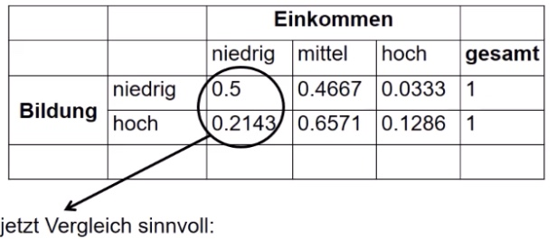
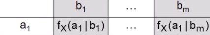

# 06.12.2021 Mehrdimensionale Merkmale 

meist ist bei statistischen Analysen mehr als ein Merkmal von Interesse => **mehrdimensionale Merkmale**

hier Fokus auf zwie Dimensionen

### Zweidimensionale Merkmale

zum Aussagetreffen immer gemeinsam erheben !

Darstellung mit Kontingenztafel: 

- zwei Merkmale X, Y
- Ausprägungen:
    - $a_1 ,..., a_k$ von X
    - $b_1,...,b_m$ von Y

verkürzte Schreibweise: $\sum_{j=1}^m h_{1j} = h_{1 \bullet}$ (Beispiel erste Zeile)

**Beispiel** Zusammenhang Einkommen <-> Bildung: 

| Absolute Verteilung                             | Bedingte Verteilung               |
| ----------------------------------------------- | --------------------------------- |
|  |  |

Bedingte Verteilung: $f_{\text{x}} = (a_i | b_j)$ 

Beispiel:

- bedingte Verteilung von X in Spalte 1, Zeile 1
- $f_{\text{x}} = (a_1 | b_1) = 0.5$ 
-  

Vergleich der bedingten Verteilung ist subjektiv => Objektivierung mit **Koeffizienten**

### Chi-Quadrat-Koeffizient

