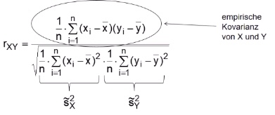
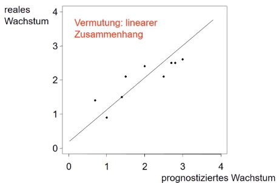

# 10.01.2022 Korrelation

Bestimmung des Zusammenhangs für höher skalierte Werte als die nominalen

### Pearsons Korrelationskoeffizient 

2 Merkmale X,Y mit Paaren $(x_1,y_1), ...,(x_n,y_n)$

Berechnung: 

Wertebereich: $-1 \le r_{XY} \le 1$ , 

- $|r_{XY}|$ = Zusammenhang
- Einteilung wie bei $K^*$ (stark, schwach,...)
- Vorzeichen => Richtung des Zusammenhangs

alternative Berechnung: 

#### Beispiel

Prognoziertes Wachstum (X) vs reales Wachstum (Y)

Darstellung im Streudiagramm:

- 

