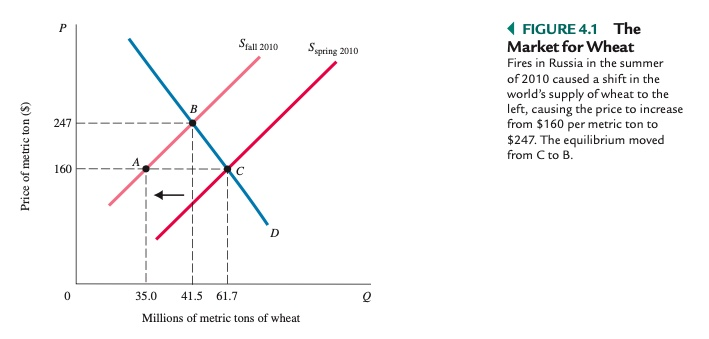
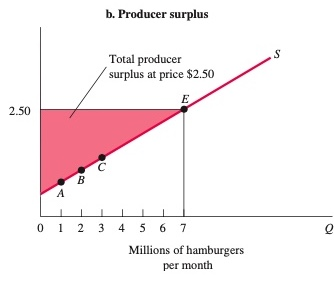

# Volkswirtschaftslehre Grundlagen

# Allgemein

### Unterbereiche

1. **Mikroökonomik**
    - Entscheidugngsprobleme auf individueller Basis
    - Koordintionsvorgänge
    - Fokus: Haushalte, Unternehmen
2. **Makroökonomik**
    - gesamtwirtschaftliche Vorgänge
    - Aggregat von Preisen, Indivuduen, Firmen zu Märtkten
    - Fokus: Preise, Beschäftigung, Inflation
3. **Verhaltensökonomik**
    - "neueres" Fach der VWL
    - psychische Verhaltensmuster hinter Entscheidungen
4. ...

### Methoden

- *Positive Ökonomik*: "Wie die Welt ist"
- *normative Ökonomik*: "Wie die Welt sein sollte"
- Modell: formale Aussage einer Theorie über den Zusammenhang zwischen Variablen
- Variable: Messung, die sich über Zeitraum verändern kann

### Begriffe

> **Kapital:** Produkt, die für Produktion neuer Güter eingesetzt werden
>
> **Produktionsfaktor:** Faktoren, die in produktionsprozess einfließen
>
> **Produktion:** Verwandlung Input -> Output
>
> **Ressourcen:**  Inputs von Natur gegeben / von früheren Generationen geschaffen
>
> **Produkte:** Objekte, die Nutzen generieren

### Grundfragen

1. Was wird produziert?
2. Wie wird es produziert?
3. Wer produziert es? 

# Mikroökonomie

## Vorteil

- *absoluter Vorteil:* Prduzent hat niedrigere Stückkosten als Konkurrent
- *relativer Vorteil:* Produzent hat niedrigere Opportunitätskosten pro Einheit als Konkurrent

> **Ricardos Theorie des komparativen Vorteils:** Spezialisierung und Handel verbessert Wohlfahrt aller Teilnehmer eines Marktes, selbst wenn einer den absoluten Vorteil hat

=> Handel ist förderlich, aufgrund starker positiver Wohlfahrtseffekte, kann aber zu kurzfristiger Umverteilung führen

## Produktionsmöglichkeitenkurve

> **Production Possibilities Frontier (PPF):** zeigt alle Kombinationen von zwei Gütern, die von Individuen/ Unternehmen / Gesellschaft produziert oder konsumiert werden können

Eigenschaften:

- negative Steigung
- zeigt Opportunitätskosten
    - wieviel von einem aufgeben, um anderes zu bekommen
- Punkte außerhalb der Linie = unerreichbar
- punkte innerhalb der Linie = ineffizient
- Wert der Steigerung = *MRT*

> **Marginal Rate of Transformation (MRT):** lokale Steigerung der Kurve an einem Punkt

## Märkte

### ökonomische Systeme

| Marktwirtschaft                              | Planwirtschaft                                   |
| -------------------------------------------- | ------------------------------------------------ |
| Individuen folgen Eigenzielen, preisgeleitet | Zentralregierung setzt Einkommen, Output, Preise |

=> reale Systeme immer Mischform

### der Markt

> **Markt:**  Institution zum Kaufen / Verkaufen; basierend auf Preismechanismus

- *Einheiten:*
    - **Unternehmen**: Organisation, die Ressourcen in Produkte umwandelt
    - **Haushalt:** Konsumenten von Produkten; Arbeitnehmer; Kapitalgeber
- *Arten:*
    - **Faktormarkt**: Märkte, auf denen Ressourcen gehandelt werden
        - Arbeitsmarkt, Kapitalmarkt, Ölmarkt, ...
    - **Produktmarkt:** Markt, auf dem Waren und Dienstleistungen getauscht werden

### Nachfrage

> **Gesetz der Nachfrage:** Nachfrage nach Produktfällt bei steigendem Preis

Einflüsse auf Nachfrage:

- Preis des Produktes
- verfügbares Haushaltseinkommen
- Preis der Alternativen
- Erwartung Vermögensentwicklung

Darstellung mit Nachfragekurve (hier auch aggregierte Nachfrage): 

- immer blau!
- negative Steigung
- schneidet X wegen Grenznutzen
- schneidet Y wegen Einkommensgrenze

### Angebot

> **Gesetz des Angebots:** positive Beziehung Preis <--> Menge

Einflüsse:

- Preis des Produktes im Markt
- Preis verwandter Produkte
- Herstellungskosten

Darstellung mit Angebitskurve

- immer rot
- positive Steigung

### Marktgleichgewicht

> Zustand, in dem Angebot = Gleichgewicht

- Überhangsnachfrage: Zustand, in dem nachgefragte Menge > Angebot übersteigt
- Überhangsangebot: Zustand, in dem der angebotene Menge Nachfrage übersteigt
- => beides führt zu Rekalibrierung => neuem Preis

> **Preismechanismus:** Prozess der Anpassung des Preises in freien Märkten

alternative Mechanismen der Verteilung:

- *Preisobergrenze:*  führt zu Überhangnachfrage
- *Schlangestehen:* => verlorene Lebenszeit, Schwarzmarkt
- *Rationierung* => Mangel, Korruption

## Wohlfahrt

> **Wohlfahrt:** Nutzen aller Individuen in einem aggregierten Markt

| Konsumentenrente                                             | Produzentenrente                                             |
| ------------------------------------------------------------ | ------------------------------------------------------------ |
|               |               |
| Differenz zwischen Höchstbetrag, den man bereit ist zu zahlen und Marktpreis | Different zwischen Produktionskosten und Marktpreis einer Firma |
| Beispiel: ich würde 5€ für Döner zahlen, er kostet aber nur 3 = 2€ Rente (Profit) für mich | Döner kostet 3€, Produktion aber nur 2€ = 1€ Profit = Rente  |

$Gesamtwohlfahrt = Konsumentenrente + Produzentenrente$

Wohlfahrtsverlust: bei fehlendem Marktgleichgewicht wie bei *Preisgrenzen, Minimumpreisen*, etc

### Haushalte

jeden Tag treffen Haushalte Entscheidungen aufgrund von Budgetbeschränkungen 

> **Budgetbeschränkung:** Grenzen, die den Entscheidungen eines Haushaltes gesetzt sind

Notation: $P_X * X + P_Y * Y = I$

- $P_X$ = Preis von Gut X
- $X$ = Gut X
- $I$ = Einkommen (Income)

Menge aller für Haushalt möglichen Güterkombinationen = Opportunitätsmenge

Auswirkungen einer Preissenkung:

- Ausweitung der Opportunitätsmenge
- andere Güter werden *"relativ"* billiger

### Nutzen
