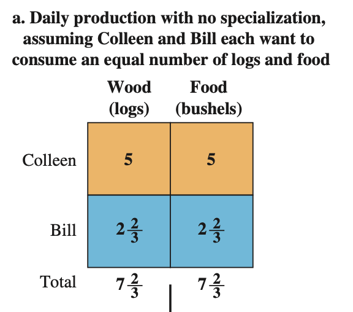
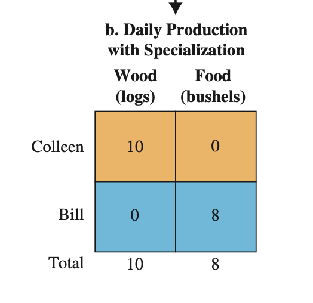

# 27.10.2021 Knappheit

### Das ökonomische Problem

fundamentale Grundanliegen ökonomischer Probleme: *knappe Ressourcen*

##### Begriffsklärungen:

> **Kapital:** Produkte, die für die Produktion neuer Güter eingesetzt werden

> **Produktionsfaktoren:** Faktoren, die in Produktionsprozess einfliessen

> **Produktion:** Prozess der Umwandlung knapper Ressourcen in nützliche Güter 

> **Ressourcen / Input:** von Natur gegeben oder früheren Generationen geschaffen

> **Produkte/ Output:** Güter, die Nutzen generieren

##### Drei Grundfragen: 

1. Was wird produziert?
2. Wie wird es produziert?
3. Wer erhält Produkte?

### komparativer Vorteil

Theorie des komparativen Vorteils (Ricardo): Spezialisierung + freier Handel verbessert Wohlfahrt aller Teilnehmer, auch den "absolut" effizienteren

> **absoluter Vorteil**: Produzent hat niedrigere absolute Kosten pro Einheit als Konkurrent

> **relativer Vorteil**: Produzent hat niedrigeren Opportunitätskosten pro Einheit als Konkurrent

##### Beispiel (S.61f): 

- Bill kann entweder produzieren: 10 Holz oder 10 Nahrung
- Colleen kann: 4 Holz, 8 Nahrung
- beide wollen von beidem gleichviel

| Ohne Handel                                                  | Mit Handel                                                   |
| ------------------------------------------------------------ | ------------------------------------------------------------ |
| beide arbeiten nur für sich | beide spezialisieren sich |

**=\>** Handel ist förderlich 

Internationaler Handel:

- starke positive Wohlfahrtseffekte
- kann aber zu kurzfristiger Umverteilung führen
- letztes jahrhundert stark gestiegen

##### Produktionsmöglichkeitskurve PPF

> **Produktionsmögllichkeitskurve:** zeigt alle Kombinationen von zwei Gütern, die von Individuum/Unternehmen/Gesellschaft effizient produziert werden können

Beispielhafte PPF (S.62)

Eigenschaften:

- negative Steigerung 
- Opportunitätskosten: wieviel von einem aufgeben, um anders zu bekommen 
- Punkte innerhalb der Linie: ineffizent
- Punkte außerhalb: nicht erreichbar
- Wert der Steigung = *Marginale Transformationsrate* 
- Effizienter Output: abhängig von Preisen beider Güter

> **marginale Transformationsrate (MRT):** Steigung der PPF, ändert sich in einem Graphen aber, also immer nur punktbezogen !

Wirtschaftswachstum: bewegt PPF nach oben und rechts

### ökonomische Systeme

Entscheidung der Gesellschaft über, wie Wirtschaft aufgebaut ist. 2 vorherschende Systeme: *Planwirtschaft + Marktwirtschaft*

>  **Planwirtschaft**: Zentralregierung setzt Outputziele, Einkommen und Preise

> **Marktwirtschaft:** Individuen folgen eigenen Zielen ohne zentrale Leitung (außer vom Markt)

reale Systeme sind Mischformen!

##### Markt:

- Institution  zum kaufen/verkaufen
- unterschiede in Komplexität, aber immer Käufer + Verkäufer
- jeder entscheidet frei, was er produziert / kauft
- alles basiert auf **Preismechanismus**

`ist der Markt naturgegeben?` historisch ja, jedoch Ausprägung unterschiedlich

Rolle des Staates im Markt:

-  in modernem Nationalstaat hat Staat *State Capacity*
- in mittelalterlichen Stadtstaaten: von Stadtherren abhängig

> **State Capacity:** Gewaltmonopol, erlaubt Durchsetzung von Steuern und Regeln

