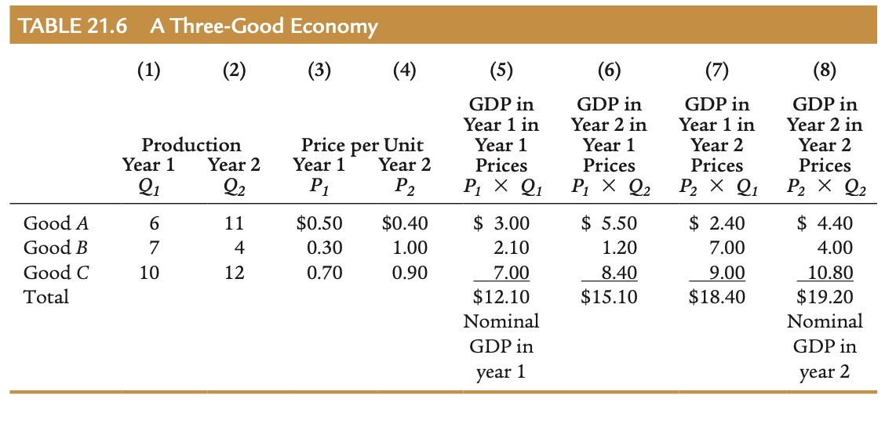
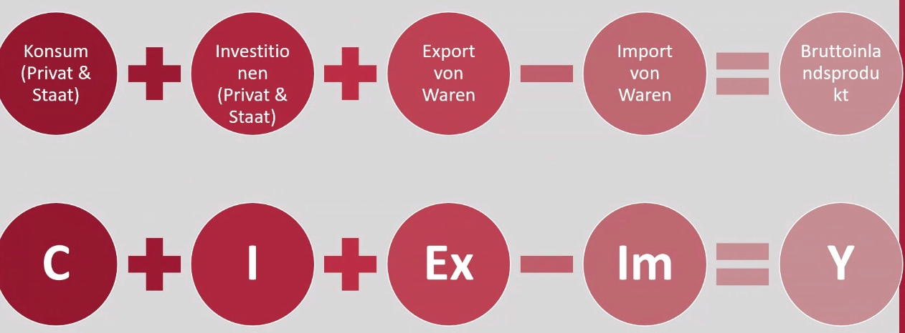

# 13.12.2021 Messung von Volkseinkommen

### BIP / BSP

> **Bruttoinlandsprodukt (BIP)** : gesamter Marktwert der Endprodukte + Dienstleistungen, die in einem Land erzeugt werden 

- in Deutschland ermittelt vom *Statistischen Bundesamt*  
- nur aktuelle Produktion (meist des Jahres)
- keine Transaktionen 

> **Bruttosozialprodukt:** Marktwert aller Endprodukte + Dienstleistungen, die von Bürgern eines Landes erzeugt werden

- unabhängig von Produktionsort ! 

`BIP: zentrale Kenngröße für wirtschaftspolitische Maßnahmen!`  

### Berechnung des BIP

#### Ausgabenansatz

Messung aller Ausgaben in der Periode

- Private Konsumausgaben (*C*) = Consumption
    - Ausgaben von Verbrauchern für Waren / Dienstleistungen
- Private Investitionen (*I*) = Investment
    - von Unternehmen und Privatpersonen für Bau, Maschinen ...
- Staatlicher Verbrauch (*G*) = Government
- Nettoexporte (*EX-IM*) = Export - Imports

Formel: $BIP = C+I+G+EX-IM$ 

#### Einkommensansatz

Messung aller Einkommen einer Periode

- Volkseinkommen (Einkommen der gesellschaftlichen PRoduktionsfaktoren)
- Arbeitnehmerentgelte
- Eigentümerentgelte 
- Unternehmensgewinne
- Zinsen
- Steuern

### Nominal vs Reales BIP 

Frage der Messung des BIP (in welcher Einheit)

1ter Weg : **Nominal:** Messung in aktuellen Dollar

*Problem mit Nominalmessung*: bei c.p. steigenden Preisen steigt BIP, trotz keiner Veränderung der Wirtschaft (nur Inflation) ! 

--> Messung in **realem** BIP 

- Gewichtung mithilfe vergangener Preise aus einem *Basisjahr*

Beispiel: 

Problem: Festpreisverfahren reagiert nicht auf Substitutionen aufgrund höherer Preise 

### Grenzen des BIP

- Steigerung des Glückes, der Freizeit, … ≠ Steigerung des BIPs

alternativer Ansatz: *HDI*

> **Human Development Index (HDI):** Messung verschiedener Dimensionen des Wohlergehen eines Landes

- informelle Wirtschaft nicht integriert -> insb. in Entwicklungsländern relevant


## Übung Berechnung


### Verwendungsrechnung



Aufschlüsselung der Komponenten

- **Konsumgüter**
    - Verbrauchsgüter
    - Gebrauchsgüter : *langlebig/kurzlebig*
    - Dienstleistungen
- **Investitionen**
    - Bruttoinvestitionen: *Gesamtwert aller neuen Kapitalgüter*
    - Abschreibungen: *Wertverlust während einer Periode*
    - Nettoinvestitionen: *Bruttoinv. - Abschreibungen*


### Verteilungsrechnung

```
Verfügbares Arbeitnehmerentgelt
+ Unternehmens + Vermögenseinkommen
   = Volkseinkommen
--------------------------------------
+ Produktions / Importabgaben an Staat
- Subventionen
+ Abschreibungem
   = Bruttonationaleinkommen
--------------------------------------
- Saldo aus anderern Weltteilen
   = Bruttoinlandsprodukt
	 ======================
```


