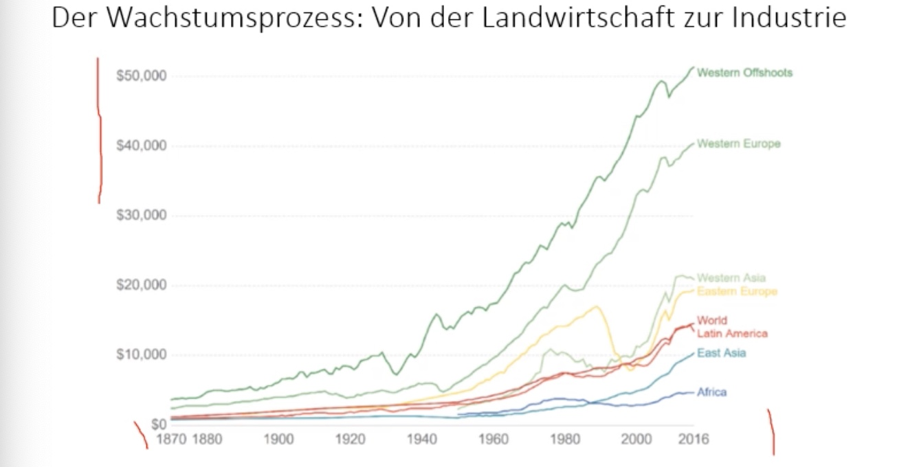
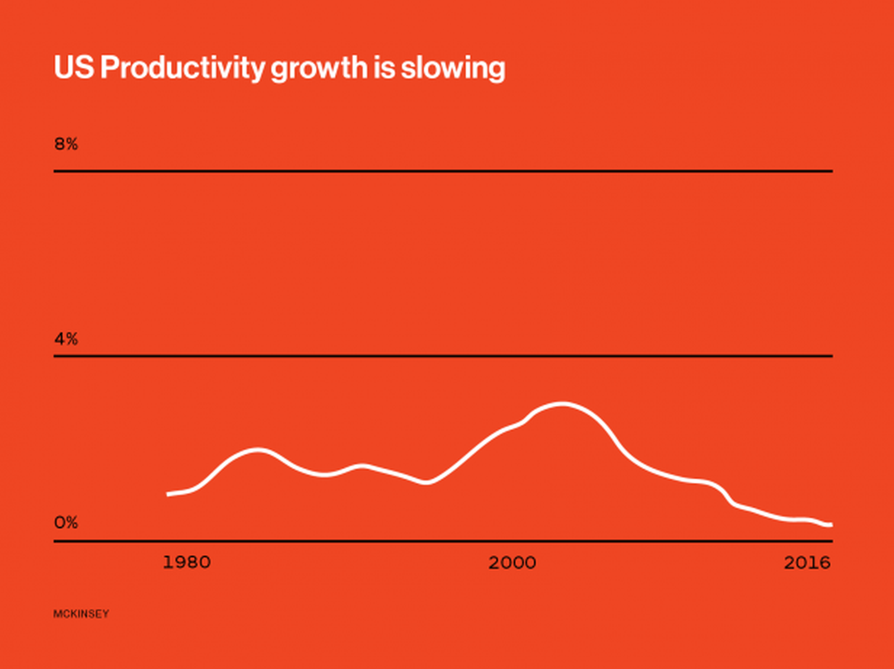

# 21.01.2022 langfristiges Wachstum

> **Produktionswachstum:** Wachstumsrate der Produktion der gesamten Wirtschaft

auch gemessen als:

- Pro-Kopf-Wachstum
- Wachstum der Arbeitsproduktivität (Output pro Arbeiter)

### Geschichte des Wachstums

- Beginn um 1750 in England durch neue *Maschinen* = (technischer Wandel)
- gesell. Wandel in städtische Industriegesellschaft
- durch mehr Arbeitskräfte + Steigerung der Produktivität

**merke:** *The Great Divide* = Auseinanderentwickeln der Staaten

verschiedene Ansätze zur Erklärung: 

#### Aufholprozess

- entwickelnde Länder zu höheren aufholen
- "Ausleihen" der Technologien der entwickelten Länder

funktioniert nicht so ganz, nur unter bestimmten **Voraussetzungen** : 

- Kapital, Institutionen, Technologien 

### Quellen des Wachstums

abhängig von **aggregierter  Produktionsfunktion** 

> **aggregierter Produktionsfunktion:** mathematische Funktion, die Produktion abhängig macht von eingesetzer Arbeit und Kapital

Beispiel:  $Y = 3*K^{1/3} L^{2/3}$

- Produktivität = $Y/L$
- Output pro Kapitaleinheit = $Y / K$
- Kapitalrendite = $\triangle Y / \triangle K$

#### Zunahme der Arbeit

- steigende Erwerbsrate
- Wachsende Bevölkerung

Bei gleichbleibendem Kapital = sinkende Produktivität

#### Zunahme des Sachkapitals

- steigende Ersparnisse
- Ausländische Direktinvestitionen ADI

bei gleichbleibender Arbeit = sinkende Zinsen

#### Zunahme der Qualität der Arbeitskräfte 

- historischer Anstieg des Bildungsniveaus

=> erhöhte Produktivität

#### Zunahme der Quakität des Kapitals

- neue Technologien / Innovationen

=> steigert Produktivität

### Produktivitätsparadox

seit Jahren Grenzproduktivität steigt langsamer 

- Trotz *Computer Age* keine starken Produktivitätssteigerungen 

### Umwelt und Wachstum

Gibt es einen Zusammenhang zwischen beiden?

 

siehe dazu auch *Club of Rome: Grenzen des Wachstums* 