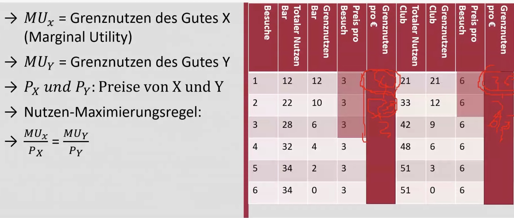

# Formelsammlung VWL

## Mikroökonomie

### Preiselastizität

- Berechnung: $|\frac{(Q_2-Q_1)}{(P_2-P_1)}*\frac{P_1}{Q_1} |$
- Wertebereich: 
    - $0 < \epsilon <1$ = unelastisch (geringe Nachfrageänderung bei Preisänderung)
    - $1 < \epsilon < \infty$: elastisch (starke Nachfrageänderung bei Preisänderung)

### Opportunitätskosten

Ausgangstabelle

| *Dauer pro Stunde* | Sandwich | Tacos |
| ------------------ | -------- | ----- |
| **Olaf**           | 80       | 20    |
| **Angela**         | 100      | 30    |

Opportunitätskosten

|            | Sandwich     | Tacos        |
| ---------- | ------------ | ------------ |
| **Olaf**   | 20/80 = 0.25 | 20/80 = 0.25 |
| **Angela** | 0.3          | 3.333        |

Lesen als: [1,1] = 80/20 = Wieviel Tacos kann Olaf statt Sandwiches machen = 0.25 in Einheit Tacos 

### Produkt der Arbeit

- durchschnittliches Produkt der Arbeit: $\frac{Totale \ Produktion}{Totale \ Einheiten \ Arbeit}$
- Grenznutzen: zusätzlicher Nutzen pro Arbeiter (nur aus Tabelle entnehmbar)
    - oder als Ableitung (**nicht relevant**)

### Budgetbeschränkung / Einkommen

- Berechnung: $P_X * X+ P_Y *  Y = I $
    - $P_X$ = Preis des Gutes X
    - *X* = konsumierte Menge von X
    - $I$ = Einkommen (Income)

### Grenznutzen

## Makroökonomie

### Wachstum

- beispielhafte Produktionsfunktion: $Y = 3*K^{1/3} L^{2/3}$
    - Produktivität = $Y/L$
    - Output pro Kapitaleinheit = $Y / K$
    - Kapitalrendite = $\triangle Y / \triangle K$
    - Kapitalintensität: $L/Y$ (Kapital pro Arbeiter)

### Wachstumsrate

- Wachstumsrate je Zeiteinheit : $p_t = \frac{x_t} {x_{t-1} } - 1$
- durchschnittliche Wachstumsrate pro Periode: $\bar{p} = (\frac{x_n}{x_0})^\frac{1}{n} - 1$ 
    - $x_0$ Anfangswert
    - $x_n$ Endwert
    - $n$  = Anzahl Perioden

### Arbeitslosigkeit

- Arbeitslosenquote: $\frac{Arbeitslose}{Berufstätige + Arbeitslose}$
- Erwerbsquote: $\frac{Erwerbsbevölkerung}{Gesamtbevölkerung}$
- Erwerbsbevölkerung: $Arbeitslose + Arbeitende$

### Lohnquote

Berechnung: $\frac{Arbeitnehmerentgelt}{Volkseinkommen}$

### Produktivität

- Produktion pro Arbeitsstunde: $\frac{Y}{L*\bar{h}}$
    - $Y$ = Gesamtoutput
    - $L$ = Erwerbstätige 
    - $\bar{h}$ auch AWH = durschnittliche Arbeitszeit pro Jahr

