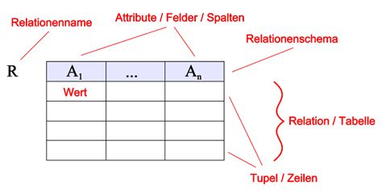
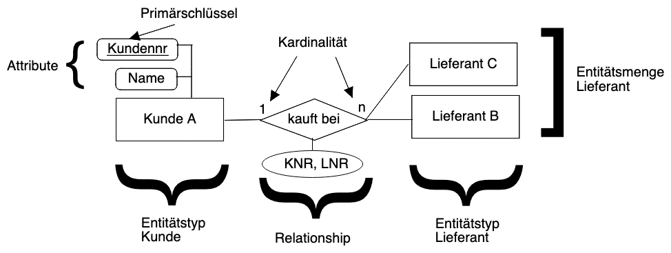
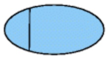
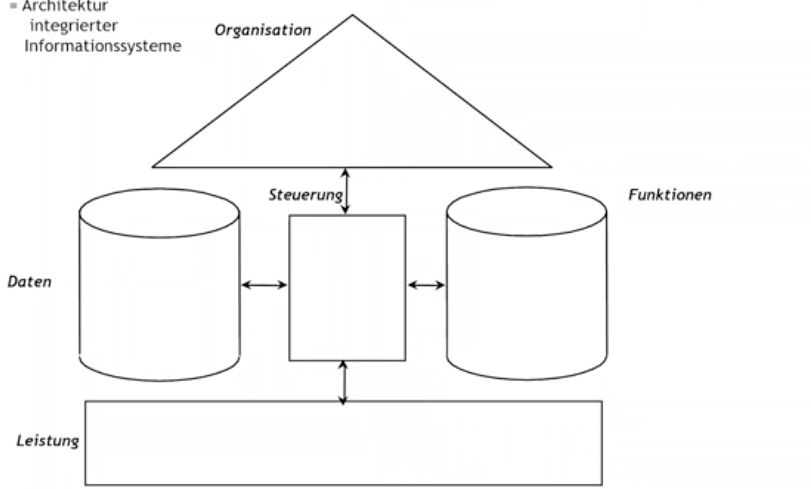

# Wirtschaftsinformatik

## Allgemein

> **Wirtschaftsinformatik:** Konzeption, Einführung, Wartung, Nutzung von computergestützten Informationssystemen in Betrieben

- Bedeutung zunehmen durch Wichtigkeit von Daten in heutigen Unternehmen
- mehr als reine Computerprogramme, sondern im soziotechnischen System von Mensch => Maschine => Aufgabe

### Daten
> Zeichen, die aufgrund von Vereinbarungen Informationen enthalten

| Hierarchie der Daten | Beispiel               |
| -------------------- | ---------------------- |
| 1. Zeichen           | 11                     |
| 2. Daten             | 11 Grad                |
| 3. Information       | 11 Grad = kalt         |
| 4. Wissen            | kalt = Jacke mitnehmen |

- codiert mit Bits / Bytes
- verarbeitet mit *Programmen*
- organisert in *Dateien*

> **Programm:** in *Programmiersprache* formulierter *Algorithmus*

> **Algorithmus:** definierte Handlungsvorschrift zur Problemlösung

> **Programmiersprache:** Sprache mit Syntax (Regeln) und Semantik (Bedeutung) zur Implementierung von Algorithmen in computerveständlicher Weise

> **Datei:** komplexer Datentyp für dauerhafte Speicherung von Informationen

Speicherung in **Datenbanken!**

# Datenbanksystem

System aus *Datenbankmanagementsystem* und *Datenbank*

| Datenbankmanagementsystem (DBMS)       | Datenbank                                  |
| -------------------------------------- | ------------------------------------------ |
| System zur Datenverwaltung und Zugriff | mehrere verknüpfte Tabellen                |
| Regelbasiert (Syntax)                  | in relationellem Modell                    |
| sicher (mit Zugriffsrechten)           | Vorteil: intuitiv + einfache Speicherung   |
| Beispiele: MySQL, SQLite,...           | Darstellung mit Entity-Relationship-Modell |

## relationelles Modell

Ansammlung von Tabellen, die mithilfe von Schlüsseln verbunden werden

- bestehend aus Relation (Tabelle) mit Attributen (Spalten) nach einem Schema
- Beispiel: 

um diese Tabellen auf einheitliches System zu bringen : **Normalisierung** in mehreren Stufen für minimale Redundanz an Daten

Ausganstabelle: 

### 1. Normalform

| Vorgang                   | Anwendung                                              |
| ------------------------- | ------------------------------------------------------ |
| Primärschlüssel festlegen | CD_ID = Primärschlüssel                                |
| Felder atomatiseren       | Album => Künstler und Album, Titelliste wird erweitert |


### 2. Normalform

> **(funktionelle) Abhängigkeit:** wenn ein Attribut immer durch ein anderes Attribut bestimmt wird, ist es abhängig von ihm

Beispiel:

- Vorname ist abhängig von Matrikelnummer, da jeder Matrikelnummer = ein Name $Name \to MNr$
- Matrikelnummer ist **nicht** abhängig von Name, da es auch Namen gibt, die sich doppeln

| Vorgehen                                                   | Anwendung                                        |
| ---------------------------------------------------------- | ------------------------------------------------ |
| keine Nichtschlüsselattribute abhängig von Primärschlüssel | Auslagern von Tracks und Titel in eigene Tabelle |


### 3. Normalform

| Vorgehen                                                 | Anwendung                                                    |
| -------------------------------------------------------- | ------------------------------------------------------------ |
| jegliche NSA, die von anderen NSA abhängig sind auslagen | Interpret und Gründungsjahr sind abhängig => auslagern in Tabelle |


## Entity-Relationship-Modell

- Modell zur Beschreibung der Systematik einer Datenbank

Bestandteile:

- bestehend aus *Entitäten* mit *Attributen* (Eigenschaften), dabei jeweils ein Primärschlüssel
- Menge aus allen Entitäten eines Types ist *Entitätsmenge*
- Entitäten sind verbunden mit *Relations* (Beziehungen), wobei in der Verbindung die jeweiligen Primärschlüssel angegeben werden
    - können Kardinalitäten haben (1:1, 1:n, n:m)



Umwandlungsregeln zu einer Datenbank:

- jeder Entitätstyp eigene Tabelle
- n:m Kardinalität mithilfe eigener Tabelle darstellen
- 1:n Kardinalität: in Tabelle des n-Typs den Primärschlüssel des 1-Typs

# Geschäftsprozessmanagement

> **GPM:** Strategie der prozessorientierten Unternehmensführung

> **Geschäftsprozess:** inhaltlich abgeschlossene Folge von Aktivitäten zur Bearbeitung einer Aufgabe

Vorteile:

- schnelle Anpussung / Änderung von Workflows
- Qualitätsteigerung

Ebenen von GPs:

- Strategisch: *welche Leistung?* 
- Taktisch: *wie Leistung erstellen?*
- Operativ: *wie umsetzen?*

Ziele: 

- Kundenausrichtung
- Flexibilität

Umsetzung mit *Geschäftsprozessmodellierung* 

> **GPM:** Identifikation, Analyse, Gestaltung von Geschäftsprozessen

## Modellierung mit EPK

> **EPK:** Ereignisgesteuerte Prozessketten, Modellierungsprache

Bestandteile

| Ereignis                                                  | Funktion                                                  | Konnektor                                                 |
| --------------------------------------------------------- | --------------------------------------------------------- | --------------------------------------------------------- |
|  |  |  |
| passive Komponente                                        | aktive Komponente                                         | verbindende Komponente                                    |
| Substantiv + Partizip (Rechnung erstellt)                 | Substantiv + Partizip (Rechnung bearbeiten)               |                                                           |

Konnektoren:

- AND: wenn alle Ereignisse eintreten / Funktionen bearbeitet wurden => Funktion/Ereignis auslösen
  - ```mermaid
    graph TD
    1{{Notizen zusammengefasst}}
    2{{Probeklausur erledigt}}
    3{{Kommilitonen genervt}}
    1 & 2 & 3 --> 4((AND)) --> 5[Klausur verkacken]
    ```
- OR: wenn mind. eine Funktion ausgeführt wird => Ereignis auslösen
- XOR: wenn genau ein Funktion ausgeführt wird =>Ereignis  auslösen

Regeln:

- Beginn / Ende mit Ereignis
- kein Objekt ohne Verbindung
- pro Element nur eine Verbindung (außer Konnektoren)
- Wechsel Ereignis | Funktion
- Ereignisse können keine OR/XOR auslösen, da kein Entscheidungscharakter

Verfeinerung: Unter-EPK zur genaueren Darstellung einer Funktion

### Erweiterte EPK (eEPK) 

erweitert EPK um Objekte, die an Funktionen angefügt werden können

| Organisationseinheit                                      | Dokument                                                  | Datenbank                                                 | Anwendungssystem (wie Excel)                              |
| --------------------------------------------------------- | --------------------------------------------------------- | --------------------------------------------------------- | --------------------------------------------------------- |
|  |  |  |  |

Beispiel für eEPK

## Modellierung mit ARIS

- ***Ar**chitektur integrierter **I**nformations**S**ysteme*
- Architekturmodell für Erweiterung der EPK
- bestehend aus 5 Schichten



| Sicht        | Inhalt                                                | Darstellung    |
| ------------ | ----------------------------------------------------- | -------------- |
| Organisation | alle Ressourcen / Einheiten                           | Organigramm    |
| Daten        | Datenbetreffende Ereignisse / Objekte                 | ERM            |
| Steuerung    | zeitlich logischer Plan und Verknüpfung aller Sichten | EPK            |
| Funktion     | Modell aller verfügbaren Funktionen                   | Funktionsliste |
| Leistung     | Modell der Bestandteile einer Leitung                 | Baumdiagramm   |

Leistungssicht Beispiel:

```mermaid
graph TD
Auto --> Reifen & Türen
Reifen --> Felgen & Kautschuk
```

## Prozessoptimierung

Ziele:

- Kostensenkung
- Zeitersparnis
- Transparenz

2 Arten:

| Art                                 | Stärke                          | Ausführend                     | Zeitrahmen                |
| ----------------------------------- | ------------------------------- | ------------------------------ | ------------------------- |
| **Process Reengineering**           | große weitgreifende Veränderung | von Geschäftsleitung ausgehend | schlagartig implementiert |
| **Continous Process Optimitsation** | kleine Schritte                 | von Mitarbeitern ausgehend     | kontinuerlich             |

### Prozessautomatisierung

- Erleichterung von Aufgaben
- für Prozesse mit geringer Intensität und hohem Wiederholgsgrad
- mithilfe eines *Workflowmanagementsystems*

> **WFMS**: System zur Automatisierung von Prozessen; Fokussierung auf Logistik der Datenweitergabe (bspw. automatisches Weiterleiten von Daten / Aufträgen,...)


# Anwendungssysteme AWS

## Informationssystem

> **IS:** soziotechnisches Systeme zur Bereistellung von Information + Kommunikation

- zur Effizienzsteigerung
- schnelle Iteration neuer Produkte


## AW-Systeme

> **AWS:** Softwaresystem zur Durchführung von Aufgaben in unterschiedlichen Unternehmensbereichen

Ziele:

- Unterstützung betrieblicher Anwendungen
- Lösung von fachlichen Problemen (bspw. Lohnkalkulation)

Daten in AWS:

- in zentraler Datenbank gespeichert
- um Redundanzen zu vermeiden
- systematisiert nach:
    - Veränderbarkeit : *Stammdaten | Bewegungsdaten*
    - Darstellung: *grafisch | alphanumerisch*
    - Zeitbezug: *historisch | aktuell*

### Innerbetriebliche AWSysteme


> **Enterprise Resource Planing System (ERP)**: integriertes betriebswirtschaftliches Softwarepaket 

- erlaubt Organisationen von Geschäftsprozessen in allen Abteilungen
- modulare Teilsysteme mit gemeinsamer Datenbasis

Bestandteile (Module):

- Personalsystem
- Vertriebssystem
- Finanzanwendung
- Produktionsplanungssystem

Risiko:

- Abhängig von einem Anbieter
- Verlust der Unternehmenseigenheiten da vorgefertigtes Paket

### Unternehmensübergreifende AWS


> **Supply-Chain-Management (SCM):** System zur Planung, Durchführung, Steuerung des Material / Informationsflusses zwischen Unternehmen

Ziele:

- enge Zusammenarbeit
- Abschaffung Friktion
- optimaler Materialfluss
- Verhinderung *Peitscheneffekt*

> **Peitscheneffekt**: verzögerte Informations-Weitergabe von Bestellmengen führen zu extremen Schwankungen beim Hersteller 

Arten der Integration:

1. Teilen der Auftragsinformation
    - simple Weitergabe der Bestellmenge
2. Teilen der Nachfrageinformation
    - Echtzeit-Datenweiterleitung der Nachfrage
3. Vendor-Managed-Inventory
    - Lieferant bekommt vollständigen Zugriff auf Lager + Daten
    - im Gegenzug vollständiges Retourenrecht

