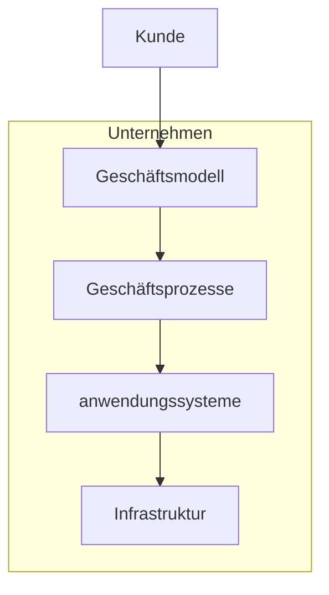

# Wirtschaftsinformatik

### Bedeutung

Informationen = Produktionsfaktor / Ressource

Bewirtschaftung der Information = **Wirtschaftsinformatik**

bestmöglicher Einsatz der Ressource Information (Hinblick Unternehmensziele) durch: 

- **Enabler:** Geschäftsmodelle durch Information ( Online Handel, Soziale Medien)
- **Align**: IT als Unterstützer geschäftlicher Impulse

>  WI: **Konzeption, Entwicklung, Einführung, Wartung, Nutzung** von Systemen in von computergestützte Informationsverarbeitung-Systemen in **Betrieben**

Herausforderungen: Internet of Things, Web 2.0 

### Klausur

Dauer: 90 Minuten

Inhalt aus VL + Übungen

Struktur: 

- 28% Multiple Choice (4-5 Ja/Nein Antworten)
- 18% Verständnisfragen ( ggfs Multiple Choice)
- 54% Bearbeitungsaufgaben über Modellierung (Themen die in VL + Ü dran waren)

### Lernziele 

Einführung in Anwendungssysteme und

| Technologische Grundlagen     | Informations und Prozessmanagement | Methodische Grundlagen   |
| ----------------------------- | ---------------------------------- | ------------------------ |
| Datenverarbeitung             | betriebliches InfoManagement       | Datenmodellierung        |
| Rechner: Aufbau, Funktion ... | Geschäftsprozesse (EPK, ARUS)      | Relationelle Datenbanken |
| Technologische Trends         | Management von GP                  | UML-Diagramme            |

