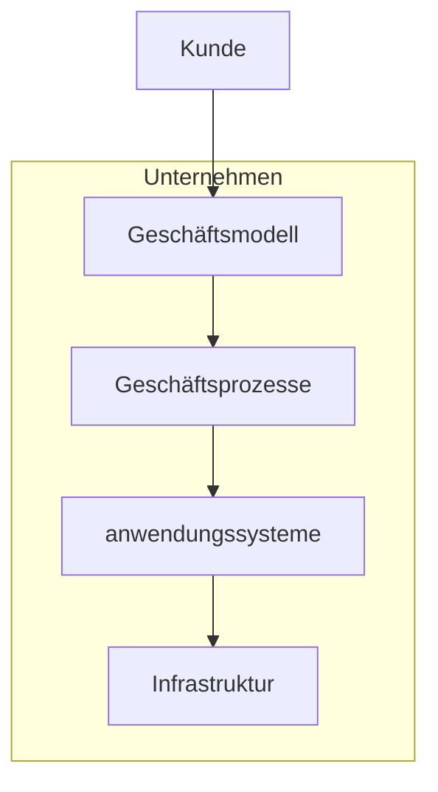
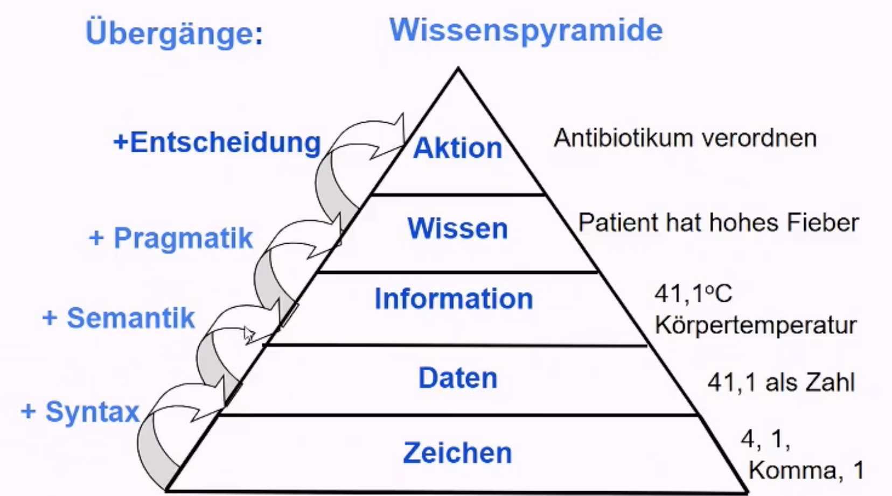

# Wirtschaftsinfo

### Bedeutung

Informationen = Produktionsfaktor / Ressource

Bewirtschaftung der Information = **Wirtschaftsinformatik**

bestmöglicher Einsatz der Ressource Information (Hinblick Unternehmensziele) durch: 

- **Enabler:** Geschäftsmodelle durch Information ( Online Handel, Soziale Medien)
- **Align**: IT als Unterstützer geschäftlicher Impulse

Herausforderungen der WiInfoler: Internet of Things, Web 2.0 

### Definitionen

>  WI: **Konzeption, Entwicklung, Einführung, Wartung, Nutzung** von Systemen in von computergestützte Informationsverarbeitung-Systemen in **Betrieben**
>
>  *Mertens*

Online-Enzyklopädie: https://www.enzyklopaedie-der-wirtschaftsinformatik.de/

**Gegenstand**: Informations- und Kommunikationssysteme (*IUK*) in Wirtschaft und öfftl. Verwaltung

- in Verbindung mit menschlicher Komponente -\> *Soziotechnisches System* 

**Zweck**: betriebliche Geschehen lenken

**Mittelpunkt:** Konzeption, Wartung, Einführung 

> **Information- + Kommunikationsystem:** 
> Mensch-Aufgaben-Technik-Systeme (MAT) 
> Anwendungs- + Organisationssystem
>
> mehr als Computerprogramme!

### Entwicklung von IUKs

1. Existierende Strukturen berücksichtigen
2. kleinere Projekte auf Desktop
3. größere im Team

### Unterschiede zu IS

Wirtschaftsinformatik <--> Information Systems (angelsächsisch):

- Konstruktiver Ansatz (Neuentwurf) <--> Behavioristischer Ansatz (Untersuchung bestehender Systeme)

## Daten

> **Definition:** *Zeichen oder Zeichenketten* die aufgrund von bekannten / unterstellten Vereinbarungen *Information* darstellen 
>
> ISO-Norm

**DATEN**:

- *Darstellung*: Binärdarstellung
- *Verarbeitung*: Algorithmus  
- *Organisation*: Datenformen, Struktur

### Darstellung

zentrale Informationseinheiten: *Bit* (Binary Digit) und *Byte* (8 Bit)

