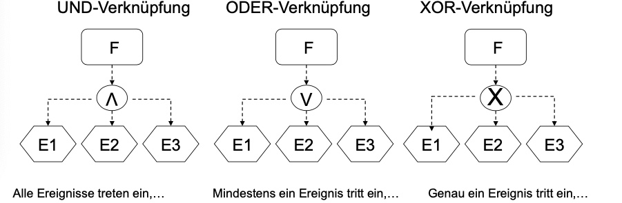
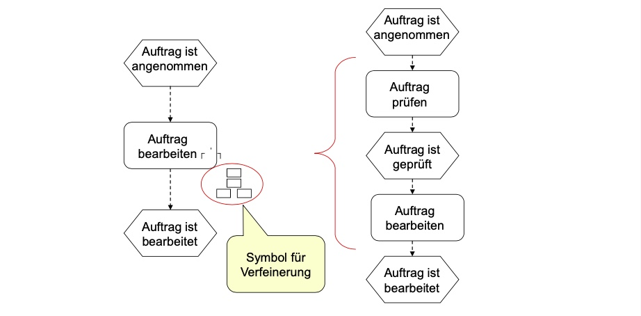

# 15.11.2021 Geschäftsprozessmanagement

### Lernziele

- Warum GPM
- Was ist ein Geschäftsprozess
- Modellierung
- Analyse + Verbesserung
- Automatisierung

## Warum Geschäftsprozessmanagement?

Situation steigender Konkurrenz, kürzerer Produktlebenszyklen

Vorteile GPM

- ermöglicht schnelle Anpassung
- Qualität + Leistungssteigerung
- unternehmensweite / übergreifende Informationsteilung

IT = Enabler des Geschäftsprozessmanagements

### Geschäftsprozess

>**Geschäftsprozess**: inhaltlich abgeschlossene Folge von Aktivitäten zur Bearbeitung eines relevanten Objektes 

Verkettung von Prozessen => **Prozessketten**

Systematisierung von Prozessen:

- nach Prozessgegenstand
- nach Art der Tätigkeit
    - Führungsprozesse
    - Operative Prozesse
- nach Marktbezug

Ebenen von Geschäftsprozessen

1. Strategische Ebene: welche Leistung 
2. taktische Ebene: wie Leistung erstellen
3. Operative Ebene: Umsetzung der Leistung

### Geschäftsprozessmanagement

> **Geschäftsprozessmanagement (GPM)**: Mittel zur prozessorientierten Unternehmensgestaltung aus der BWL

##### Ziele des GP-Management:

- Ausrichtung auf Kunden
- Flexibilität
- Agile Steuerung

##### Ansatzpunkte:

- Erhöhung Prozesstransparenz
- Organisationswissen dokumentieren
- IT-Systemgestaltung

##### Aufgabenfelder :

- Identifizieren von GPs
- *Geschäftsprozessmodellierung*
- Schnittstellendefinition
- Überwachung der Prozesse

> **Geschäftsprozessmodellierung:** Identifikation, Analyse und Ausgestaltung von GPs

wichtigster Teil des GPM!  (Fokus in dieser Vorlesung)

## Modellierung

> **Modelle:** Erklärungsgrößen im Rahmen einer Theorie mit dem Ziel der Prognose/Erklärung

- Definition eines Modells: mit *Modellierungssprache*
- Erstellung eines Modells: bedeutet beträchtlichen Aufwand/ Kosten
- Erfolg eines Modells: abhängig von Einheitlichkeit und Ordnungsrahmen

### EPK

> **EPK**: ereignisgesteuerte Prozessketten

Grundelemente der EPK:

##### Funktion

>  erfasst einen betrieblichen Vorgang (zeitverbrauchendes Geschehen mit Start und Ende)

- Aktivitäten, die input in Output transformiert
- aktive Komponente
- Formulierung: Substantiv + Infinitiv (Bsp.: Rechnung schreiben)

##### Ereignisse

> Zeitpunktbezogener Ausdruck eines Zustands, lösen Funktionen aus oder sind Ergebnis von ihnen

- Auslöseereignis oder Bereitstellungsereignis

- Passive Komponente

- Formulierung: Substantiv + Partizip Perfekt (Bsp.: Rechnung geschrieben)

    

##### Konnektoren

> Verknüpfung mehrerer Elemente aufgrund einer Regel mit anderen Elementen (Elemente oder Funktion)

Arten Konnektoren (eintretende Ereignisse):

auch andersherum mit auslösenden Ereignissen/Funktionen etc

##### Prozessschnittstelle

> Verbindung zwischen vorangegangenem und nachfolgendem Prozess

- Beispiel: **Rechnungsprozess**(schreiben, drucken, versenden) -> **Versendeprozess**(einpacken, abgeben,...)

##### Verfeinerung

> EPK, die Funktion einer anderen genauer darstellt

##### Grundregeln

> **Kante**: Verbindung *genau* zweier Elemente

- beginnt mit mindestens einem Startereignis
- endet mit mindestens einem Endereignis
- immer Wechsel (Ereignis | Funktion)
- In oder aus einer Funktion nur eine Kante (Konnektoren nutzen)
- kein Objekt ohne Kante
- Direktverbindungen von Konnektoren erlaubt

