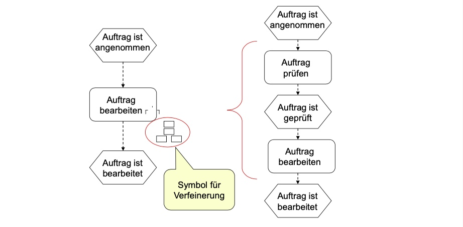
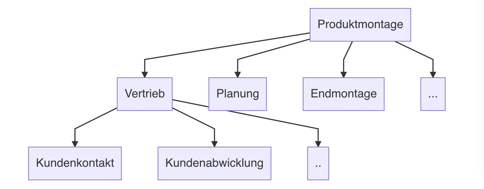

# 17.11.2021 Modellierung

## Modellierung (Video 3)

> **Modelle:** Erklärungsgrößen im Rahmen einer Theorie mit dem Ziel der Prognose/Erklärung

- Definition eines Modells: mit *Modellierungssprache*
- Erstellung eines Modells: bedeutet beträchtlichen Aufwand/ Kosten
- Erfolg eines Modells: abhängig von Einheitlichkeit und Ordnungsrahmen

### EPK

> **EPK**: ereignisgesteuerte Prozessketten

Grundelemente der EPK:

#### Funktion

>  erfasst einen betrieblichen Vorgang (zeitverbrauchendes Geschehen mit Start und Ende)

- Aktivitäten, die input in Output transformiert
- aktive Komponente
- Formulierung: Substantiv + Infinitiv (Bsp.: Rechnung schreiben)

#### Ereignisse

> Zeitpunktbezogener Ausdruck eines Zustands, lösen Funktionen aus oder sind Ergebnis von ihnen

- Auslöseereignis oder Bereitstellungsereignis

- Passive Komponente

- Formulierung: Substantiv + Partizip Perfekt (Bsp.: Rechnung geschrieben)

    

#### Konnektoren

> Verknüpfung mehrerer Elemente aufgrund einer Regel mit anderen Elementen (Elemente oder Funktion)

Arten Konnektoren (eintretende Ereignisse):

auch andersherum mit auslösenden Ereignissen/Funktionen etc

#### Prozessschnittstelle

> Verbindung zwischen vorangegangenem und nachfolgendem Prozess

- Beispiel: **Rechnungsprozess**(schreiben, drucken, versenden) -> **Versendeprozess**(einpacken, abgeben,...)

#### Verfeinerung

> EPK, die Funktion einer anderen genauer darstellt

#### Grundregeln

> **Kante**: Verbindung *genau* zweier Elemente

- beginnt mit mindestens einem Startereignis
- endet mit mindestens einem Endereignis
- immer Wechsel (Ereignis | Funktion)
- In oder aus einer Funktion nur eine Kante (Konnektoren nutzen)
- kein Objekt ohne Kante
- Direktverbindungen von Konnektoren erlaubt

## Erweiterte Sichten (Video4)

normale EPK erlaubt nicht kompletten Überblick über Prozess => *erweiterte Sichten auf Geschäftsprozesse*

schnellen Überblick über relevante Fragen, die nur Untergruppe der EPK betreffen

Erweiterte Sichten werden in Untermodelle ausgelagert in einer konsistenten *Architektur*

### Arhchitekturmodell ARIS

jede Untersicht hat eigene Syntax

---

> **Leistungssicht**: Modell der Bestandteile eines Guts / einer Leistung und die Unterbestandteile

Beispiel Auto:

---

> **Funktionssicht:** Modell aller im Unternehmen verfügbaren Funktion

jede Funktion wird schriftlich weiter ausführlich beschrieben in Funktionsliste

---

> **Organisationssicht**: Modell der beteiligten Organisationseinheiten am GP

Einheiten:

- Stellen
- Personen
- Abteilungen

Darstellung mit *Organigrammen*

---

> **Datensicht**: Beschreibung von Objekten und Beziehung untereinander

- Beschreibung mit Entity-Relationship-Modell (ERM) => bereits bekannt
- Ausführung mit Datenbanksystem

---

#### Steuerungssicht

gesamte Verknüpfung aller Sichten => **EPK** wie oben

