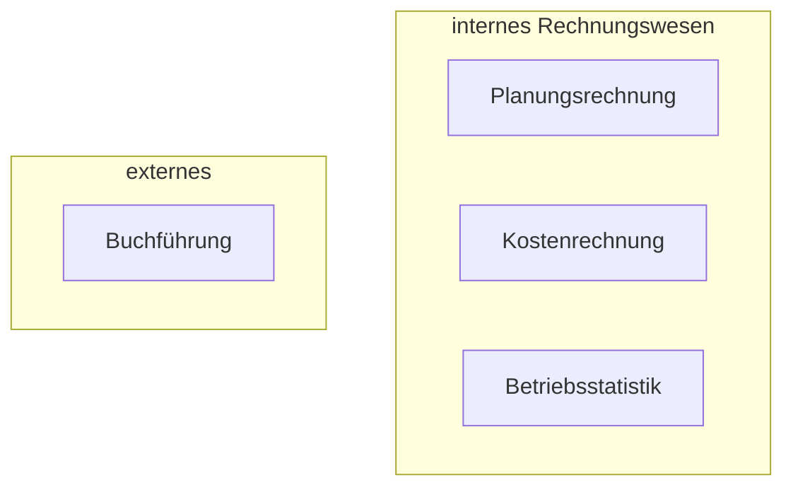

# 1. Vorlesung Buchführung

### Bestandteile

- Grundlagen der Buchführung 
- Inventur, Inventar, Bilanz
- Buchungen
- Kontierungsregeln
- Grundbuch, Bilanzbuch
- Abschreibungen
- Jahresabschluss
- ...

### Einordnung

Teil des betrieblichen Rechnungswesens, aber **externes Rechnungswesen**:

> **externes Rechnungswesen**: Ergebnisse auch für Außenstehende zugänglich 
>
> bspw. : Gläubiger, Aktionäre, Finanzamt (für Steuern)

### Aufgaben

unternehmerische Aufgaben

- Einkauf von Roh- , Hilfs- , und Betriebsstoffen

